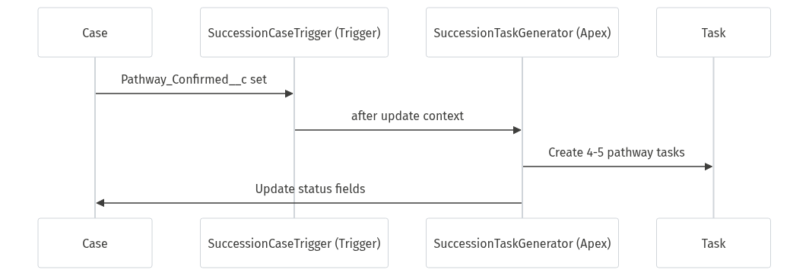

# System Architecture

**Last Updated:** October 15, 2025  
**Version:** 1.0  
**Project:** Succession Management System for Schwab Charitable Fund

---

## Overview

Complete succession management solution for Financial Services Cloud, handling deceased donor account transitions through three distinct pathways: Disclaim, New DAF, and Final Grant.

**Architecture:** Standard Objects Only (Case, Task, Account, Contact, FinancialAccount, FinancialAccountRole)  
**Target Org:** schwab-sandbox (josh.rojas.charfsc@schwab.com.fscjosh)  
**Demo-Optimized:** Maximum permissiveness, zero validation rules

---

## Key Features

- **Multi-Pathway Processing** - Three succession pathways with guided workflows
- **Pathway Task Automation** - Auto-creates 4-5 milestone tasks per pathway via Apex trigger
- **Task-Based Contact Cadence** - Date-gated task system (Days 0, 5, 35, 65, 95)
- **SLA Tracking** - Real-time monitoring via entitlement processes
- **Hierarchical Case Management** - Multi-successor scenario handling
- **Person Account Compatible** - Full FSC Person Account support

---

## Data Model


Legend
- Entities: `Account`, `Contact`, `FinancialAccount (FA)`, `FinancialAccountRole (FAR)`, `Case`, `Task`.
- Person Accounts: `FAR.FinServ__RelatedContact__c -> Account.PersonContactId` (not `RelatedAccount`).
- Multi-successor: Parent–child `Case` via `ParentId`; each child has its own cadence `Task`s.
- Tasks track contact attempts: `Contact_Attempt_Number__c`, `ActivityDate`, `Succession_Contact_Established__c`.

### Core Objects

```
Case (Record Type: Estate Administration)
├── Type: "Named Successor Enactment" or "Multi-Account Succession Master"
├── Succession-specific fields (18 custom fields)
└── ParentId (for multi-successor child cases)

Task (Contact Attempts)
├── Contact_Attempt_Number__c (1-5)
├── ActivityDate (date-gating)
└── Succession_Contact_Established__c (outcome)

FinancialAccountRole
├── Role: "Successor"
├── SuccessorAllocation__c (percentage)
└── FinServ__RelatedContact__c (points to PersonContactId)
```

### Relationships

- **Financial Services Cloud Standard:**
  - Uses `FinServ__FinancialAccount__c` and `FinServ__FinancialAccountRole__c`
  - Person roles use `FinServ__RelatedContact__c` → `Account.PersonContactId`
  - Organization roles use `FinServ__RelatedAccount__c`

---

## Component Inventory


Legend
- Layers: LWC (UI) → Apex Controllers → Standard Objects (DB).
- Automation: Trigger `SuccessionCaseTrigger` → `SuccessionTaskGenerator` (primary automation); Flows in repo are Inactive.
- Security: Most Apex executes WITH USER_MODE to enforce FLS (exception: SuccessionTaskGenerator uses SYSTEM_MODE for automation).

### Apex Classes (4)

| Class | Purpose | Test Coverage |
|-------|---------|---------------|
| `CaseHierarchyController` | Multi-successor case hierarchy visualization | ✅ 95%+ |
| `ContactCadenceController` | Date-gated contact attempt management | ✅ 95%+ |
| `SuccessionPublicFormController` | Guest user form submission handler | ✅ 95%+ |
| `SuccessionTaskGenerator` | **PRIMARY AUTOMATION** - Pathway task creation via trigger | ✅ 100% (7/7 tests) |

**Triggers (1):**
- `SuccessionCaseTrigger` - Fires SuccessionTaskGenerator when Pathway_Confirmed__c changes

**Security:** Most use `WITH USER_MODE` for FLS enforcement (exception: SuccessionTaskGenerator uses SYSTEM_MODE for automation)

### Flows (5 - All Inactive in Source Control)

**⚠️ All flows in this repository are marked as `Inactive`.** Primary automation is trigger-based (see above).

| Flow | Intended Purpose (if active) | File |
|------|------------------------------|------|
| `Succession_Start_Contact_Process` | Would create Day 0 task | `force-app/main/default/flows/Succession_Start_Contact_Process.flow-meta.xml` |
| `Succession_Schedule_Next_Contact` | Would auto-create next task (Day 5, 35, 65, 95) | `force-app/main/default/flows/Succession_Schedule_Next_Contact.flow-meta.xml` |
| `Succession_Mark_Contact_Established` | Would set contact established flag | `force-app/main/default/flows/Succession_Mark_Contact_Established.flow-meta.xml` |
| `Succession_Close_Multi_Successor_Parent` | Would close parent when all children complete | `force-app/main/default/flows/Succession_Close_Multi_Successor_Parent.flow-meta.xml` |
| `Succession_Update_Case_Status_And_Notify` | Would auto-update Case.Status and post Chatter | `force-app/main/default/flows/Succession_Update_Case_Status_And_Notify.flow-meta.xml` |

**Legacy Flow Name Mapping:**
- `Case_Create_Initial_Contact_Attempt` → now `Succession_Start_Contact_Process` (Inactive)
- `Task_Create_Next_Contact_Attempt` → now `Succession_Schedule_Next_Contact` (Inactive)
- `Case_Status_Coordination` → functionality in `Succession_Update_Case_Status_And_Notify` (Inactive)
- `Case_Succession_Segment_Transition` → functionality in `Succession_Update_Case_Status_And_Notify` (Inactive)

### Lightning Web Components (5)

- `successionContactCadence` - **Primary UI** - Date-gated contact tracker
- `caseHierarchyViewer` - Visual case hierarchy for multi-successor
- `recordPathwaySelection` - Quick action pathway selector
- `successionAccountSummary` - Account/financial data display
- `successionPublicForm` - Guest user pathway selection form

### Pathway Task Automation

**How It Works:** When `Pathway_Confirmed__c` is set on a Case, `SuccessionCaseTrigger` fires and creates 4-5 milestone tasks based on the selected pathway.



Legend
- Trigger: `Pathway_Confirmed__c` set on `Case` (after update).
- Generator: `SuccessionTaskGenerator` creates 4–5 pathway tasks and updates status fields.

**Task Templates (Apex-based, not Action Plan metadata):**

| Pathway | Tasks | Timeline | Implementation |
|---------|-------|----------|----------------|
| Final Grant | 5 | Day 2-20 | `SuccessionTaskGenerator.generateFinalGrantTasks()` |
| New DAF Account | 4 | Day 2-18 | `SuccessionTaskGenerator.generateNewDAFTasks()` |
| Disclaim Assets | 4 | Day 3-20 | `SuccessionTaskGenerator.generateDisclaimTasks()` |

**Note:** No Action Plan Templates directory exists. Tasks are created via Apex trigger.

---

## Workflow Architecture

### 5-Phase Succession Process


Legend
- Five phases: Verification → Contact Cadence → Pathway Selection → Confirmation → Execution/Closure.
- Gates: Contact established stops cadence; form sent/completed drive transitions; pathway confirmation creates tasks.

**Phase 1: Verification (24h SLA)**
- Agent verifies successor identity and documentation
- Manual gate: "✅ Begin Succession Processing" Quick Action
- Sets `Verification_Status__c = "Complete - Verified"`

**Phase 2: Contact Cadence (Days 0-95)**
- Automated task creation at Day 0, 5, 35, 65, 95
- Sequential unlock pattern (must complete prior task)
- Circuit breaker: Contact established → stops cadence
- Email validation: opt-out checking, format validation


Legend
- Sequential unlock: next task is created/unlocked only when prior is completed.
- Circuit breaker: `Contact_Established__c = true` stops creating further tasks.
- Note: Contact task creation is currently manual or via inactive flows in this codebase.

**Phase 3: Pathway Selection (30-day SLA)**
- Automated email with public form link (when contact established)
- Three pathways: Final Grant, New DAF, Disclaim
- Guest-accessible form with URL parameter security

**Phase 4: Pathway Confirmation**
- Pathway tasks auto-created via SuccessionTaskGenerator trigger
- 4-5 pathway-specific tasks created
- Case field updates trigger status coordination

**Phase 5: Execution & Completion (60-day SLA)**
- Pathway execution tasks tracked
- Status coordination flows update Case.Status
- Parent case closure (multi-successor scenarios)

---

## Auto-Population Pattern

**Flow:** `Case_Estate_Administration_Defaults`  
**Trigger:** Before Save, `RecordType = "EstateAdministration"`

**Auto-Populated Fields:**
- Subject: `"Estate Succession - " & Account.Name`
- Description: Standard succession description
- Priority: Medium
- Origin: Phone
- Type: "Named Successor Enactment"
- Status: New
- Verification_Status__c: "Not Started"

**Person Account Support:**
```apex
IF Account.IsPersonAccount = TRUE
  THEN Set Case.ContactId = Account.PersonContactId
  ELSE Skip (Business Account - ContactId set manually)
```

**Rationale:** Streamlines demo scenarios, ensures consistency, reduces data entry from 7 steps to 1 step.

---

## Status Coordination

### Problem: Stage Management API Unavailable

**Research Finding (October 14, 2025):**
- Salesforce Stage Management metadata types (`StageDefinition`, `TransitionPlan`) are NOT in Metadata API
- Cannot deploy programmatically via CLI
- Cannot version control in Git

**Solution:** Flow-Based Status Coordination

**Note:** Status coordination is currently manual or via inactive flows in this codebase.  
**Legacy Reference:** Previously documented as `Case_Status_Coordination` flow


Legend
- Transitions: New → In Progress → Awaiting Response → In Review → In Progress → Closed.
- Drivers: `Verification_Status__c`, `Contact_Established__c`, `Form_Sent_Date__c`, `Form_Completed_Date__c`, `Pathway_Confirmed__c`, `Execution_Status__c`.

**Status Transitions:**
1. Phase 1→2: `Verification_Status__c = "Complete - Verified"` → Status = "In Progress"
2. Phase 2→3: `Contact_Established__c = TRUE` AND `Form_Sent_Date__c != NULL` → Status = "Awaiting Response"
3. Phase 3→4: `Form_Completed_Date__c != NULL` → Status = "In Review"
4. Phase 4→5: `Pathway_Confirmed__c != "Not Selected"` → Status = "In Progress"
5. Phase 5→Complete: `Execution_Status__c = "Completed"` → Status = "Closed"

**Trade-off:**
- ✅ Deployable via metadata
- ✅ Version controlled
- ❌ No visual progress component (Stage Management benefit)

---

## Multi-Successor Architecture

### Data Pattern

```
Account (Deceased Donor: Patricia Williams)
    ├── FinancialAccount ($3.5M)
    │   ├── FinancialAccountRole (Primary Owner → Patricia)
    │   ├── FinancialAccountRole (Successor → Amanda, 50%)
    │   └── FinancialAccountRole (Successor → Brandon, 50%)
    ├── Case (Parent: Type = "Multi-Account Succession Master")
    │   ├── Case (Child: Amanda Williams)
    │   └── Case (Child: Brandon Williams)
```


Legend
- Parent `Case` type: "Multi-Account Succession Master"; one child per successor.
- Roles: FAR records per successor with allocation percentages.
- Closure: Parent auto-closes only when all child cases are Closed.

### Flow Logic

**Flow:** `Case_Multiple_Successors_Handler`  
**Trigger:** Before Save, detects 2+ FinancialAccountRole records with `Role = 'Successor'`

**Actions:**
1. Creates parent case (Type = "Multi-Account Succession Master")
2. Creates child cases (1 per successor)
3. Links children to parent via `ParentId`
4. Each child has independent contact cadence

**Parent Closure:**
- Flow monitors all child cases
- When all children reach `Status = "Closed"`, parent auto-closes
- Prevents incomplete multi-successor scenarios

---

## Person Account Compatibility

### FSC Best Practices

**For Person Roles (Successors, Beneficiaries):**
- ✅ USE: `FinServ__RelatedContact__c` → `Account.PersonContactId`
- ❌ DO NOT USE: `FinServ__RelatedAccount__c`

**For Business/Organization Roles (Advisors, Trustees):**
- ✅ USE: `FinServ__RelatedAccount__c` → `Account.Id`

### Implementation Details

**Apex Classes:**
- All controllers handle both Person Accounts and Business Accounts
- Query `Account.IsPersonAccount` to determine logic path
- Use `Account.PersonEmail` for Person Accounts
- Use `Contact.Email` for Business Accounts

**Flows:**
- `Case_Send_Succession_Form` uses formula fields to resolve email
- `Case_Multiple_Successors_Handler` uses `PersonContactId` for lookups

**Test Data:**
- Snowfakery recipes populate `FinServ__RelatedContact__c` correctly
- Uses `PersonContactId` after Account creation

---

## Page Layout Strategy

**Layout:** `Case-Estate Administration Layout`

**Organization:** Grouped by 5-phase workflow

**Section 1:** Case Information (8 fields)  
**Section 2:** Phase 1 - Verification (2 fields)  
**Section 3:** Phase 2 - Contact Cadence (5 fields)  
**Section 4:** Phase 3 - Pathway Selection (3 fields)  
**Section 5:** Phase 4 - Pathway Execution (4 fields)  
**Section 6:** Pathway Details (4 fields)  
**Section 7:** System Information (4 fields)

**Quick Actions:**
- Begin_Succession_Processing
- Record_Pathway_Selection
- Standard actions (LogACall, NewTask, SendEmail)

**Related Lists:**
- Activities (contact attempts)
- Child Cases (multi-successor)
- Files (documents)
- Content Notes (outcome details)

**Demo Optimization:**
- Removed 8 irrelevant/deprecated fields
- No clutter, only workflow-relevant fields
- Quick Actions prominent for demos

---

## Security Model

### Permission Sets

**Succession_Management_Access (Internal Users):**
- Account: Read/Edit (`Deceased__c`, `Date_of_Death__c`)
- Case: Create, Read, Edit (no Delete - audit trail)
- Task: Create, Read, Edit, Delete
- All 18 Case custom fields: Read/Edit
- All 3 Apex controllers: Enabled

**Succession_Field_Access (Extended Access):**
- All permissions from Management_Access
- Event (Activity) fields: Read/Edit
- For QA testers, system admins, data migration

**Succession_Guest_Access (Public Form):**
- Case: Read, Limited Edit (pathway fields only)
- Account, Contact, FinancialAccount: Read only
- SuccessionPublicFormController: Enabled
- URL parameter obscurity (demo simplicity)

### Apex Security

**All controllers enforce WITH USER_MODE:**
- CaseHierarchyController: 4 queries
- ContactCadenceController: 5 queries, 5 DML operations
- SuccessionPublicFormController: All queries/DML

**Coverage:** 100% production controllers use WITH USER_MODE

---

## Demo Philosophy

**⚠️ DEMO-FIRST APPROACH**

This project is explicitly configured for demonstration purposes:

1. **Maximum Permissiveness** - Full edit access to all fields (except calculated)
2. **Zero Validation Rules** - No business logic constraints that block demos
3. **Audit Fields Included** - `Deceased__c`, `Date_of_Death__c` for narrative context
4. **Guest User Access** - Permissive read access, limited edit
5. **Email Validation** - Compliance-enforced (opt-out checking, format validation)

**For Production:**
- Add validation rules (required fields, format validations)
- Restrict permissions (read-only where appropriate)
- Enhance guest security (tokenized URLs, rate limiting, CAPTCHA)
- Add approval processes
- Enable Field History Tracking

---

## Project Structure

```
force-app/main/default/
├── triggers/               # Apex triggers (1: SuccessionCaseTrigger)
├── classes/                # 3 Apex classes + test classes
├── flows/                  # 8 active flows
├── email/                  # 6 email templates (5 cadence + 1 form invitation)
├── lwc/                    # 12 LWC components (4 active, 8 deprecated)
├── objects/                # Custom fields (Case, Task, Activity, Account)
├── permissionsets/         # 3 permission sets
├── layouts/                # Case-Estate Administration Layout
└── triggers/               # SuccessionCaseTrigger (auto-creates pathway tasks)
```

---

## Known Limitations

**Pathway Task Automation:**
- No Action Plan Templates directory exists in this codebase
- Tasks are created via Apex trigger: `SuccessionCaseTrigger` → `SuccessionTaskGenerator`
- **Solution:** Apex-based task generation (deployable, version-controlled)

**Email Automation:**
- `Case_Send_Succession_Form` flow has complex errors
- **Workaround:** Manual email sending (30 sec/case)
- Email template deployed with merge fields

**Experience Cloud Site:**
- Guest profile must be configured manually (not in Metadata API)
- Site setup requires per-org configuration

---

## Version History

**v1.0 (October 2025):**
- Initial release
- 8 active flows, 3 Apex classes, 12 LWC components
- Person Account compatibility complete
- Multi-successor support implemented
- Email validation compliance enforced

---

## Related Documentation

- [02-DEPLOYMENT-AND-CICD.md](02-DEPLOYMENT-AND-CICD.md) - Deployment procedures
- [03-ADMIN-RUNBOOK.md](03-ADMIN-RUNBOOK.md) - Administrator guide
- [04-FIELD-REFERENCE.md](04-FIELD-REFERENCE.md) - Complete field documentation
- [05-TESTING-AND-DATA.md](05-TESTING-AND-DATA.md) - Test scenarios and data generation
- [06-SECURITY.md](06-SECURITY.md) - Security audit and compliance
