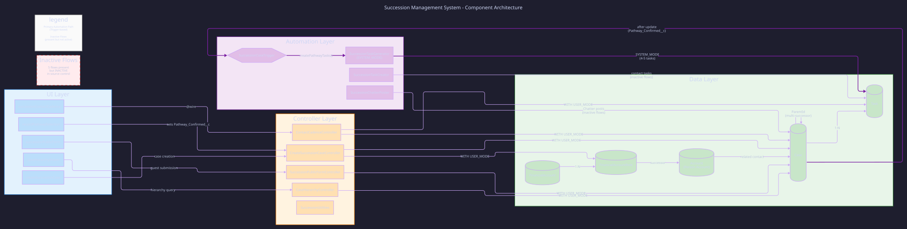
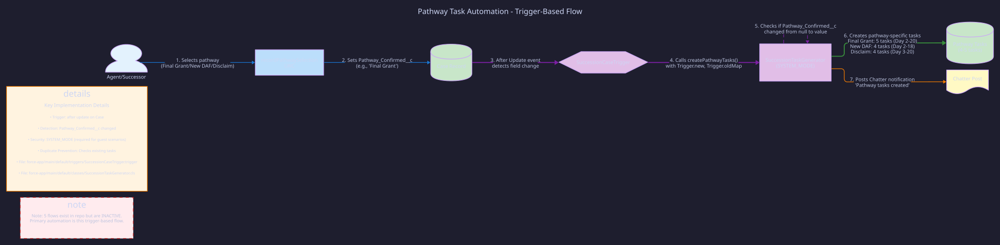
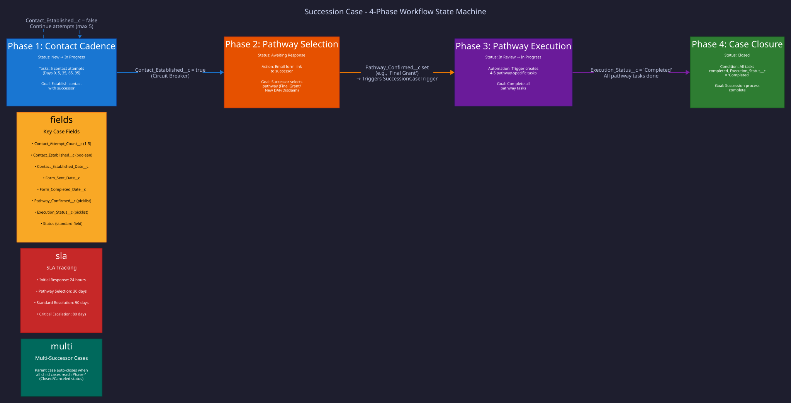
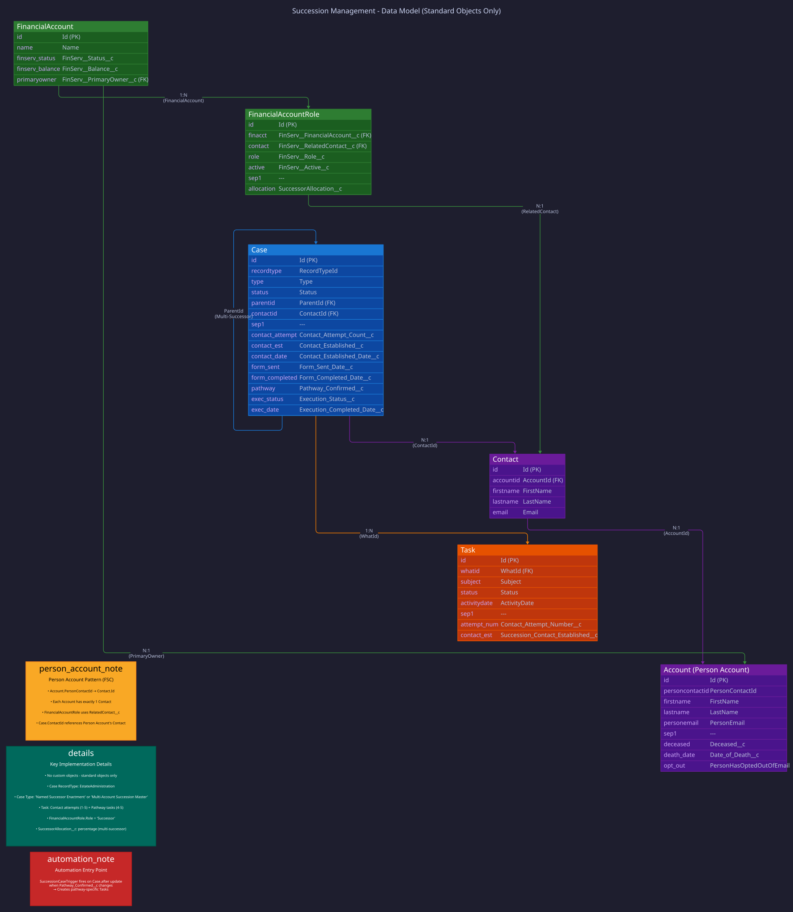

e# System Architecture, Automation & Data Model

**Last Updated:** November 2, 2025  
**Version:** 1.0

---

## Overview

The Succession Management System is a Salesforce Financial Services Cloud application built for Schwab Charitable Fund that automates deceased donor account transitions through three succession pathways: **Final Grant**, **New DAF Account**, and **Disclaim Assets**.

**Key Characteristics:**

- Built entirely on **standard Salesforce objects** (no custom objects)
- Uses Person Account model (Financial Services Cloud)
- **Trigger-based automation** (primary mechanism)
- 5 Lightning Web Components for user interaction
- Demo-optimized: simplified workflows, no blocking validations

---

## ⚠️ Current Automation Status

**Primary automation is trigger-based via Apex.** All flows present in this repository are marked as `Inactive` in source control. The system uses:

```
SuccessionCaseTrigger → SuccessionTaskGenerator
```

This trigger fires when `Pathway_Confirmed__c` changes on a Case record, automatically creating 4-5 pathway-specific tasks.

---

## Component Architecture

The system follows a layered architecture with clear separation of concerns:



### Layer Breakdown

#### 1. UI Layer (Lightning Web Components)

| Component                  | Purpose                                                                         | File Path                                              |
| -------------------------- | ------------------------------------------------------------------------------- | ------------------------------------------------------ |
| `successionContactCadence` | **Primary UI** - Date-gated contact attempt tracker with progress visualization | `force-app/main/default/lwc/successionContactCadence/` |
| `recordPathwaySelection`   | **Key Component** - Quick Action pathway selector (sets `Pathway_Confirmed__c`) | `force-app/main/default/lwc/recordPathwaySelection/`   |
| `successionPublicForm`     | Guest user pathway selection form (public-facing)                               | `force-app/main/default/lwc/successionPublicForm/`     |
| `caseHierarchyViewer`      | Visual case hierarchy tree for multi-successor scenarios                        | `force-app/main/default/lwc/caseHierarchyViewer/`      |
| `createSuccessionCase`     | Quick Action for creating succession cases from Financial Account               | `force-app/main/default/lwc/createSuccessionCase/`     |

#### 2. Controller Layer (Apex Classes)

| Class                            | Purpose                                           | Security Mode  |
| -------------------------------- | ------------------------------------------------- | -------------- |
| `ContactCadenceController`       | Manages contact attempt data and email validation | WITH USER_MODE |
| `CreateSuccessionCaseController` | Multi-successor case creation with validation     | WITH USER_MODE |
| `SuccessionPublicFormController` | Guest user form submission handler                | WITH USER_MODE |
| `CaseHierarchyController`        | Multi-successor case hierarchy visualization      | WITH USER_MODE |
| `SuccessionUtilities`            | Shared utility methods (email, Chatter, etc.)     | WITH USER_MODE |

#### 3. Automation Layer (Trigger + Apex)

**Primary Automation:**

- **`SuccessionCaseTrigger`** (Trigger) - Fires on Case after update
- **`SuccessionTaskGenerator`** (Apex) - Creates pathway-specific tasks
  - **Security:** Uses `SYSTEM_MODE` for task creation (required for guest user scenarios)
  - **File:** `force-app/main/default/classes/SuccessionTaskGenerator.cls`

**Invocable Apex** (referenced by inactive flows):

- `SuccessionTaskCreator` - Contact task creation
- `SuccessionChatterPoster` - Chatter notifications

**Inactive Flows** (5 flows present but not active):

- `Succession_Start_Contact_Process`
- `Succession_Schedule_Next_Contact`
- `Succession_Mark_Contact_Established`
- `Succession_Close_Multi_Successor_Parent`
- `Succession_Update_Case_Status_And_Notify`

#### 4. Data Layer (Standard Objects)

All data is stored in standard Salesforce objects:

- **Case** (Record Type: EstateAdministration)
- **Task** (Contact Attempts + Pathway Tasks)
- **Account** (Person Account model)
- **Contact** (linked to Person Account)
- **FinancialAccount** (FSC standard object)
- **FinancialAccountRole** (FSC standard object)

---

## Automation Flow

The primary automation mechanism is trigger-based. Here's how it works:



### Step-by-Step Flow

1. **User Action:** Agent or successor selects a pathway (Final Grant, New DAF, or Disclaim)
2. **LWC Update:** `recordPathwaySelection` component sets `Pathway_Confirmed__c` field on Case
3. **Trigger Fires:** `SuccessionCaseTrigger` detects the field change (after update event)
4. **Apex Execution:** Trigger calls `SuccessionTaskGenerator.createPathwayTasks()`
5. **Validation:** Generator checks if `Pathway_Confirmed__c` changed from null to a value
6. **Task Creation:** Generator creates 4-5 pathway-specific tasks based on the selected pathway:
   - **Final Grant:** 5 tasks over 20 days (Day 2, 5, 10, 15, 20)
   - **New DAF:** 4 tasks over 18 days (Day 2, 7, 12, 18)
   - **Disclaim:** 4 tasks over 20 days (Day 3, 8, 13, 20)
7. **Notification:** Generator posts a Chatter notification to the Case feed

### Key Implementation Details

**File Locations:**

- Trigger: `force-app/main/default/triggers/SuccessionCaseTrigger.trigger`
- Generator: `force-app/main/default/classes/SuccessionTaskGenerator.cls` (lines 42-250)

**Security:**

- Uses `SYSTEM_MODE` for task creation (lines 82, 92)
- Required because guest users cannot create Tasks directly
- Documented as necessary for automation reliability

**Duplicate Prevention:**

- Checks for existing pathway tasks before creating new ones
- Prevents duplicate task creation on subsequent Case updates

---

## 4-Phase Workflow

The succession process follows a state machine with four distinct phases:



### Phase 1: Contact Cadence

**Goal:** Establish contact with successor

**Status:** New → In Progress

**Tasks:** 5 contact attempts on Days 0, 5, 35, 65, 95

**Key Fields:**

- `Contact_Attempt_Count__c` (1-5)
- `Contact_Established__c` (boolean)
- `Contact_Established_Date__c`

**Circuit Breaker:** When `Contact_Established__c = true`, the cadence stops and the case moves to Phase 2.

**SLA:** Initial Response - 24 hours

---

### Phase 2: Pathway Selection

**Goal:** Successor selects their preferred pathway

**Status:** Awaiting Response

**Action:** Email sent with public form link to successor

**Key Fields:**

- `Form_Sent_Date__c`
- `Form_Completed_Date__c`
- `Pathway_Confirmed__c` (picklist: Final Grant, New DAF, Disclaim)

**Transition:** When `Pathway_Confirmed__c` is set, the trigger fires and creates pathway tasks, moving to Phase 3.

**SLA:** Pathway Selection - 30 days

---

### Phase 3: Pathway Execution

**Goal:** Complete all pathway-specific tasks

**Status:** In Review → In Progress

**Automation:** `SuccessionCaseTrigger` → `SuccessionTaskGenerator` creates 4-5 tasks

**Key Fields:**

- `Execution_Status__c` (picklist: Not Started, In Progress, Completed)
- `Execution_Completed_Date__c`

**Tasks by Pathway:**

| Pathway         | Tasks | Timeline | Implementation                                      |
| --------------- | ----- | -------- | --------------------------------------------------- |
| Final Grant     | 5     | Day 2-20 | `SuccessionTaskGenerator.generateFinalGrantTasks()` |
| New DAF Account | 4     | Day 2-18 | `SuccessionTaskGenerator.generateNewDAFTasks()`     |
| Disclaim Assets | 4     | Day 3-20 | `SuccessionTaskGenerator.generateDisclaimTasks()`   |

**Transition:** When all pathway tasks are completed and `Execution_Status__c = 'Completed'`, the case moves to Phase 4.

**SLA:** Standard Resolution - 90 days

---

### Phase 4: Case Closure

**Goal:** Succession process complete

**Status:** Closed

**Condition:** All tasks completed, `Execution_Status__c = 'Completed'`

**Multi-Successor Note:** For multi-successor cases, the parent case auto-closes when all child cases reach Closed or Canceled status.

**SLA:** Critical Escalation - 80 days

---

## Data Model

The system uses only standard Salesforce objects with custom fields:



### Core Entities

#### Case (Record Type: EstateAdministration)

**Standard Fields:**

- `Id` (Primary Key)
- `RecordTypeId` (EstateAdministration)
- `Type` (Named Successor Enactment or Multi-Account Succession Master)
- `Status` (New, In Progress, Awaiting Response, In Review, Closed)
- `ParentId` (Foreign Key - for multi-successor child cases)
- `ContactId` (Foreign Key - successor contact)

**Custom Fields:**

- `Contact_Attempt_Count__c` (Number) - Tracks contact attempts (1-5)
- `Contact_Established__c` (Boolean) - Circuit breaker flag
- `Contact_Established_Date__c` (DateTime) - When contact was made
- `Form_Sent_Date__c` (DateTime) - When pathway form was sent
- `Form_Completed_Date__c` (DateTime) - When form was completed
- `Pathway_Confirmed__c` (Picklist) - **TRIGGER FIELD** - Selected pathway
- `Execution_Status__c` (Picklist) - Pathway execution status
- `Execution_Completed_Date__c` (DateTime) - When execution completed

**File Location:** `force-app/main/default/objects/Case/fields/`

---

#### Task

**Standard Fields:**

- `Id` (Primary Key)
- `WhatId` (Foreign Key - Case)
- `Subject` (Text)
- `Status` (Not Started, In Progress, Completed)
- `ActivityDate` (Date) - Date-gating for contact attempts

**Custom Fields:**

- `Contact_Attempt_Number__c` (Number) - Which attempt (1-5)
- `Succession_Contact_Established__c` (Boolean) - Outcome of contact attempt

**File Location:** `force-app/main/default/objects/Task/fields/`

---

#### Account (Person Account Model)

**Standard Fields:**

- `Id` (Primary Key)
- `PersonContactId` (Foreign Key - auto-created Contact)
- `FirstName`, `LastName`
- `PersonEmail`
- `PersonHasOptedOutOfEmail` (Boolean)

**Custom Fields:**

- `Deceased__c` (Boolean)
- `Date_of_Death__c` (Date)

**Person Account Pattern:**

- Each Account has exactly one Contact (PersonContactId)
- FSC uses Person Account model for individuals
- FinancialAccountRole references the Contact, not the Account directly

**File Location:** `force-app/main/default/objects/Account/fields/`

---

#### Contact

**Standard Fields:**

- `Id` (Primary Key)
- `AccountId` (Foreign Key - Person Account)
- `FirstName`, `LastName`
- `Email`

**Note:** In Person Account model, Contact is auto-created and linked to Account via `Account.PersonContactId`.

---

#### FinancialAccount (FSC Standard Object)

**Standard Fields:**

- `Id` (Primary Key)
- `Name`
- `FinServ__Status__c`
- `FinServ__Balance__c`
- `FinServ__PrimaryOwner__c` (Foreign Key - Account)

**File Location:** `force-app/main/default/objects/FinServ__FinancialAccount__c/`

---

#### FinancialAccountRole (FSC Standard Object)

**Standard Fields:**

- `Id` (Primary Key)
- `FinServ__FinancialAccount__c` (Foreign Key)
- `FinServ__RelatedContact__c` (Foreign Key - Contact)
- `FinServ__Role__c` (Text - "Successor")
- `FinServ__Active__c` (Boolean)

**Custom Fields:**

- `SuccessorAllocation__c` (Percent) - Allocation percentage for multi-successor scenarios

**File Location:** `force-app/main/default/objects/FinServ__FinancialAccountRole__c/fields/`

---

### Relationships

1. **Case → Task** (1:N via WhatId)
   - One Case has many Tasks (contact attempts + pathway tasks)

2. **Case → Case** (Self-referential via ParentId)
   - Multi-successor parent case has multiple child cases
   - Parent auto-closes when all children are Closed/Canceled

3. **Case → Contact** (N:1 via ContactId)
   - Each Case is associated with one successor Contact

4. **Contact → Account** (N:1 via AccountId)
   - Person Account pattern: each Contact belongs to one Account

5. **FinancialAccount → FinancialAccountRole** (1:N)
   - One FinancialAccount has many roles (Primary Owner, Successor, etc.)

6. **FinancialAccountRole → Contact** (N:1 via RelatedContact\_\_c)
   - Each role is associated with one Contact (successor)

7. **FinancialAccount → Account** (N:1 via PrimaryOwner\_\_c)
   - Each FinancialAccount has one primary owner Account

---

## Key Implementation Notes

### No Custom Objects

The system uses only standard Salesforce objects with custom fields. This simplifies:

- Deployment and maintenance
- Integration with FSC features
- Compliance with Salesforce best practices

### Person Account Pattern (FSC)

Financial Services Cloud uses Person Accounts where:

- Each Account represents an individual
- Account.PersonContactId → Contact.Id (1:1 relationship)
- FinancialAccountRole uses `RelatedContact__c` to reference the Contact
- Case.ContactId references the Person Account's Contact

### Trigger-Based Automation

The primary automation mechanism is:

1. User/LWC sets `Pathway_Confirmed__c` on Case
2. `SuccessionCaseTrigger` fires (after update)
3. `SuccessionTaskGenerator` creates pathway tasks
4. Tasks use `SYSTEM_MODE` for security (guest users can't create Tasks)

### Inactive Flows

5 flows exist in the repository but are marked as `Inactive`:

- They reference invocable Apex classes (`SuccessionTaskCreator`, `SuccessionChatterPoster`)
- Primary automation is trigger-based, not flow-based
- Flows are retained for reference but not active in this codebase

### Demo-Optimized Architecture

The system is designed for easy live demonstrations:

- No validation rules that block data entry
- Maximum permissiveness for demo scenarios
- Simplified workflows with clear visual feedback
- Quick Action-based UI for rapid case creation and updates

---

## Security Model

### Permission Sets

| Permission Set                 | Purpose                                             | Access Level   |
| ------------------------------ | --------------------------------------------------- | -------------- |
| `Succession_Management_Access` | Full CRUD on Cases, Tasks, and related objects      | Internal users |
| `Succession_Field_Access`      | Extended field-level access to succession fields    | Internal users |
| `Succession_Guest_Access`      | Limited Case edit access for public form submission | Guest users    |

**File Location:** `force-app/main/default/permissionsets/`

### Apex Security Modes

**WITH USER_MODE (Most Controllers):**

- `ContactCadenceController`
- `CreateSuccessionCaseController`
- `SuccessionPublicFormController`
- `CaseHierarchyController`
- `SuccessionUtilities`

**SYSTEM_MODE (Automation Only):**

- `SuccessionTaskGenerator` (lines 82, 92)
- **Rationale:** Guest users cannot create Tasks; automation requires elevated privileges
- **Documentation:** Explicitly documented in code comments as necessary for automation reliability

### Field-Level Security

All custom fields have FLS configured via permission sets. Standard field access follows Salesforce defaults.

---

## Performance Considerations

### Trigger Efficiency

- Single trigger per object (SuccessionCaseTrigger on Case)
- Bulk-safe: handles multiple records in Trigger.new
- Efficient field change detection using Trigger.oldMap

### Query Optimization

- All controllers use selective queries with WHERE clauses
- No SOQL in loops
- Bulk processing patterns throughout

### Flow Consolidation

Previous architecture had multiple flows triggering on same events. Current trigger-based approach:

- Single execution path per Case update
- Reduced flow interviews per case lifecycle
- Better performance and maintainability

---

## Monitoring & Troubleshooting

### Key Metrics to Monitor

1. **Case Age:** Track time in each phase
2. **Contact Attempt Success Rate:** % of cases where contact is established
3. **Pathway Distribution:** Which pathways are most common
4. **Task Completion Time:** Average time to complete pathway tasks
5. **SLA Compliance:** % of cases meeting SLA targets

### Common Issues

**Issue:** Pathway tasks not created after pathway selection

- **Cause:** `Pathway_Confirmed__c` not set or trigger not firing
- **Solution:** Check trigger is active, verify field value changed

**Issue:** Guest user cannot submit form

- **Cause:** Permission set not assigned or sharing rules incorrect
- **Solution:** Verify `Succession_Guest_Access` permission set, check sharing settings

**Issue:** Multi-successor parent case not auto-closing

- **Cause:** Child cases not all in terminal status (Closed/Canceled)
- **Solution:** Verify all child cases are Closed or Canceled

### Debug Logs

Enable debug logs for:

- `SuccessionCaseTrigger`
- `SuccessionTaskGenerator`
- User running the process

Filter by:

- `APEX_CODE`
- `VALIDATION_RULE`
- `WORKFLOW`

---

## Future Enhancements

### Potential Improvements

1. **Active Flows:** Activate flows for contact cadence automation
2. **Email Automation:** Automate form invitation emails
3. **Advanced Analytics:** Dashboard with real-time metrics
4. **Mobile Support:** Optimize LWCs for mobile devices
5. **Multi-Language:** Support for multiple languages
6. **Document Management:** Integration with document management system

### Technical Debt

1. **Test Coverage:** Expand test coverage beyond current 100%
2. **Error Handling:** Enhanced error handling and user feedback
3. **Logging:** Centralized logging for better troubleshooting
4. **CI/CD:** Implement automated CI/CD pipeline

---

# Runtime Automation Source of Truth

- All flows in `force-app/main/default/flows/` are kept **Inactive** in source control.
- Runtime automation for pathway task creation is owned by `SuccessionCaseTrigger` → `SuccessionTaskGenerator`.
- Stage Management metadata and the design in `docs/stage-management-design.md` are **documentation-only** and MUST NOT be enabled without explicit approval.

---

**Document Status:** Last verified November 2, 2025 | Commit: [current]
