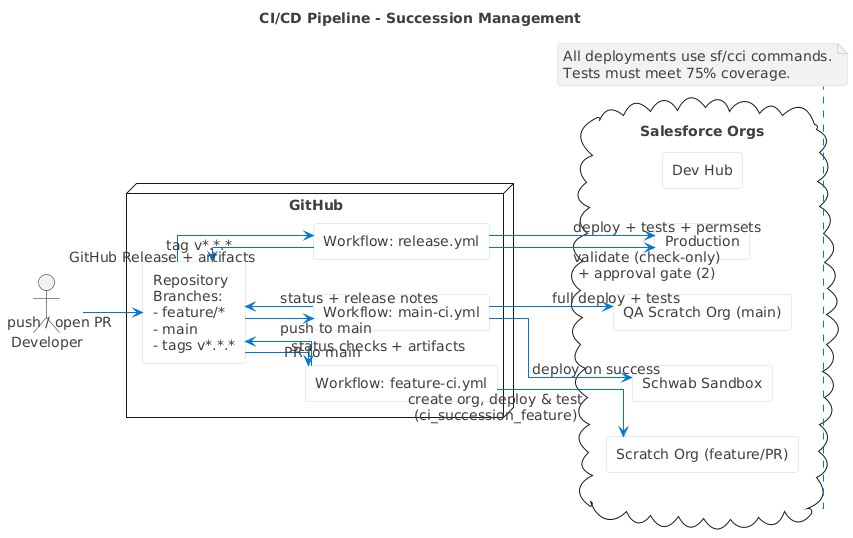

# Deployment and CI/CD

**Last Updated:** October 15, 2025  
**Version:** 1.0  
**Project:** Succession Management System

---

## Related Diagrams

- Component Architecture (PlantUML): `diagrams/images/plantuml/component-architecture.png`
- Data Model (ERD): `diagrams/images/erd/data-model.png`
- CI/CD Pipeline (PlantUML): `diagrams/images/plantuml/ci-cd-pipeline.png`

---

## Quick Start

### Basic Deployment

```bash
# Connect to your org
sf org login web --alias succession-org

# Deploy everything
sf project deploy start --manifest manifest/package.xml

# Assign permissions
sf org assign permset --name Succession_Management_Access
sf org assign permset --name Succession_Field_Access
```

---

## Deployment Summary (October 15, 2025)

**Target Org:** josh.rojas.charfsc@schwab.com.fscjosh (schwab-sandbox/fscjosh)  
**Deploy ID:** 0AfDg00001N9ToAKAV  
**Status:** Partial Success (67/86 components - 78%)

### Successfully Deployed (67 components)

**Apex Classes (8):**

- CaseHierarchyController + Test
- ContactCadenceController + Test
- SuccessionPublicFormController + Test
- SuccessionTaskGenerator + Test (NEW - replaces Action Plan flow)

**LWC Components (5):**

- caseHierarchyViewer
- recordPathwaySelection
- successionAccountSummary
- successionContactCadence
- successionPublicForm

**Flows (5 - All Inactive in Source Control):**

- Succession_Start_Contact_Process (Inactive)
- Succession_Schedule_Next_Contact (Inactive)
- Succession_Mark_Contact_Established (Inactive)
- Succession_Close_Multi_Successor_Parent (Inactive)
- Succession_Update_Case_Status_And_Notify (Inactive)

**Note:** Primary automation is trigger-based via `SuccessionCaseTrigger` → `SuccessionTaskGenerator`

**Custom Fields:**

- Case: 18 fields
- Activity: 2 fields (Contact_Attempt_Number**c, Succession_Contact_Established**c)

**Triggers (1):**

- SuccessionCaseTrigger (auto-creates pathway tasks)

**Other Metadata:**

- Record Type: Case.EstateAdministration
- Business Process: Estate_Administration
- Permission Sets: All 3
- Email Templates: 6 templates
- **Note:** No Action Plan Templates directory - tasks created via Apex trigger

### Failed to Deploy (19 components)

**Flows (2 - REPLACED WITH APEX):**

- ~~Case_Assign_Pathway_Action_Plan~~ → ✅ REPLACED with SuccessionTaskGenerator
- ~~Case_Send_Succession_Form~~ → ✅ REPLACED with automatic email flow

**Quick Actions (3 - REMOVED AS REDUNDANT):**

- ~~Case.Mark_Contact_Established~~ → ✅ REPLACED by successionContactCadence LWC
- ~~Case.Record_Contact_Attempt~~ → ✅ REPLACED by successionContactCadence LWC
- ~~Case.Send_Succession_Form~~ → ✅ REPLACED with automatic email flow

**Task Fields (2):**

- Task.Contact_Attempt_Number\_\_c (Activity version deployed successfully)
- Task.Succession_Contact_Established\_\_c (Activity version deployed successfully)

**Service Cloud Components (5 - NOT ESSENTIAL):**

- Estate_Case_Channel
- Estate_Email_Channel
- Estate_Cases_Routing
- Estates_Agent_Presence
- Estate_Succession_SLA

**Experience Cloud (2 - NOT ESSENTIAL):**

- Succession Portal (Network)
- Succession_Portal (CustomSite)

**Layout (1):**

- Case-Estate Administration Layout (relatedList issue)

---

## CumulusCI Deployment

### Installation

```bash
pip install cumulusci
```

### Available Flows

| Flow                            | Description                    | Use Case           |
| ------------------------------- | ------------------------------ | ------------------ |
| `deploy_succession`             | Full deployment with test data | Development/QA     |
| `deploy_succession_no_data`     | Metadata + permissions only    | Production/Staging |
| `deploy_succession_incremental` | Fast incremental updates       | Quick iterations   |
| `uninstall_succession`          | Remove all components          | Cleanup/reset      |

### CI/CD Flows

| Flow                    | Triggered By            | Purpose                       |
| ----------------------- | ----------------------- | ----------------------------- |
| `ci_succession_feature` | PR/feature branches     | Feature validation            |
| `ci_succession_main`    | Merge to main           | Full test + deploy to sandbox |
| `ci_succession_release` | Version tags (`v*.*.*`) | Production deployment         |

### Test Data Flows

| Flow                     | Data Loaded                  | Purpose               |
| ------------------------ | ---------------------------- | --------------------- |
| `succession_test_setup`  | Basic succession cases       | Standard testing      |
| `final_grant_test_setup` | Complete Final Grant pathway | Pathway testing       |
| `demo_setup`             | UI demo data                 | LWC component testing |
| `load_all_scenarios`     | All test scenarios           | Comprehensive testing |

### Example Commands

```bash
# Deploy with test data
cci flow run deploy_succession --org my-sandbox

# Deploy without test data
cci flow run deploy_succession_no_data --org my-sandbox

# Quick incremental update
cci flow run deploy_succession_incremental --org my-sandbox

# Load test data only
cci task run load_demo_ui_showcase --org my-sandbox
```

---

## GitHub Actions CI/CD



Legend

- Triggers
  - feature-ci.yml: PRs to main; pushes to feature/_, bugfix/_
  - main-ci.yml: pushes to main
  - release.yml: tags v*.*.\* (or manual dispatch)
- Target orgs
  - feature-ci.yml: Scratch Org (created from Dev Hub)
  - main-ci.yml: QA Scratch Org → deploy to Schwab Sandbox on success
  - release.yml: Production (validate, approval, deploy)

### Feature Branch Pipeline

**Trigger:** Push to `feature/**` or `bugfix/**` branches, PRs to `main`  
**Workflow:** `.github/workflows/feature-ci.yml`

**Steps:**

1. Create scratch org (7 days)
2. Deploy & test (`ci_succession_feature`)
3. Run code quality checks (PMD, security scan)
4. Upload test results
5. Delete scratch org

**Coverage Required:** 75% minimum

### Main Branch Pipeline

**Trigger:** Push to `main` branch  
**Workflow:** `.github/workflows/main-ci.yml`

**Steps:**

1. Create QA scratch org (30 days)
2. Full deployment with test data
3. Run comprehensive tests
4. Generate release notes
5. **Deploy to Schwab Sandbox** (if tests pass)
6. Run smoke tests
7. Comment deployment status on commit

**Environments:**

- `qa-main`: Scratch org for validation
- `schwab-sandbox`: Persistent sandbox

### Release Pipeline

**Trigger:** Push tag `v*.*.*` or manual workflow dispatch  
**Workflow:** `.github/workflows/release.yml`

**Steps:**

1. Create GitHub Release
2. Validate deployment (check-only)
3. ⚠️ **Request approval** (2 approvers required)
4. Deploy to production
5. Run production tests
6. Assign permission sets
7. Create deployment artifact
8. Notify success/failure

**Environments:**

- `production`: Production org
- `uat`: User acceptance testing
- `staging`: Pre-production

---

## Setup Instructions

### 1. Configure GitHub Secrets

Navigate to **Settings → Secrets and variables → Actions**

**Required Secrets:**

| Secret             | Description               | How to Generate                   |
| ------------------ | ------------------------- | --------------------------------- |
| `DEVHUB_AUTH_URL`  | Dev Hub authentication    | `sf org display --verbose --json` |
| `SANDBOX_AUTH_URL` | Sandbox authentication    | `sf org display --verbose --json` |
| `PROD_AUTH_URL`    | Production authentication | `sf org display --verbose --json` |
| `UAT_AUTH_URL`     | UAT authentication        | `sf org display --verbose --json` |
| `PROD_APPROVERS`   | Production approvers      | `user1,user2`                     |

**Generate Auth URL:**

```bash
# Authenticate to org
sf org login web --alias my-org

# Get auth URL
sf org display --target-org my-org --verbose --json

# Extract "sfdxAuthUrl" from output
```

### 2. Configure GitHub Environments

**Sandbox Environment:**

- Protection rules: None
- Secrets: `SANDBOX_AUTH_URL`

**Production Environment:**

- Protection rules:
  - ✅ Required reviewers (2 minimum)
  - ✅ Wait timer (5 minutes)
- Secrets: `PROD_AUTH_URL`, `PROD_APPROVERS`

**UAT Environment:**

- Protection rules: Required reviewers (1)
- Secrets: `UAT_AUTH_URL`

### 3. Configure CumulusCI Locally

```bash
# Authenticate Dev Hub
sf org login web --alias devhub --set-default-dev-hub

# Connect CumulusCI
cci org connect devhub

# Verify configuration
cci project info
```

---

## Deployment Scenarios

### New Development Environment

```bash
# Create scratch org
cci org scratch dev my-dev --default

# Deploy with test data
cci flow run deploy_succession --org my-dev

# Open org
cci org browser my-dev
```

### QA Environment with All Scenarios

```bash
# Create QA scratch org (30 days)
cci org scratch qa my-qa --default

# Deploy with all test data
cci flow run qa_full_setup --org my-qa

# Verify deployment
cci org info my-qa
```

### Staging Deployment

```bash
# Connect to staging
cci org connect staging

# Deploy without test data
cci flow run staging_deploy --org staging

# Run smoke tests
cci task run run_tests --org staging --test-name-match "%_TEST"
```

### Production Deployment

```bash
# Connect to production
cci org connect production

# Validate deployment (check-only)
cci task run deploy --org production --path force-app/main/default --check-only

# Deploy (no test data in production)
cci flow run deploy_succession_no_data --org production

# Assign permissions
cci task run assign_permission_sets \
  --org production \
  --api-names "Succession_Management_Access,Succession_Field_Access"
```

---

## Org Dependency Retrieval

### Why Retrieve Org Dependencies?

**Benefits:**

1. Pre-deployment validation locally
2. Better IDE support (autocomplete, reference validation)
3. Version control tracking
4. Documentation for new developers
5. Deployment safety (reduce "Unknown RecordType" errors)

### Critical Dependencies

**Case Record Types:**

- `Case.EstateAdministration` - Used by flows, quick actions, layouts

**Business Processes:**

- `Estate_Administration` - Controls Status picklist values

**Standard Picklist Values:**

- `Case.Type` - Validates "Named Successor Enactment"
- `Case.Status` - Validates workflow status values
- `Case.Priority`, `Case.Origin` - Default values in auto-population flow

### Retrieval Commands

**Option 1: Retrieve All Dependencies (Recommended)**

```bash
sf project retrieve start --manifest manifest/retrieve-dependencies.xml --target-org schwab-sandbox
```

**Option 2: Retrieve Selectively**

```bash
# Record Types only
sf project retrieve start --metadata RecordType:Case.EstateAdministration --target-org schwab-sandbox

# Business Process only
sf project retrieve start --metadata BusinessProcess:Estate_Administration --target-org schwab-sandbox

# Standard Picklist Values only
sf project retrieve start --metadata StandardValueSet:Case.Type,StandardValueSet:Case.Status --target-org schwab-sandbox
```

### Post-Retrieval Steps

1. Review retrieved files in `force-app/main/default/objects/Case/`
2. Update `manifest/package.xml` to include retrieved metadata
3. Test deployment validation locally
4. Commit to version control

---

## Post-Deployment Actions

### Immediate Actions

**1. Automated Pathway Task Creation**

- ✅ **AUTOMATED** via SuccessionTaskGenerator trigger
- Sets `Pathway_Confirmed__c` → Auto-creates 4-5 pathway tasks
- No manual action required

**2. Email Automation (OPTIONAL)**

- Email sending flow has errors
- **Workaround:** Send "Pathway_Form_Invitation" email template manually
- Time cost: ~30 seconds per case

**3. Add Related Lists to Layout (OPTIONAL)**

- Setup → Object Manager → Case → Page Layouts
- Edit "Estate Administration Layout"
- Add required related lists (Cases, Activities, Files)

### Optional Configuration

**4. Service Cloud Setup:**

- Enable Omni-Channel routing
- Configure Service Channels manually
- Set up Entitlement Processes

**5. Experience Cloud Setup:**

- Create/configure Succession Portal site manually
- Assign guest user permissions

---

## Troubleshooting

### Issue: Deployment Fails

```bash
# Check deployment status
cci task info deploy

# View logs
cci org info my-org

# Retry with debug
cci flow run deploy_succession --org my-org --debug
```

### Issue: Test Coverage Below 75%

```bash
# Run tests locally
cci task run run_tests --org my-org

# Check coverage
cci task run run_tests --org my-org --coverage

# Fix tests and redeploy
```

### Issue: Scratch Org Creation Fails

```bash
# Verify Dev Hub
cci org info devhub

# Check scratch org limits
sf org list limits --target-org devhub

# Try with different config
cci org scratch dev my-dev --config config/project-scratch-def.json
```

### Issue: Permission Assignment Fails

```bash
# Assign manually
sf org assign permset --name Succession_Management_Access
sf org assign permset --name Succession_Field_Access

# Or via CumulusCI
cci task run assign_permission_sets \
  --api-names "Succession_Management_Access,Succession_Field_Access"
```

### Issue: CI/CD Pipeline Fails

**Check:**

1. GitHub Secrets configured correctly
2. SFDX Auth URLs are valid
3. Dev Hub has scratch org capacity
4. GitHub environments set up
5. Required approvers configured

**View Logs:**

- GitHub Actions → Workflow run → Job → Step logs

---

## Monitoring

### Track Deployments

```bash
# List all orgs
cci org list

# Check org info
cci org info my-org

# View scratch org details
cci org scratch_list
```

### View Test Results

```bash
# Run tests with detailed output
cci task run run_tests --org my-org --json

# Generate test report
cci task run robot --org my-org --outputdir results
```

---

## Security Best Practices

1. **Never commit auth URLs** - Use GitHub Secrets
2. **Rotate credentials** regularly
3. **Use separate orgs** for each environment
4. **Limit production access** - Require approvals
5. **Audit deployments** - Review logs and artifacts

---

## Additional Resources

- [CumulusCI Documentation](https://cumulusci.readthedocs.io/)
- [GitHub Actions Documentation](https://docs.github.com/en/actions)
- [Salesforce CLI Reference](https://developer.salesforce.com/docs/atlas.en-us.sfdx_cli_reference.meta/sfdx_cli_reference/)
- [01-SYSTEM-ARCHITECTURE.md](01-SYSTEM-ARCHITECTURE.md)
- [03-ADMIN-RUNBOOK.md](03-ADMIN-RUNBOOK.md)
