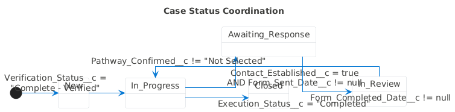

# 04 - Field Reference

**Last updated: October 15, 2025**

Comprehensive field documentation for all succession-specific custom fields.

---

## Related Diagrams

- Data Model (ERD): `diagrams/images/erd/data-model.png`
- Status Coordination – State Machine (PlantUML): `diagrams/images/plantuml/status-coordination-state.png`

---

## Person Account Compatibility

**Critical Note:** This system primarily uses **Person Accounts** (Financial Services Cloud) for successor management:

- **Person Accounts:** Use `Account.PersonEmail` (NOT `Contact.Email`)
- **Email Actions:** Use `Account.SendEmail` action (NOT `Contact.SendEmail`)
- **Contact Cadence:** Flows and LWC components detect Person Account vs Business Account automatically
- **Test Data:** All Snowfakery recipes generate Person Accounts by default

**Business Account Support:** The system also supports Business Accounts with Contact relationships when needed.

---

## Case Object Fields (16 fields)

### Contact_Attempt_Count__c

**Type:** Number (1 decimal)  
**Record Type:** EstateAdministration

**Description:**
> BRD Contact Cadence: Running count of contact attempts (1-5). Maps to BRD Day 0, 5, 35, 65, 95 cadence. Auto-increments with each task completion. After 5 attempts without contact, case escalates to trading/liquidation.

**Help Text:**
> Number of contact attempts made (1-5). Automatically increments as contact tasks are completed. After 5 attempts, case is escalated per BRD.

**BRD Reference:** Section 3.2 - Contact Cadence Requirements  
**Related Fields:** Task.Contact_Attempt_Number__c, Contact_Established__c

---

### Contact_Established__c

**Type:** Checkbox  
**Record Type:** EstateAdministration

**Description:**
> BRD Phase 1-2: Indicates whether verbal contact has been successfully established with the successor. Used as gate to stop contact cadence automation. Only check after direct conversation where successor understands their options.

**Help Text:**
> Check this box ONLY after you have successfully spoken with the successor and confirmed they understand their three pathway options (Final Grant, New DAF, Disclaim).

**BRD Reference:** Section 3.1 - Phase 1: Initial Contact and Verification  
**Related Fields:** Contact_Established_Date__c, Form_Sent_Date__c

---

### Verification_Status__c

**Type:** Picklist  
**Record Type:** EstateAdministration

**Description:**
> BRD Phase 1: Manual workflow trigger field controlled by Quick Action. Values: "Not Started" (default) → "Complete - Verified". Provides intentional entry point for succession processing despite 90%+ of cases arriving ready.

**Help Text:**
> Workflow status for initial verification. Set to "Complete - Verified" to begin contact cadence. Use the "✅ Begin Succession Processing" Quick Action button.

**BRD Reference:** Section 3.1 - Phase 1: Initial Contact and Verification  
**Values:** Not Started, Complete - Verified

---

### Pathway_Confirmed__c

**Type:** Picklist  
**Record Type:** EstateAdministration

**Description:**
> BRD Phase 2: Successor's chosen succession pathway. Three mutually exclusive options per BRD section 3.1. Pathway locks once documentation begins - cannot be changed after that point.

**Help Text:**
> Select the succession pathway chosen by the successor. This selection locks once documentation collection begins and cannot be changed.

**BRD Reference:** Section 3.2 - Pathway Selection Requirements  
**Values:** Not Selected, Final Grant, New DAF Account, Disclaim Assets

---

### Form_Sent_Date__c

**Type:** DateTime  
**Record Type:** EstateAdministration

**Description:**
> BRD Phase 3: Timestamp when pathway selection form invitation email was sent to successor. Auto-populated by Case_Send_Succession_Form flow when Contact_Established__c = TRUE.

**Help Text:**
> Date and time when the pathway selection form invitation was emailed to the successor. Automatically populated when contact is established.

**BRD Reference:** Section 3.3 - Phase 3: Online Pathway Selection  
**Related Fields:** Form_Completed_Date__c

---

### Form_Completed_Date__c

**Type:** DateTime  
**Record Type:** EstateAdministration

**Description:**
> BRD Phase 3: Timestamp when successor completed the public pathway selection form. Set by SuccessionPublicFormController when form is submitted with pathway choice.

**Help Text:**
> Date and time when the successor completed the pathway selection form. This marks the completion of the online selection phase.

**BRD Reference:** Section 3.3 - Phase 3: Online Pathway Selection  
**Related Fields:** Form_Sent_Date__c, Pathway_Confirmed__c

---

### Execution_Status__c

**Type:** Picklist  
**Record Type:** EstateAdministration

**Description:**
> BRD Phase 5: Tracks the status of pathway execution. Values progress from "Not Started" through execution phases to "Completed". Used for status coordination (manual or via inactive flows).

**Help Text:**
> Current status of pathway execution. This field tracks the progress of implementing the successor's chosen pathway.

**BRD Reference:** Section 3.5 - Phase 5: Pathway Execution  
**Values:** Not Started, In Progress, On Hold, Completed

---

### Execution_Started_Date__c

**Type:** DateTime  
**Record Type:** EstateAdministration

**Description:**
> BRD Phase 5: Timestamp when pathway execution began. Set when Execution_Status__c changes from "Not Started" to "In Progress". Used for SLA tracking and reporting.

**Help Text:**
> Date and time when pathway execution began. This marks the start of implementing the successor's chosen pathway.

**BRD Reference:** Section 3.5 - Phase 5: Pathway Execution  
**Related Fields:** Execution_Status__c, Execution_Completed_Date__c

---

### Execution_Completed_Date__c

**Type:** DateTime  
**Record Type:** EstateAdministration

**Description:**
> BRD Phase 5: Timestamp when pathway execution was completed. Set when Execution_Status__c changes to "Completed". Used for status coordination (manual or via inactive flows).

**Help Text:**
> Date and time when pathway execution was completed. This marks the successful completion of the succession process.

**BRD Reference:** Section 3.5 - Phase 5: Pathway Execution  
**Related Fields:** Execution_Status__c, Execution_Started_Date__c

---

### Execution_Notes__c

**Type:** Long Text Area (32,768)  
**Record Type:** EstateAdministration

**Description:**
> BRD Phase 5: Free-form text field for execution notes and documentation. Captures important details about pathway implementation, issues encountered, and resolution steps.

**Help Text:**
> Detailed notes about the pathway execution process. Include any issues encountered and how they were resolved.

**BRD Reference:** Section 3.5 - Phase 5: Pathway Execution

---

### Asset_Transfer_Status__c

**Type:** Picklist  
**Record Type:** EstateAdministration

**Description:**
> BRD Phase 5: Tracks the status of financial account transfers during pathway execution. Used for Final Grant and New DAF Account pathways to monitor transfer completion.

**Help Text:**
> Status of any financial account transfers required for this succession pathway. Updated as transfers are processed.

**BRD Reference:** Section 3.5 - Phase 5: Pathway Execution  
**Values:** Not Started, Initiated, In Progress, Completed, Failed

---

### New_DAF_Account_Number__c

**Type:** Text (50)  
**Record Type:** EstateAdministration

**Description:**
> BRD Phase 5: Account number of the new DAF account created for the successor. Populated when New DAF Account pathway is executed. Used for account linking and verification.

**Help Text:**
> Account number of the new Donor-Advised Fund account created for the successor. Populated automatically during account creation.

**BRD Reference:** Section 3.2.2 - New DAF Account Pathway

---

### Grant_Settlement_Status__c

**Type:** Picklist  
**Record Type:** EstateAdministration

**Description:**
> BRD Phase 5: Tracks grant settlement progress for Final Grant pathway. Monitors the process of distributing account balance as charitable grants to designated beneficiaries.

**Help Text:**
> Status of grant settlements for the Final Grant pathway. Tracks the distribution of funds to designated charities.

**BRD Reference:** Section 3.2.1 - Final Grant Pathway  
**Values:** Not Started, Beneficiaries Confirmed, Grants Initiated, Grants Completed

---

### Disclaimer_Disposition__c

**Type:** Picklist  
**Record Type:** EstateAdministration

**Description:**
> BRD Phase 5: Tracks the final disposition when successor disclaims their inheritance rights. Determines how the account will be handled per organizational policy.

**Help Text:**
> Final disposition when successor disclaims their rights. Determines how the account balance will be handled according to policy.

**BRD Reference:** Section 3.2.3 - Disclaim Assets Pathway  
**Values:** Pending Review, Transferred to Charity, Liquidated, Held in Trust

---

### SLA_Status__c

**Type:** Formula (Text)  
**Record Type:** EstateAdministration

**Description:**
> Calculated field that evaluates SLA milestone compliance. Returns "On Track", "At Risk", or "Violated" based on milestone completion timers. Used for list view filtering and escalation routing.

**Help Text:**
> Automatically calculated SLA status based on milestone timers. Shows whether this case is on track, at risk, or has violated SLA targets.

**BRD Reference:** Section 3.6 - SLA Management  
**Formula:** `IF(Milestones_Violated__c > 0, "Violated", IF(Milestones_At_Risk__c > 0, "At Risk", "On Track"))`

---

### Next_Task_Scheduled_At__c

**Type:** DateTime  
**Record Type:** EstateAdministration

**Description:**
> Timestamp of the next scheduled contact attempt task. Calculated from contact cadence schedule (Day 0, 5, 35, 65, 95). Used for agent workload planning and task routing.

**Help Text:**
> Date and time of the next scheduled contact attempt. Used for planning agent workload and task assignments.

**BRD Reference:** Section 3.2 - Contact Cadence Requirements  
**Related Fields:** Contact_Attempt_Count__c

---

## Task Object Fields (2 fields)

### Contact_Attempt_Number__c

**Type:** Number (1 decimal)  
**Object:** Task

**Description:**
> Indicates which contact attempt this task represents (1-5). Maps to Case.Contact_Attempt_Count__c for tracking. Used by contact cadence flows to schedule follow-up tasks.

**Help Text:**
> Which contact attempt this task represents (1 of 5). Synced with the case's contact attempt counter.

**BRD Reference:** Section 3.2 - Contact Cadence Requirements  
**Related Fields:** Case.Contact_Attempt_Count__c

---

### Succession_Contact_Established__c

**Type:** Checkbox  
**Object:** Task

**Description:**
> Indicates whether this specific task resulted in successful contact with the successor. Used by flows to update Case.Contact_Established__c and halt further contact attempts.

**Help Text:**
> Check this box if this task resulted in successful contact with the successor. This will stop further automated contact attempts.

**BRD Reference:** Section 3.2 - Contact Cadence Requirements  
**Related Fields:** Case.Contact_Established__c

---

## Activity (Event) Fields (2 fields)

### Contact_Attempt_Number__c

**Type:** Number (1 decimal)  
**Object:** Event

**Description:**
> Same as Task.Contact_Attempt_Number__c but for scheduled Events (e.g., scheduled phone calls, meetings). Maps to Case.Contact_Attempt_Count__c.

**Help Text:**
> Which contact attempt this event represents (1 of 5). Synced with the case's contact attempt counter.

**BRD Reference:** Section 3.2 - Contact Cadence Requirements

---

### Succession_Contact_Established__c

**Type:** Checkbox  
**Object:** Event

**Description:**
> Same as Task.Succession_Contact_Established__c but for Events. Indicates whether this scheduled activity resulted in successful contact.

**Help Text:**
> Check this box if this event resulted in successful contact with the successor. This will stop further automated contact attempts.

**BRD Reference:** Section 3.2 - Contact Cadence Requirements

---

## Account Object Fields (2 audit fields)

### Deceased__c

**Type:** Checkbox  
**Object:** Account (Person Account)

**Description:**
> Marks account holder as deceased. Used for audit trail and visual indicator on Account record. Not actively used in automation but provides valuable context for reports and manual reviews.

**Help Text:**
> Check this box to mark the account holder as deceased. This creates an audit trail for compliance purposes.

**Use Cases:**
- Quick visual indicator on Account record
- Historical reference for compliance
- Manual reporting and data analysis
- Demo narrative context

---

### Date_of_Death__c

**Type:** Date  
**Object:** Account (Person Account)

**Description:**
> Records the date of death for deceased account holders. Used for audit trail and compliance reporting. Not actively used in automation but provides important historical context.

**Help Text:**
> Date of death for the account holder. This is an important audit field for compliance and historical records.

**Use Cases:**
- Compliance documentation
- Historical timeline reference
- Manual reporting
- Demo narrative context

---

## Field Summary

**Total Custom Fields:** 20

| Object    | Field Count | Notes                          |
| --------- | ----------- | ------------------------------ |
| **Case**  | 16          | Core succession workflow       |
| **Task**  | 2           | Contact cadence tracking       |
| **Event** | 2           | Activity-based contact cadence |
| **Account** | 2         | Audit trail (not used in flows) |

**All fields have:**
- ✅ Comprehensive admin descriptions with BRD references
- ✅ User-friendly help text for Estate Operations staff
- ✅ Proper field-level security via permission sets
- ✅ 100% coverage in Succession_Management_Access permission set (16/16 Case fields)

---

## Pathway Flow Summary

### Phase 1: Initial Contact & Verification (Day 0-1)

**Fields Used:**
- `Verification_Status__c` → "Complete - Verified" (manual trigger)
- `Contact_Attempt_Count__c` → Increments from 0 to 1
- `Task.Contact_Attempt_Number__c` → 1
- `Contact_Established__c` → TRUE (if successful)

---

### Phase 2: Contact Cadence (Day 0-95)

**Fields Used:**
- `Contact_Attempt_Count__c` → Increments 1→2→3→4→5
- `Task.Contact_Attempt_Number__c` → Tracks each attempt
- `Task.Succession_Contact_Established__c` → Stops cadence when TRUE
- `Next_Task_Scheduled_At__c` → Schedules next attempt (Day 5, 35, 65, 95)

---

### Phase 3: Pathway Selection (Post-Contact)

**Fields Used:**
- `Form_Sent_Date__c` → Timestamp when email sent
- `Form_Completed_Date__c` → Timestamp when form submitted
- `Pathway_Confirmed__c` → Final Grant / New DAF / Disclaim

---

### Phase 4: Documentation Collection

**Fields Used:**
- (External system integration - no custom fields in Salesforce)

---

### Phase 5: Pathway Execution

**Fields Used:**
- `Execution_Status__c` → Not Started → In Progress → Completed
- `Execution_Started_Date__c` → Timestamp
- `Execution_Completed_Date__c` → Timestamp
- `Execution_Notes__c` → Free-form documentation

**Pathway-Specific Fields:**

**Final Grant:**
- `Grant_Settlement_Status__c` → Tracks grant distribution

**New DAF:**
- `New_DAF_Account_Number__c` → New account number
- `Asset_Transfer_Status__c` → Transfer progress

**Disclaim:**
- `Disclaimer_Disposition__c` → Final disposition

---

## Related Documentation

- **01-SYSTEM-ARCHITECTURE.md** - System overview and data model
- **02-DEPLOYMENT-AND-CICD.md** - Deployment procedures
- **03-ADMIN-RUNBOOK.md** - Admin setup and configuration
- **05-TESTING-AND-DATA.md** - Test data generation
- **06-SECURITY.md** - Field-level security details
