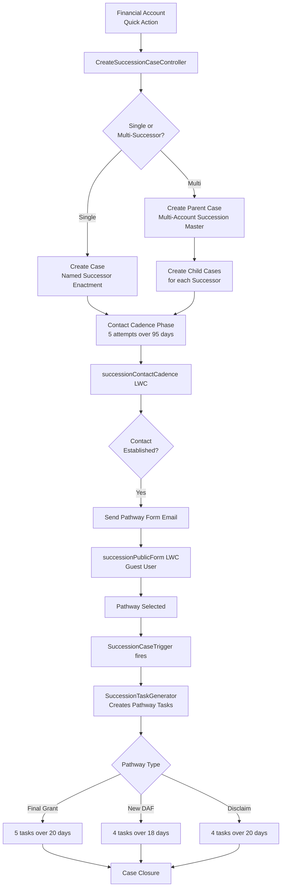
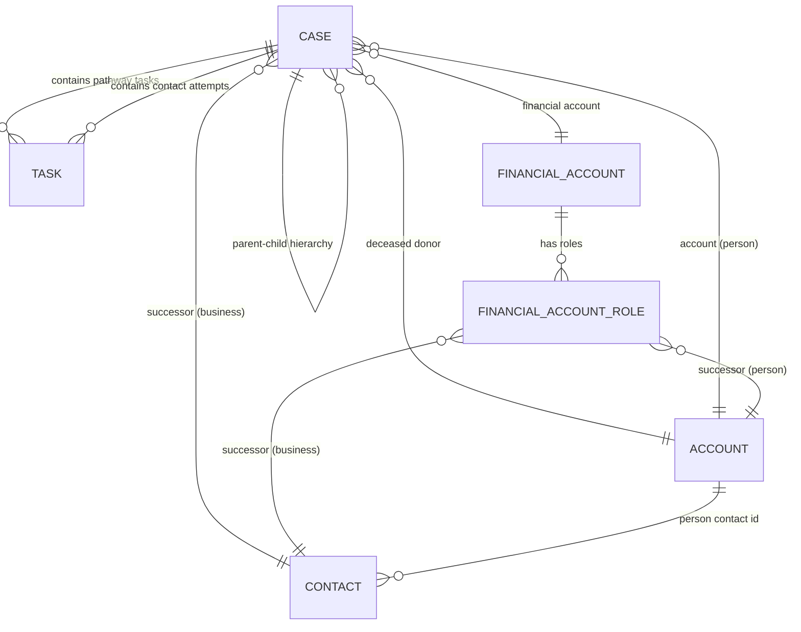

# Succession Management System - Comprehensive Technical Analysis

**Generated:** 2025-11-16
**Version:** 1.0
**System:** Salesforce Financial Services Cloud Estate Administration

---

## Executive Summary

The **Succession Management System** is a well-architected Salesforce FSC solution for managing deceased donor account transitions at Schwab Charitable Fund. Built on **standard objects only** (no custom objects), it leverages trigger-based automation, Person Account support, and a multi-phase contact cadence workflow. The system demonstrates strong architectural patterns but has **critical correctness gaps** in duplicate prevention and contact cadence progression that should be addressed immediately.

**Key Metrics:**

- **9 production Apex classes** (1,084 total lines of code)
- **12 test classes** with comprehensive coverage patterns
- **5 Lightning Web Components** (1,084 JS LOC in primary component)
- **23 custom fields** across Case, Task, Account
- **0 custom objects** (standard FSC objects only)
- **6 inactive flows** (automation migrated to trigger-based Apex)

---

## 1. Architecture Overview

### 1.1 System Architecture

The system follows a **trigger-based automation pattern** with modern Lightning Web Components, designed specifically for demo/sandbox environments with simplified constraints.

#### Core Design Principles

- **Demo-optimized**: Built for demonstration with no validation rules
- **Standard objects only**: No custom objects - leverages FSC standard objects
- **Trigger over Flow**: Primary automation uses Apex triggers instead of declarative flows
- **Person Account support**: Comprehensive handling of both Person Accounts and Business Accounts with Contacts

#### System Flow



### 1.2 Core Components

#### **Apex Classes (9 Production + 12 Test)**

**Controllers:**

- [`CreateSuccessionCaseController`](file:///Users/joshsmbp/Documents/Github/Estates-SFDX-Project/force-app/main/default/classes/CreateSuccessionCaseController.cls) (415 LOC) - Multi-successor case orchestration
- [`ContactCadenceController`](file:///Users/joshsmbp/Documents/Github/Estates-SFDX-Project/force-app/main/default/classes/ContactCadenceController.cls) (854 LOC) - Contact attempt workflow, email validation
- [`SuccessionPublicFormController`](file:///Users/joshsmbp/Documents/Github/Estates-SFDX-Project/force-app/main/default/classes/SuccessionPublicFormController.cls) (272 LOC) - Guest user pathway form
- [`CaseHierarchyController`](file:///Users/joshsmbp/Documents/Github/Estates-SFDX-Project/force-app/main/default/classes/CaseHierarchyController.cls) (241 LOC) - Multi-successor visualization

**Automation:**

- [`SuccessionCaseTrigger`](file:///Users/joshsmbp/Documents/Github/Estates-SFDX-Project/force-app/main/default/triggers/SuccessionCaseTrigger.trigger) (10 LOC) - Single trigger for Case automation
- [`SuccessionTaskGenerator`](file:///Users/joshsmbp/Documents/Github/Estates-SFDX-Project/force-app/main/default/classes/SuccessionTaskGenerator.cls) (292 LOC) - Pathway task creation engine

**Utilities:**

- [`SuccessionUtilities`](file:///Users/joshsmbp/Documents/Github/Estates-SFDX-Project/force-app/main/default/classes/SuccessionUtilities.cls) (779 LOC) - Email validation, Chatter, ContentNote integration

**Invocables (for Flow compatibility):**

- [`SuccessionTaskCreator`](file:///Users/joshsmbp/Documents/Github/Estates-SFDX-Project/force-app/main/default/classes/SuccessionTaskCreator.cls) - Contact task creation
- [`SuccessionChatterPoster`](file:///Users/joshsmbp/Documents/Github/Estates-SFDX-Project/force-app/main/default/classes/SuccessionChatterPoster.cls) - Standardized notifications
- [`SuccessionPathwayEmailSender`](file:///Users/joshsmbp/Documents/Github/Estates-SFDX-Project/force-app/main/default/classes/SuccessionPathwayEmailSender.cls) - Email automation

#### **Lightning Web Components (5)**

| Component                                                                                                                                                                  | Purpose            | LOC   | Key Features                                                         |
| -------------------------------------------------------------------------------------------------------------------------------------------------------------------------- | ------------------ | ----- | -------------------------------------------------------------------- |
| [`successionContactCadence`](file:///Users/joshsmbp/Documents/Github/Estates-SFDX-Project/force-app/main/default/lwc/successionContactCadence/successionContactCadence.js) | Primary contact UI | 1,084 | Progress indicator, Kanban cards, countdown timers, email validation |
| [`successionPublicForm`](file:///Users/joshsmbp/Documents/Github/Estates-SFDX-Project/force-app/main/default/lwc/successionPublicForm/successionPublicForm.js)             | Guest pathway form | 521   | 7 error types, retry mechanism, URL parameter extraction             |
| [`createSuccessionCase`](file:///Users/joshsmbp/Documents/Github/Estates-SFDX-Project/force-app/main/default/lwc/createSuccessionCase/createSuccessionCase.js)             | Quick Action       | 195   | Headless, toast notifications, duplicate prevention                  |
| [`caseHierarchyViewer`](file:///Users/joshsmbp/Documents/Github/Estates-SFDX-Project/force-app/main/default/lwc/caseHierarchyViewer/caseHierarchyViewer.js)                | Hierarchy tree     | -     | Parent/child display, configurable fields                            |
| [`recordPathwaySelection`](file:///Users/joshsmbp/Documents/Github/Estates-SFDX-Project/force-app/main/default/lwc/recordPathwaySelection/recordPathwaySelection.js)       | Pathway selector   | -     | Sets `Pathway_Confirmed__c` trigger field                            |

### 1.3 Data Model (Standard Objects Only)

#### **Object Relationships**



#### **Custom Fields Summary**

**Case (14 fields):**

- `Pathway_Confirmed__c` - **Critical trigger field** (Final Grant | New DAF Account | Disclaim Assets)
- `Contact_Established__c`, `Contact_Established_Date__c`, `Contact_Attempt_Count__c`
- `Form_Sent_Date__c`, `Form_Completed_Date__c`
- `Successor__c` (Contact lookup), `Successor_Email__c`, `Successor_Phone__c`
- `Deceased_Donor__c` (Account lookup)
- `Execution_Status__c`, `Verification_Status__c`, `SLA_Status__c` (Formula)
- `New_DAF_Account_Number__c`

**Task (2 fields):**

- `Contact_Attempt_Number__c` (1-5)
- `Succession_Contact_Established__c` (checkbox)

**FinancialAccountRole (1 field):**

- `SuccessorAllocation__c` (Percent, must sum to 100%)

### 1.4 Integration Patterns

#### **Email Integration**

- **Pattern**: Lightning Email Composer Quick Actions
- **Person Account**: `Account.SendEmail` Quick Action
- **Business Account**: `Contact.SendEmail` Quick Action
- **Template Selection**: Manual (compliance review required)
- **Tracking**: `Form_Sent_Date__c` + Chatter notification

#### **Chatter Integration**

- **Pattern**: FeedItem creation via `SuccessionUtilities.createChatterPost()`
- **LinkPost Support**: Clickable record links
- **Use Cases**: Pathway task notifications, contact outcomes, workflow transitions
- **Security**: `SYSTEM_MODE` option for automation context

#### **ContentNote Integration**

- **Pattern**: Dual storage for compliance
- **Primary**: Task.Description (immediate, always available)
- **Secondary**: ContentNote (structured format, better UX)
- **Querying**: ContentDocumentLink → ContentDocument → ContentVersion (FileType = 'SNOTE')
- **Async Handling**: 1.5s delay after creation for platform indexing

### 1.5 Key Business Processes

#### **4-Phase Workflow**

1. **Case Creation Phase**
   - Quick Action from FinancialAccount
   - Multi-successor detection (allocation % validation)
   - Parent-child case hierarchy creation
   - Deceased donor identification

2. **Contact Cadence Phase (95 days)**
   - 5 attempts: Day 0, 5, 35, 65, 95
   - Custom Metadata-driven wait durations
   - Email validation (Person Account vs Contact field resolution)
   - ContentNote tracking for compliance
   - Date-gated task unlocking

3. **Pathway Selection Phase**
   - Guest user pathway form (no authentication)
   - URL-based access control (caseId parameter)
   - 3 pathway options: Final Grant, New DAF Account, Disclaim Assets
   - Form completion triggers automation

4. **Execution Phase (18-20 days)**
   - Pathway-specific task series:
     - **Final Grant**: 5 tasks (Days 2, 5, 10, 15, 20)
     - **New DAF Account**: 4 tasks (Days 2, 7, 12, 18)
     - **Disclaim Assets**: 4 tasks (Days 3, 8, 15, 20)
   - Chatter notifications on task creation
   - SLA tracking via formula fields

---

## 2. Technical Implementation Details

### 2.1 Apex Class Structure & Responsibilities

#### **SuccessionTaskGenerator** (Primary Automation Engine)

**Lines of Code:** 292
**Pattern:** Trigger handler with private helper methods
**Security Model:** `with sharing` + `SYSTEM_MODE` for DML

**Key Method:**

```apex
public static void createPathwayTasks(List<Case> newCases, Map<Id, Case> oldCaseMap)
```

**Responsibilities:**

- Detects `Pathway_Confirmed__c` field changes
- Generates 4-5 pathway-specific tasks based on pathway type
- Creates Chatter notifications
- Uses `SYSTEM_MODE` for task creation (guest user compatibility)

**Task Templates:**

- **Final Grant**: 5 tasks (days 2, 5, 10, 15, 20)
- **New DAF Account**: 4 tasks (days 2, 7, 12, 18)
- **Disclaim Assets**: 4 tasks (days 3, 8, 15, 20)

**Critical Design Decision:**
Uses `SYSTEM_MODE` instead of `USER_MODE` because:

1. Guest users submit pathway forms → trigger fires → tasks must be created
2. Guest user profile lacks Task create permission
3. Alternative would be scheduled batch job (poor UX)
4. **Documented** in comments as intentional

#### **CreateSuccessionCaseController** (Multi-Successor Orchestrator)

**Lines of Code:** 415
**Pattern:** Quick Action controller with complex branching logic
**Security Model:** `with sharing` + `SYSTEM_MODE` for case creation

**Key Methods:**

- `createSuccessionCase(Id financialAccountId)` - Main entry point
- `createSingleSuccessorCase()` - Single successor branch
- `createMultiSuccessorCases()` - Multi-successor coordination
- `validateRequirements()` - Idempotency checks
- `getContactIdForSuccessor()` - Person Account vs Contact resolution

**Validation:**

- Successor allocation percentages (must sum to 100%)
- Contact existence for cadence workflow
- Deceased donor identification
- Duplicate case prevention

#### **ContactCadenceController** (Contact Workflow Manager)

**Lines of Code:** 854
**Pattern:** LWC controller with extensive business logic
**Security Model:** `with sharing` + `WITH USER_MODE`

**Key Methods:**

- `getContactCadence(Id caseId)` - Main data provider (cacheable)
- `saveAttemptOutcome()` - Records contact outcome
- `markFormEmailSent()` - Tracks pathway email sends
- `getAttemptWaitDurations()` - Custom Metadata configuration
- `validateEmailAddress()` - Compliance-critical email validation

**Complexity Refactoring:**
Reduced cognitive complexity from 63 to 10 via helper method extraction

**Email Validation:**
Person Account vs Contact field resolution with comprehensive opt-out checking

**ContentNote Integration:**
Dual storage (Task.Description + ContentNote) for compliance

#### **SuccessionUtilities** (Shared Library)

**Lines of Code:** 779
**Pattern:** Static utility class with tiered methods
**Security Model:** `with sharing` + `WITH USER_MODE`

**Tier 1 Utilities (High Priority):**

- Email validation (RFC 5322 compliant regex)
- Chatter post creation (with/without record links)
- Record type lookup (cached for performance)
- ContentNote integration

**Tier 2 Utilities:**

- DateTime formatting (4 predefined patterns)
- String manipulation (integer extraction, section parsing)
- Security helpers (FLS enforcement, SQL injection prevention)
- Error handling (AuraHandledException wrapper)

**Tier 3 Utilities:**

- Business logic (successor allocation validation)
- Contact querying

### 2.2 LWC Implementation Patterns

#### **successionContactCadence** (Primary Contact UI)

**Lines of Code:** 1,084
**Pattern:** Wire service + imperative Apex with state management

**Key Features:**

- **Progress indicator**: Visual completion tracking
- **Kanban-style attempt cards**: 5 cards with date-gating
- **Countdown timers**: Millisecond-based with Custom Metadata configuration
- **Date-gating**: Tasks unlock based on ActivityDate
- **Email validation**: Person Account vs Contact field resolution
- **ContentNote display**: Historical notes on completed attempts
- **Email composer integration**: Quick Action pattern for cross-environment compatibility
- **Dual note storage**: Task.Description (immediate) + ContentNote (structured)

**Performance Optimizations:**

- Memoized attempt calculations
- Centralized state management
- No polling (on-demand countdown calculation)

**Testing:** Jest unit tests with wire adapter mocks

#### **successionPublicForm** (Guest User Form)

**Lines of Code:** 521
**Pattern:** Form with comprehensive error categorization

**Error Handling:** 7 error types:

1. URL parameter errors
2. Network errors
3. Server errors
4. Validation errors
5. Permission errors
6. Not found errors
7. Already submitted errors

**Features:**

- URL parameter extraction (caseId)
- Salesforce ID validation (15/18 character pattern)
- Retry mechanism (max 3 attempts)
- Pre-filled form data from Apex
- Pathway selection (3 options)
- Additional notes capture

### 2.3 Security Model

#### **Permission Sets**

1. `Succession_Management_Access` - Admin/agent access
2. `Succession_Field_Access` - Field-level security
3. `Succession_Guest_Access` - Public site access

#### **Apex Security Patterns**

**Standard Pattern** (7 of 8 production classes):

```apex
public with sharing class ControllerName {
    List<Case> cases = [SELECT Id FROM Case WHERE ... WITH USER_MODE];
    Database.insert(records, AccessLevel.USER_MODE);
}
```

**Exception - Automation Context** (SuccessionTaskGenerator):

```apex
public with sharing class SuccessionTaskGenerator {
    // SYSTEM_MODE required for guest user pathway submissions
    Database.insert(tasksToCreate, false, AccessLevel.SYSTEM_MODE);
    SuccessionUtilities.createChatterPost(caseId, postBody, true);
}
```

**⚠️ Security Inconsistency Identified:**
CreateSuccessionCaseController uses `SYSTEM_MODE` in multiple places (lines 168, 204, 252, 343-355, 379-395) despite documentation claiming `WITH USER_MODE` everywhere except SuccessionTaskGenerator. Documentation likely out of date.

### 2.4 Test Coverage & Testing Patterns

#### **Test Classes (12)**

1. `SuccessionTaskGenerator_Test` - Pathway task generation
2. `SuccessionIntegrationTest` - End-to-end workflows
3. `SuccessionPerformanceTestSuite` - Bulk operations
4. `ContactCadenceController_Test` - Contact cadence logic
5. `CreateSuccessionCaseController_Test` - Case creation
6. `SuccessionUtilities_Test` - Utility methods
7. Additional test classes for other controllers

#### **Pattern 1: Inline Test Helpers**

Self-contained tests with no external test data factory dependency:

```apex
private static Account createDeceasedDonorAccount(String name) {
    Account acc = new Account(Name = name, Deceased__c = true);
    insert acc;
    return acc;
}
```

#### **Pattern 2: End-to-End Workflow Tests**

Complete workflow validation from case creation through task generation

#### **Pattern 3: Bulk Testing**

Tests with 200 test cases to validate governor limits and bulk processing

#### **Pattern 4: Negative Testing**

Validates that tasks are NOT created when conditions aren't met

#### **Pattern 5: LWC Jest Tests**

Each LWC has corresponding Jest tests in `__tests__/` subdirectories with comprehensive mocks

---

## 3. Technical Gaps & Issues

### 3.1 Critical Issues (Fix Immediately)

#### **🔴 Issue 1: Duplicate Case Creation Risk**

**Severity:** High
**Impact:** Inconsistent processing, duplicate work, confusing UX

**Problem:**
`CreateSuccessionCaseController.validateRequirements()` uses `WITH USER_MODE` (lines 312-331). If the caller can't see existing cases due to sharing rules, the query returns no results and the system creates duplicates in `SYSTEM_MODE`.

**Additional Gap:**
No uniqueness constraint to prevent multiple "Master" cases per Financial Account; no defensive recheck before insert.

**Example Scenario:**

```
User A (limited sharing) → Creates case for Financial Account X
User B (limited sharing) → Creates DUPLICATE case for Financial Account X
```

#### **🔴 Issue 2: Contact Cadence Stalls After Attempt 1**

**Severity:** High
**Impact:** Cadence workflow completely blocks after first attempt; agents must manually create tasks

**Problem:**
`ContactCadenceController.saveAttemptOutcome()` comments indicate "Flow Task_Create_Next_Contact_Attempt will auto-create next task" but **all 6 flows are marked inactive**. Next contact attempt tasks are never created automatically.

**Current State:**

- Attempt 1 task created manually or via initial setup
- Attempt 2-5 tasks: **NOT CREATED AUTOMATICALLY**
- Agents blocked or forced to create tasks manually

### 3.2 High-Priority Issues

#### **🟠 Issue 3: Pathway Task Duplication**

**Severity:** Medium-High
**Impact:** Duplicate tasks, drift from business process

**Problem 1: No Idempotency**
`SuccessionTaskGenerator` creates tasks every time `Pathway_Confirmed__c` changes (lines 41-71) without checking for existing tasks. Toggling the field or changing pathways spawns duplicate task series.

**Problem 2: Hard-Coded Templates**
Task templates hard-coded in Apex; admins cannot adjust without deployment. Risk of drift from business process.

#### **🟠 Issue 4: Security Mode Inconsistencies**

**Severity:** Medium
**Impact:** Potential audit issues, documentation drift

**Problem:**
Documentation claims `WITH USER_MODE` everywhere except `SuccessionTaskGenerator`. In reality:

- `CreateSuccessionCaseController` uses `SYSTEM_MODE` in multiple places (lines 168, 204, 252, 343-355, 379-395)
- `ContactCadenceController` mixes raw DML (`update parentCase`) with `Database.update(..., USER_MODE)`
- Documentation out of date with actual implementation

#### **🟠 Issue 5: Brittle Role Filtering**

**Severity:** Medium
**Impact:** Can match unintended values, loses selectivity

**Problem:**
`getDeceasedDonorAccount()` and `getSuccessors()` use `LIKE '%Primary%'` and `LIKE '%Successor%'` (lines 349, 391). This:

- Can match unintended values (e.g., "Secondary Primary Owner")
- Loses selectivity
- Is case-sensitive

**Better Approach:**
Use exact values or named constants:

```apex
WHERE FinServ__Role__c = 'Primary Owner'
WHERE FinServ__Role__c = 'Successor'
```

### 3.3 Medium-Priority Issues

#### **🟡 Issue 6: Email Send Workflow UX Gap**

**Severity:** Medium
**Impact:** Reporting inconsistency, manual tracking burden

**Problem:**
LWC asks agents to "mark as sent" via separate action (`ContactCadenceController.markFormEmailSent()`), but there's no reliable callback from the email composer. Agents can forget, causing reporting inconsistency.

**Recommendation:**
Surface a persistent banner until marked (or auto-mark when composer is used via known quick action signal).

#### **🟡 Issue 7: Case Type Gating Brittleness**

**Severity:** Low-Medium
**Impact:** Silent failures across orgs with different configurations

**Problem:**
LWC validates record type and case type strictly (EstateAdministration + Succession Management/Named Successor Enactment). If picklist dev names vary across orgs, component silently disables.

**Recommendation:**
For production, consider admin-configurable allowlist.

#### **🟡 Issue 8: Accessibility & Guest UX**

**Severity:** Medium
**Impact:** Accessibility compliance, poor user experience in Experience Cloud

**Problems:**

- Experience/guest toasts aren't dependable for critical messages
- `confirm()` is not accessible
- Limited `aria-live` regions for status updates

**Recommendation:**
Ensure inline error regions in `successionPublicForm` and `successionContactCadence` templates with `aria-live` regions for status/toast equivalents.

### 3.4 Low-Priority Issues

#### **🔵 Issue 9: Limited Logging/Observability**

**Severity:** Low
**Impact:** Hard to diagnose issues in sandboxes and pilots

**Problem:**
Heavy use of `System.debug()` without central logging. No correlation IDs or structured logging.

**Recommendation:**
Minimal wrapper Logger utility would help.

#### **🔵 Issue 10: Minor Correctness Issues**

- `saveAttemptOutcome()` updates Case via plain `update` (no `USER_MODE`) while other writes use `Database.update(..., USER_MODE)` (inconsistent)
- Pathway tasks do not guard weekends/holidays (likely fine for demo)
- Dates based on `Form_Completed_Date__c` or today; if agent sets Pathway before form completion date is stamped, expectations may differ

---

## 4. Roadmap & Prioritization

### 4.1 Short-Term (1-2 Days) - High Impact, Low Risk

#### **Priority 1: Prevent Duplicate Cases**

**Effort:** Small (<1 hour)
**Impact:** High
**Risk:** Low

**Actions:**

1. Change `validateRequirements()` to `WITH SYSTEM_MODE` for query
2. Add post-query recheck just before insert
3. **Optional:** Add `Succession_Case_Key__c` unique External ID field (if custom fields allowed):
   - Formula: `FinancialAccountId + RecordTypeId + Type`
   - Enforce uniqueness at DML level

**Example Implementation:**

```apex
// Before insert of parent/child cases, recheck:
if ([SELECT COUNT() FROM Case
     WHERE FinServ__FinancialAccount__c = :financialAccountId
     AND Type IN ('Named Successor Enactment','Multi-Account Succession Master')
     AND IsClosed = FALSE
     WITH SYSTEM_MODE] > 0) {
    return createErrorResult('A succession case already exists for this financial account');
}
```

#### **Priority 2: Remove Flow Dependency for Cadence Progression**

**Effort:** Medium (1-3 hours)
**Impact:** High
**Risk:** Low

**Actions:**

1. In `ContactCadenceController.saveAttemptOutcome()`:
   - After closing attempt N, create task for attempt N+1 if N < 5
   - Use Custom Metadata wait days
   - Guard with idempotency: check for existing task with `Contact_Attempt_Number__c = N+1`
   - Keep bulk-safe

**Example Implementation:**

```apex
// After closing attempt N and contactEstablished == false
if (attemptNumber < 5) {
    Integer waitDays = getWaitDaysForAttempt(attemptNumber + 1);
    Date dueDate = Date.today().addDays(waitDays);

    // Idempotency check
    if ([SELECT COUNT() FROM Task
         WHERE WhatId = :caseId
         AND Contact_Attempt_Number__c = :attemptNumber + 1] == 0) {
        Task nextAttempt = new Task(
            WhatId = caseId,
            Contact_Attempt_Number__c = attemptNumber + 1,
            Status = 'Not Started',
            Subject = 'Contact Attempt ' + (attemptNumber + 1),
            ActivityDate = dueDate
        );
        Database.insert(nextAttempt, AccessLevel.USER_MODE);
    }
}
```

#### **Priority 3: Pathway Task Idempotency**

**Effort:** Medium (1-3 hours)
**Impact:** High
**Risk:** Low

**Actions:**

1. In `SuccessionTaskGenerator.createPathwayTasks()`:
   - Query existing tasks for cases with pathway subjects
   - Skip creating duplicates
   - **Optional:** If pathway changed, close or mark old tasks as "Canceled"

**Example Implementation:**

```apex
Set<String> subjects = pathway == 'Final Grant' ? FINAL_GRANT_SUBJECTS : ...;
Map<Id, Set<String>> existingByCase = new Map<Id, Set<String>>();

for (Task t : [SELECT WhatId, Subject
               FROM Task
               WHERE WhatId IN :caseIds
               AND Subject IN :subjects]) {
    if (!existingByCase.containsKey(t.WhatId)) {
        existingByCase.put(t.WhatId, new Set<String>());
    }
    existingByCase.get(t.WhatId).add(t.Subject);
}

// When building new tasks, only add if not in existingByCase
```

#### **Priority 4: Security Consistency + Documentation Sync**

**Effort:** Small (<1 hour)
**Impact:** Medium
**Risk:** Low

**Actions:**

1. Use `Database.update(..., AccessLevel.USER_MODE)` consistently for user-initiated writes
2. Update `AGENTS.md` and `CLAUDE.md` to document intentional `SYSTEM_MODE` usage
3. Add code comments explaining security mode choices

#### **Priority 5: A11y/UX Quick Wins**

**Effort:** Small (<2 hours)
**Impact:** Medium
**Risk:** Low

**Actions:**

1. Ensure inline error regions and `aria-live` sections in both LWCs
2. Keep toast for convenience but do not depend on it for critical messages
3. Replace `confirm()` with in-component modal where possible

#### **Priority 6: Jest/Apex Tests for Above**

**Effort:** Medium (2-4 hours)
**Impact:** High (prevents regressions)
**Risk:** Low

**Test Coverage:**

- Duplicate case prevention
- Next task creation on attempt completion
- Person Account email validation warnings
- Pathway task idempotency

### 4.2 Medium-Term (1-2 Weeks) - Moderate Impact

#### **Priority 7: Replace LIKE Filters with Precise Role Checks**

**Effort:** Small (<1 hour)
**Impact:** Medium
**Risk:** Low

**Actions:**
Use normalized exact match or Custom Metadata mapping for FSC role names; cache values in utilities.

#### **Priority 8: Externalize Pathway Task Templates**

**Effort:** Large (1-5 days)
**Impact:** Medium (if admins need to adjust frequently)
**Risk:** Medium

**Actions:**

1. Move three pathway series to Custom Metadata (title, description, priority, offsets)
2. Add thin cache in Apex utility
3. Provide admin UI for template management

**Only pursue if:** Admins request frequent task template changes

#### **Priority 9: Robust Idempotency and Backfill**

**Effort:** Medium (1-2 days)
**Impact:** Medium
**Risk:** Low

**Actions:**

1. If pathway changes, close or archive previous series (mark Status = Completed/Canceled)
2. Post Chatter note explaining change
3. Add small backfill script to de-duplicate historical demos

#### **Priority 10: Email "Mark Sent" Reliability**

**Effort:** Medium (1-2 days)
**Impact:** Medium
**Risk:** Low

**Actions:**

1. Add persistent UI banner on LWC after "No" outcome until `markFormEmailSent()` is clicked
2. Consider custom quick action that calls `markFormEmailSent()` on success

#### **Priority 11: Lightweight Logging**

**Effort:** Medium (2-3 days)
**Impact:** Medium
**Risk:** Low

**Actions:**
Introduce Logger utility (level-gated, requestId correlation) and replace `System.debug()` in hot paths.

### 4.3 Long-Term (2-4 Weeks) - Strategic

#### **Priority 12: Governance of Execution Modes**

**Effort:** Large (3-5 days)
**Impact:** High (for production)
**Risk:** Medium

**Actions:**

1. Centralize decisions for `USER_MODE` vs `SYSTEM_MODE` in shared utility
2. Enforce lint rules
3. Add static analyzer rule or PMD rule config

#### **Priority 13: Metadata-Driven Cadence**

**Effort:** Extra Large (1-2 weeks)
**Impact:** High (if policy changes frequent)
**Risk:** High

**Actions:**
Fully metadata-drive cadence attempts (names, statuses, wait periods, max attempts). Enables policy changes without code and supports A/B flows.

#### **Priority 14: Operational Safeguards**

**Effort:** Medium (3-5 days)
**Impact:** High
**Risk:** Low

**Actions:**

1. Add duplicate rules or unique Case key field as hard stop
2. Add "Pathway Locked" flag after tasks generated to prevent re-triggering without admin override
3. Add audit trail for pathway changes

#### **Priority 15: Experience Site Hardening (Guest)**

**Effort:** Large (1 week)
**Impact:** High (for production)
**Risk:** Medium

**Actions:**

1. Full CRUD/FLS guard in `SuccessionPublicFormController`
2. Explicit IP rate-limiting
3. CSRF token checks
4. Content Security Policy review
5. Add robot/SEO noindex headers if needed

---

## 5. Next Best Steps

### Immediate Actions (Week 1)

#### **Step 1: Fix Duplicate Case Check**

**Effort:** S (<1 hour)
**Owner:** Backend Developer
**Dependencies:** None

**Tasks:**

1. Change query in `validateRequirements()` to `WITH SYSTEM_MODE`
2. Add just-in-time recheck before insert
3. Optionally add `Succession_Case_Key__c` (unique) if allowed

**Acceptance Criteria:**

- No duplicate cases created when multiple users access same Financial Account
- Test with 2 users with different sharing rules accessing same account
- Error message clearly explains duplicate case exists

#### **Step 2: Create Next Contact Attempt in Apex**

**Effort:** M (1-3 hours)
**Owner:** Backend Developer
**Dependencies:** None

**Tasks:**

1. In `ContactCadenceController.saveAttemptOutcome()`:
   - After closing attempt N, compute due date from Custom Metadata
   - Insert Task with `Contact_Attempt_Number__c = N+1`
   - Guard with idempotency check
2. Use `Database.insert(..., USER_MODE)` unless running as guest/system
3. Document security mode choice

**Acceptance Criteria:**

- Attempt 2 task created automatically when Attempt 1 completed
- No duplicate tasks created if method called multiple times
- Works for attempts 2-5
- Does not create Attempt 6

#### **Step 3: Pathway Task Idempotency**

**Effort:** M (1-3 hours)
**Owner:** Backend Developer
**Dependencies:** None

**Tasks:**

1. In `SuccessionTaskGenerator.createPathwayTasks()`:
   - Query existing tasks for cases and pathway subjects
   - Skip creating duplicates
   - Optionally close/mark old tasks as "Canceled" if pathway changed

**Acceptance Criteria:**

- Toggling `Pathway_Confirmed__c` does not create duplicate tasks
- Changing pathway closes old tasks and creates new ones
- Chatter notification explains pathway change

#### **Step 4: Standardize DML Mode**

**Effort:** S (<1 hour)
**Owner:** Backend Developer
**Dependencies:** None

**Tasks:**

1. In `saveAttemptOutcome()`, change `update parentCase;` to `Database.update(parentCase, AccessLevel.USER_MODE)`
2. Keep `SYSTEM_MODE` only where needed (guest or system automations)
3. Add code comments explaining choice

**Acceptance Criteria:**

- All user-initiated DML uses `USER_MODE`
- All guest/system-initiated DML uses `SYSTEM_MODE`
- Comments explain security mode choice

#### **Step 5: Replace LIKE with Exact Role Checks**

**Effort:** S (<1 hour)
**Owner:** Backend Developer
**Dependencies:** None

**Tasks:**

1. Change `WHERE FinServ__Role__c LIKE '%Primary%'` to `WHERE FinServ__Role__c = 'Primary Owner'`
2. Change `WHERE FinServ__Role__c LIKE '%Successor%'` to `WHERE FinServ__Role__c = 'Successor'`
3. Centralize allowed values via small utility or metadata

**Acceptance Criteria:**

- Queries use exact role values
- No unintended matches
- Code easier to maintain

#### **Step 6: A11y/UX Inline Errors**

**Effort:** S (<2 hours)
**Owner:** Frontend Developer
**Dependencies:** None

**Tasks:**

1. Ensure both LWCs render `errorState` in markup via `aria-live` regions
2. Keep toast as secondary
3. Replace `confirm()` with in-component modal in Experience Cloud

**Acceptance Criteria:**

- Screen readers announce errors
- Errors visible without toasts
- No `confirm()` dialogs in guest forms

### Follow-Up Actions (Weeks 2-3)

#### **Step 7: Update Documentation**

**Effort:** S (1-2 hours)
**Owner:** Tech Lead

**Tasks:**

1. Update `AGENTS.md` with security mode patterns
2. Update `CLAUDE.md` with architecture changes
3. Document new idempotency patterns

#### **Step 8: Comprehensive Testing**

**Effort:** M (4-8 hours)
**Owner:** QA + Backend Developer

**Tasks:**

1. Add Apex tests for duplicate prevention
2. Add Apex tests for next task creation
3. Add Jest tests for A11y improvements
4. Run full test suite with coverage report

**Acceptance Criteria:**

- All new code covered by tests
- No regressions in existing tests
- Coverage > 80%

#### **Step 9: Deploy to Sandbox**

**Effort:** S (1 hour)
**Owner:** DevOps

**Tasks:**

1. Deploy to integration sandbox
2. Assign permission sets
3. Run smoke tests
4. Demo to stakeholders

### Strategic Planning (Month 2+)

#### **Step 10: Evaluate Metadata-Driven Templates**

**Decision Point:** Only if admins request frequent template changes

**Tasks:**

1. Survey admins on template change frequency
2. Estimate ROI of Custom Metadata approach
3. Design Custom Metadata schema
4. Plan migration path

#### **Step 11: Production Hardening Assessment**

**Decision Point:** If moving beyond demo/sandbox

**Tasks:**

1. Security audit (guest access, CRUD/FLS)
2. Duplicate rule implementation
3. Validation rule implementation
4. Performance testing (bulk operations)
5. Disaster recovery plan

---

## 6. Dependencies & Constraints

### Technical Dependencies

- **Custom Metadata**: Wait days already present; Step 2 depends on this
- **Unique Case Key**: Optional; requires custom field if implemented
- **Permission Sets**: Already configured; no changes needed for short-term fixes

### Organizational Constraints

- **Demo Environment**: No validation rules allowed
- **Standard Objects Only**: Cannot create custom objects
- **FSC License**: Required for FinancialAccount, FinancialAccountRole
- **Person Accounts**: Must be enabled in org

### Risk Mitigation

- Changing `USER_MODE` to `SYSTEM_MODE` can broaden data visibility; mitigate with clear documentation and final pre-insert recheck
- Auto-creating next attempt tasks increases DML in hot path; keep bulk-safe and idempotent
- Closing prior pathway tasks on pathway change may surprise users; start with "skip duplicates" only and message via Chatter

---

## 7. Effort Estimation Summary

| Priority | Item                        | Effort    | Impact | Risk   | Sprint |
| -------- | --------------------------- | --------- | ------ | ------ | ------ |
| 1        | Prevent duplicate cases     | S (<1h)   | High   | Low    | 1      |
| 2        | Contact cadence progression | M (1-3h)  | High   | Low    | 1      |
| 3        | Pathway task idempotency    | M (1-3h)  | High   | Low    | 1      |
| 4        | Security consistency        | S (<1h)   | Medium | Low    | 1      |
| 5        | A11y/UX quick wins          | S (<2h)   | Medium | Low    | 1      |
| 6        | Tests for above             | M (2-4h)  | High   | Low    | 1      |
| 7        | Replace LIKE filters        | S (<1h)   | Medium | Low    | 2      |
| 8        | Externalize templates       | L (1-5d)  | Medium | Medium | 3+     |
| 9        | Idempotency backfill        | M (1-2d)  | Medium | Low    | 2      |
| 10       | Email reliability           | M (1-2d)  | Medium | Low    | 2      |
| 11       | Lightweight logging         | M (2-3d)  | Medium | Low    | 3      |
| 12       | Execution mode governance   | L (3-5d)  | High   | Medium | 3+     |
| 13       | Metadata-driven cadence     | XL (1-2w) | High   | High   | 4+     |
| 14       | Operational safeguards      | M (3-5d)  | High   | Low    | 3      |
| 15       | Guest site hardening        | L (1w)    | High   | Medium | 4+     |

**Effort Legend:**

- S (Small): <1 hour
- M (Medium): 1-8 hours (1 day)
- L (Large): 1-5 days
- XL (Extra Large): 1-2 weeks

---

## 8. Success Metrics

### Short-Term Success Criteria (Sprint 1)

- ✅ Zero duplicate cases created in testing
- ✅ Contact cadence progresses automatically through all 5 attempts
- ✅ Pathway changes do not create duplicate tasks
- ✅ All user-initiated DML uses `USER_MODE` consistently
- ✅ Screen readers can access all error messages
- ✅ All new code covered by tests

### Medium-Term Success Criteria (Month 1)

- ✅ Role filtering uses exact matches
- ✅ Email "mark sent" workflow has 95%+ compliance
- ✅ Structured logging in place for key workflows
- ✅ Documentation updated and accurate

### Long-Term Success Criteria (Month 2+)

- ✅ Production-ready security model
- ✅ Metadata-driven configuration (if needed)
- ✅ Operational safeguards prevent data issues
- ✅ Guest site passes security audit

---

## 9. Conclusion

The Succession Management System is **architecturally sound** with strong patterns and comprehensive functionality. However, it has **critical correctness gaps** that prevent it from functioning properly:

1. **Duplicate case creation** due to visibility issues
2. **Stalled contact cadence** due to inactive flow dependency
3. **Pathway task duplication** due to lack of idempotency

These three issues should be addressed **immediately** (Sprint 1) before any other work. The recommended short-term improvements can be completed in **1-2 days** and will make the system fully functional.

Medium and long-term improvements should be prioritized based on organizational needs:

- **Metadata-driven templates**: Only if admins need frequent changes
- **Production hardening**: Only if moving beyond demo/sandbox
- **Advanced logging**: Only if pilots reveal diagnostic challenges

**Recommendation:** Focus on Sprint 1 priorities (Steps 1-6) to achieve a fully functional demo system, then reassess based on stakeholder feedback and pilot needs.

---

## Appendix A: File Inventory

### Apex Classes

```
force-app/main/default/classes/
├── CaseHierarchyController.cls (241 LOC)
├── ContactCadenceController.cls (854 LOC) ⚠️
├── CreateSuccessionCaseController.cls (415 LOC) ⚠️
├── SuccessionChatterPoster.cls
├── SuccessionPathwayEmailSender.cls
├── SuccessionPublicFormController.cls (272 LOC)
├── SuccessionTaskCreator.cls
├── SuccessionTaskGenerator.cls (292 LOC) ⚠️
└── SuccessionUtilities.cls (779 LOC)
```

⚠️ = Contains identified issues

### LWC Components

```
force-app/main/default/lwc/
├── caseHierarchyViewer/
├── createSuccessionCase/
├── recordPathwaySelection/
├── successionContactCadence/ ⚠️ (1,084 LOC)
└── successionPublicForm/ ⚠️ (521 LOC)
```

### Triggers

```
force-app/main/default/triggers/
└── SuccessionCaseTrigger.trigger (10 LOC)
```

### Inactive Flows

```
force-app/main/default/flows/
├── Succession_Start_Contact_Process.flow-meta.xml (inactive)
├── Succession_Schedule_Next_Contact.flow-meta.xml (inactive)
├── Succession_Mark_Contact_Established.flow-meta.xml (inactive)
├── Succession_Close_Multi_Successor_Parent.flow-meta.xml (inactive)
├── Succession_Update_Case_Status_And_Notify.flow-meta.xml (inactive)
└── Succession_Send_Pathway_Form_Email.flow-meta.xml (inactive)
```

---

**Document Version:** 1.0
**Last Updated:** 2025-11-16
**Next Review:** After Sprint 1 completion
