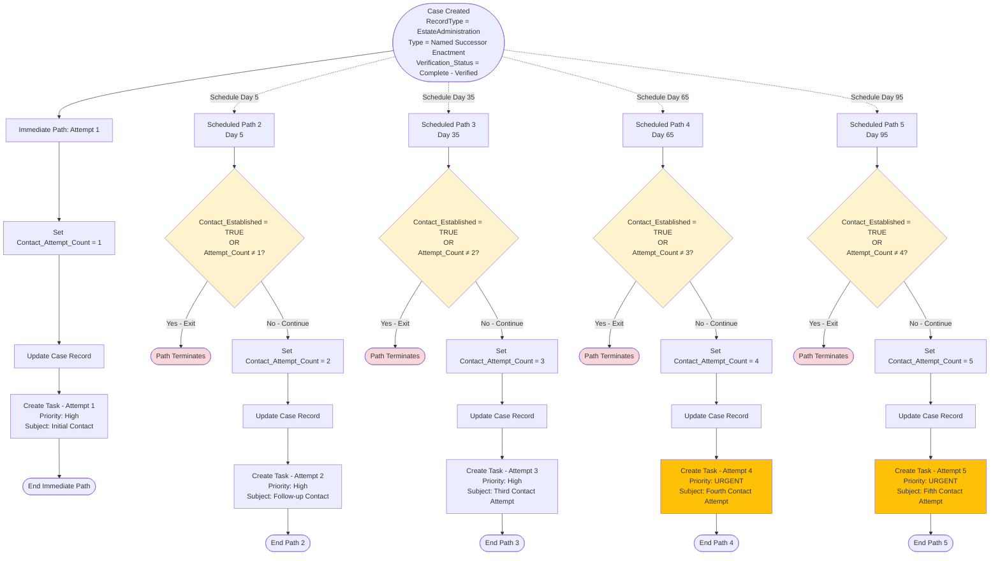
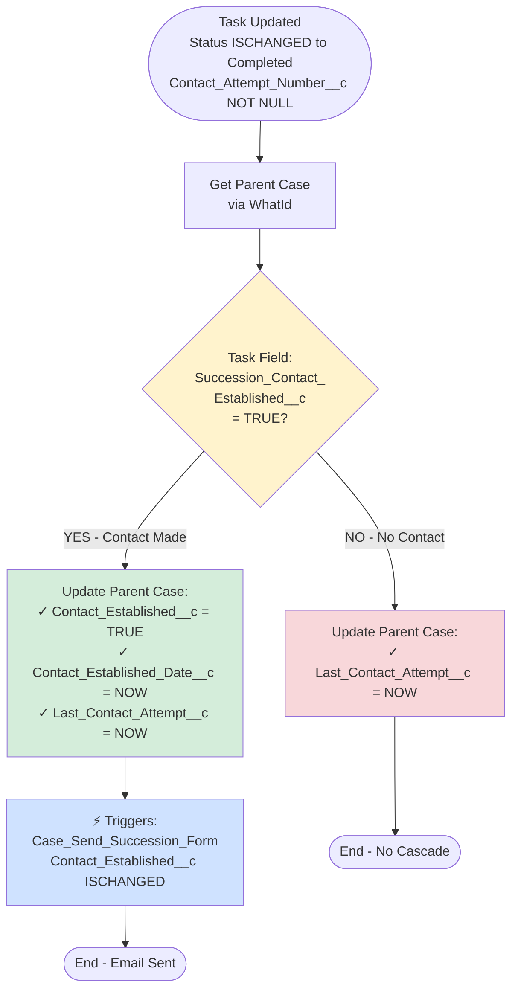
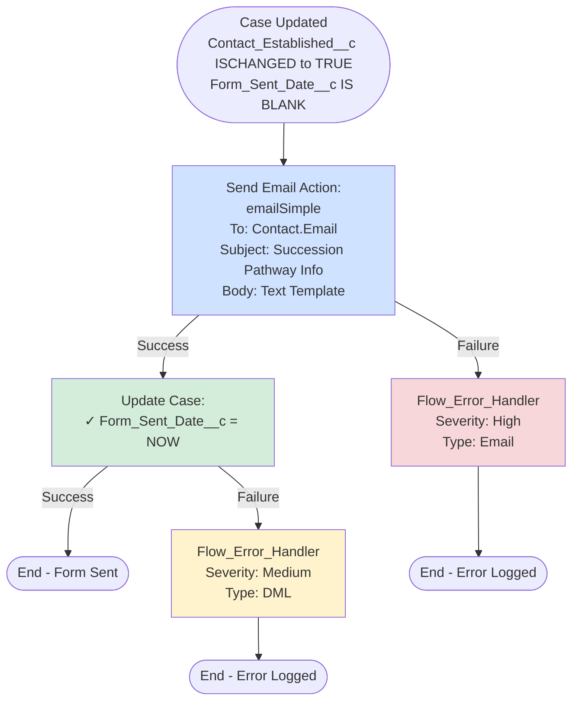
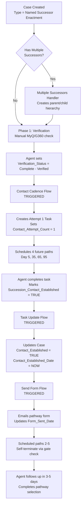
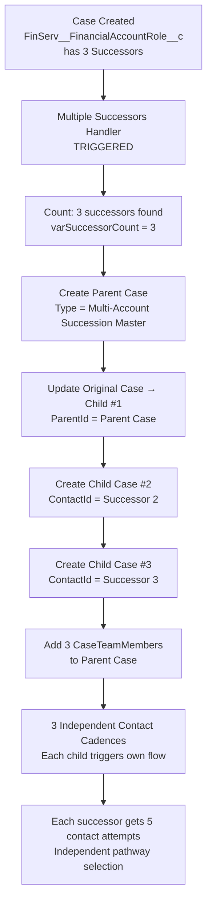

# Succession Management Flow Architecture

**Last Updated:** October 2, 2025
**API Version:** 65.0
**Status:** Production Active

---

## Table of Contents
1. [Overview](#overview)
2. [Flow Inventory](#flow-inventory)
3. [Orchestration Flow](#orchestration-flow)
4. [Data Model](#data-model)
5. [Architecture Patterns](#architecture-patterns)
6. [Technical Deep Dive](#technical-deep-dive)
7. [Error Handling](#error-handling)
8. [Testing Strategy](#testing-strategy)

---

## Overview

The Succession Management system automates the Named Successor Enactment process for Donor-Advised Fund (DAF) accounts when a donor passes away. The system orchestrates a 5-phase workflow using **4 record-triggered flows** that work together without custom orchestration objects.

### Business Requirements (BRD-Aligned)

**5-Phase Workflow:**
1. **Verification** - Verify successor identity (MyQ/G360)
2. **Contact & Pathway** - Contact successor, explain 3 pathways, send form
3. **Documentation** - Gather pathway-specific documents
4. **Review** - Operations approval
5. **Execution** - Enact chosen pathway

**Contact Cadence:**
- Schedule: Day 0, 5, 35, 65, 95 (max 5 attempts)
- Pattern: Conditional task creation (only if previous failed)
- Gate: `Contact_Established__c` = TRUE stops cadence
- Escalation: After 4 attempts (not 5) → Compliance

### Key Design Principles

✅ **Zero Custom Objects** - Uses standard Case, Task, FinServ objects
✅ **Self-Terminating Paths** - Scheduled paths check gates and exit gracefully
✅ **Decoupled Flows** - Each flow has single responsibility
✅ **Comprehensive Error Handling** - All flows call Flow_Error_Handler subflow

---

## Flow Inventory

### 1. **Case_Succession_Contact_Cadence.flow-meta.xml**

**Purpose:** Automates 5-attempt contact schedule with conditional task creation

| Property | Value |
|----------|-------|
| **Type** | Record-Triggered (After Save) |
| **Object** | Case |
| **Trigger** | Create |
| **Status** | Active |
| **Lines** | 651 |

**Entry Criteria:**
```apex
AND(
    {!$Record.RecordType.DeveloperName} = "EstateAdministration",
    TEXT({!$Record.Type}) = "Named Successor Enactment",
    TEXT({!$Record.Verification_Status__c}) = "Complete - Verified"
)
```

**Architecture:**
- **Immediate Path:** Creates Attempt 1 task, sets Contact_Attempt_Count__c = 1
- **4 Scheduled Paths:** Day 5, 35, 65, 95 - each with decision node gate
- **Decision Logic:** Checks Contact_Established__c = TRUE OR attempt count ≠ expected value
- **Actions:** Assignment → Update Case → Create Task

**Scheduled Path Details:**

| Path | Offset | Priority | Decision Logic |
|------|--------|----------|---------------|
| Attempt 1 | Day 0 (immediate) | High | Always executes |
| Attempt 2 | +5 days | High | Contact_Established = FALSE AND attempt_count = 1 |
| Attempt 3 | +35 days | High | Contact_Established = FALSE AND attempt_count = 2 |
| Attempt 4 | +65 days | **Urgent** | Contact_Established = FALSE AND attempt_count = 3 |
| Attempt 5 | +95 days | **Urgent** | Contact_Established = FALSE AND attempt_count = 4 |

**Key Fields Updated:**
- `Contact_Attempt_Count__c` (Number) - Incremented for each attempt

**Tasks Created:**
```
Subject: "Succession Contact - Attempt {N} (Day {X}): {Label}"
ActivityDate: $Flow.CurrentDate
Contact_Attempt_Number__c: {N}
Status: Not Started
WhatId: $Record.Id
```

**Flow Logic Diagram:**



---

### 2. **Task_Succession_Contact_Update.flow-meta.xml**

**Purpose:** Circuit breaker - updates Case when agent marks contact established

| Property | Value |
|----------|-------|
| **Type** | Record-Triggered (After Save) |
| **Object** | Task |
| **Trigger** | Update |
| **Status** | Active |
| **Lines** | 144 |

**Entry Criteria:**
```apex
AND(
    ISCHANGED({!$Record.Status}),
    TEXT({!$Record.Status}) = "Completed",
    NOT(ISBLANK({!$Record.Contact_Attempt_Number__c}))
)
```

**Flow Logic Diagram:**



**Impact:** When Contact_Established__c is set to TRUE on the Case, all future scheduled paths in the Contact Cadence flow will self-terminate via their decision nodes.

**Circuit Breaker Mechanism:**
- Task completion → Case.Contact_Established__c = TRUE
- Scheduled Path 2/3/4/5 check Contact_Established__c in decision node
- If TRUE → Path exits without creating task
- This stops the cadence automation without manual intervention

---

### 3. **Case_Send_Succession_Form.flow-meta.xml**

**Purpose:** Automatically sends pathway form email when contact established

| Property | Value |
|----------|-------|
| **Type** | Record-Triggered (After Save) |
| **Object** | Case |
| **Trigger** | Update |
| **Status** | Active |
| **Lines** | 237 |

**Entry Criteria:**
```apex
AND(
    {!$Record.RecordType.DeveloperName} = "EstateAdministration",
    TEXT({!$Record.Type}) = "Named Successor Enactment",
    ISCHANGED({!$Record.Contact_Established__c}),
    {!$Record.Contact_Established__c} = TRUE,
    ISBLANK({!$Record.Form_Sent_Date__c})
)
```

**Email Configuration:**
- **Action Type:** emailSimple (plain text)
- **Recipient:** `$Record.Contact.Email`
- **Subject:** `"Succession Pathway Information for {Account.Name}'s Donor-Advised Fund"`
- **Body:** Text template with 3 pathway options, next steps, required documents

**Email Content Includes:**
1. Three pathway options (Final Grant, New DAF, Disclaim)
2. Next steps (follow-up call in 3-5 business days)
3. Required documents (death certificate, government ID)
4. Support contact information (phone + case number)

**Key Fields Updated:**
- `Form_Sent_Date__c` (DateTime) - Timestamp when email sent

**Error Handling:**
- Email failure → Flow_Error_Handler (severity: High, type: Email)
- DML failure → Flow_Error_Handler (severity: Medium, type: DML)

**Flow Logic Diagram:**



**Email Template Content:**
```
Subject: Succession Pathway Information for {Account.Name}'s Donor-Advised Fund

Body:
- Greeting to {Contact.Name}
- 3 Pathway Options (Final Grant, New DAF, Disclaim)
- Next Steps (follow-up call in 3-5 days)
- Required Documents (death cert, gov't ID)
- Support Info (phone, case number)
- Owner signature
```

---

### 4. **Case_Multiple_Successors_Handler.flow-meta.xml**

**Purpose:** Creates parent/child case hierarchy for DAFs with multiple successors

| Property | Value |
|----------|-------|
| **Type** | Record-Triggered (After Save) |
| **Object** | Case |
| **Trigger** | Create |
| **Status** | Active (⚠️ Being modified by another agent) |
| **Lines** | 484 |

**Entry Criteria:**
```apex
AND(
    {!$Record.RecordType.DeveloperName} = "EstateAdministration",
    TEXT({!$Record.Type}) = "Named Successor Enactment",
    NOT(ISBLANK({!$Record.FinServ__FinancialAccount__c})),
    ISBLANK({!$Record.ParentId})
)
```

**Flow Variables:**
- `varSuccessorCount` (Number, scale 0, initial = 0)
- `varFirstSuccessorAllocation` (Number, scale 2)

**Flow Logic Diagram:**

```mermaid
graph TD
    Start([Case Created<br/>RecordType = EstateAdministration<br/>Type = Named Successor Enactment<br/>FinancialAccount__c NOT NULL<br/>ParentId IS NULL]) --> GetRoles[Get Financial Account Roles<br/>Filter:<br/>• Role CONTAINS 'Successor'<br/>• Active = TRUE<br/>• FinancialAccount = $Record.FinancialAccount]

    GetRoles --> CountLoop[Loop 1: Count Successors<br/>varSuccessorCount++]
    CountLoop -->|Loop Complete| Decision{varSuccessorCount > 1?}

    Decision -->|NO - Single Successor| ExitSingle([End - No Hierarchy Needed])
    Decision -->|YES - Multiple Successors| CreateParent[Create Parent Case:<br/>Type = Multi-Account Succession Master<br/>Status = In Progress<br/>Subject = Multi-Successor Coordination<br/>Description = {N} successors identified]

    CreateParent --> UpdateOriginal[Update Original Case → Child #1:<br/>✓ ParentId = Parent Case ID<br/>✓ Subject = Succession - {Name} {%}]

    UpdateOriginal --> LoopChildren[Loop 2: Create Children<br/>For Successors 2 through N]
    LoopChildren --> CheckFirst{Is First<br/>Successor?}

    CheckFirst -->|YES - Skip| NextChild[Continue Loop]
    CheckFirst -->|NO - Create| GetContactId[Get Successor Account<br/>PersonContactId]

    GetContactId --> CreateChild[Create Child Case:<br/>• ParentId = Parent Case ID<br/>• ContactId = Successor PersonContactId<br/>• Type = Named Successor Enactment<br/>• Status = New<br/>• Subject with allocation %<br/>• Verification_Status = Not Started]

    CreateChild --> NextChild
    NextChild -->|More Successors| LoopChildren
    NextChild -->|Loop Complete| LoopTeam[Loop 3: Add Team Members<br/>For All Successors]

    LoopTeam --> GetTeamContact[Get Successor Account<br/>PersonContactId]
    GetTeamContact --> AddTeam[Add CaseTeamMember:<br/>• ParentId = Parent Case ID<br/>• MemberId = Successor PersonContactId<br/>• TeamRoleId = Successor]

    AddTeam -->|More Successors| LoopTeam
    AddTeam -->|Loop Complete| EndMulti([End - Hierarchy Created<br/>Each child triggers own cadence])

    style Decision fill:#fff3cd
    style CreateParent fill:#cfe2ff
    style UpdateOriginal fill:#d4edda
    style CreateChild fill:#d4edda
    style AddTeam fill:#e7f3ff
    style ExitSingle fill:#f8d7da
```

**Architecture Highlights:**
- **Zero Custom Objects** - Uses FinServ__FinancialAccountRole__c for successor data
- **Standard Hierarchy** - Uses Case.ParentId (no junction objects)
- **Visibility Model** - CaseTeamMember provides multi-party access
- **Independent Cadence** - Each child case triggers its own Contact Cadence flow

**Parent Case Fields:**
```apex
Type: "Multi-Account Succession Master"
Status: "In Progress"
Subject: "Multi-Successor Coordination - {Account.Name}"
Description: "{N} successors identified. Individual succession cases
              created for each successor with independent contact
              cadence and pathway selection."
```

**Child Case Fields:**
```apex
Type: "Named Successor Enactment"
Status: "New"
Subject: "Succession - {Successor.Name} ({Allocation}%)"
ParentId: {Parent Case ID}
ContactId: {Successor PersonContactId}
Verification_Status: "Not Started"
Description: "Succession case for {Name} ({Allocation}% allocation).
              Part of multi-successor coordination under parent case."
```

---

## Orchestration Flow

### End-to-End Journey (Single Successor)



### Multi-Successor Journey



---

## Data Model

### Case Fields (Succession-Specific)

| Field API Name | Type | Purpose | Updated By |
|---------------|------|---------|------------|
| `Contact_Established__c` | Checkbox | **Gate field** - stops cadence when TRUE | Task_Succession_Contact_Update |
| `Contact_Established_Date__c` | DateTime | Audit trail for contact success | Task_Succession_Contact_Update |
| `Contact_Attempt_Count__c` | Number | Running count (1-5) | Case_Succession_Contact_Cadence |
| `Last_Contact_Attempt__c` | DateTime | Latest attempt timestamp | Task_Succession_Contact_Update |
| `Next_Contact_Due__c` | Date | User-facing due date | Manual/Formula |
| `Verification_Status__c` | Picklist | Phase 1 verification | Manual |
| `Pathway_Confirmed__c` | Picklist | Final Grant \| New DAF \| Disclaim | Manual |
| `Form_Sent_Date__c` | DateTime | Pathway form email timestamp | Case_Send_Succession_Form |
| `Form_Completed_Date__c` | DateTime | Form completion timestamp | Manual |
| `SLA_Status__c` | Formula | 🟢 On Track \| 🟡 Attention \| 🟠 At Risk \| 🔴 Critical | Formula |

### Task Fields (Succession-Specific)

| Field API Name | Type | Purpose | Updated By |
|---------------|------|---------|------------|
| `Contact_Attempt_Number__c` | Number | Which attempt (1-5) | Case_Succession_Contact_Cadence |
| `Succession_Contact_Established__c` | Checkbox | Agent marks TRUE when contact made | Agent (manual) |

### FinServ__FinancialAccountRole__c (Standard FSC Object)

Used for successor allocation data:

| Field | Purpose |
|-------|---------|
| `FinServ__Role__c` | CONTAINS "Successor" |
| `FinServ__Active__c` | TRUE for active successors |
| `SuccessorAllocation__c` | Percentage allocation (custom field) |
| `FinServ__RelatedAccount__c` | Successor Account (PersonAccount) |

### CaseTeamMember (Standard Object)

Used for multi-successor visibility:

| Field | Purpose |
|-------|---------|
| `ParentId` | Parent coordination case |
| `MemberId` | Successor PersonContactId |
| `TeamRoleId` | "Successor" |

---

## Architecture Patterns

### Pattern 1: Scheduled Path with Conditional Gates

**Problem:** Need to schedule 5 contact attempts, but stop early if contact established.

**Solution:** All 5 paths scheduled simultaneously; each path checks gate condition.

**Implementation:**
```xml
<start>
    <scheduledPaths>
        <name>Attempt_2_Day_5</name>
        <offsetNumber>5</offsetNumber>
        <offsetUnit>Days</offsetUnit>
        <connector>
            <targetReference>Check_Contact_Established_Attempt_2</targetReference>
        </connector>
    </scheduledPaths>
</start>

<decisions>
    <name>Check_Contact_Established_Attempt_2</name>
    <rules>
        <name>Contact_Already_Established</name>
        <conditionLogic>or</conditionLogic>
        <conditions>
            <leftValueReference>$Record.Contact_Established__c</leftValueReference>
            <operator>EqualTo</operator>
            <rightValue><booleanValue>true</booleanValue></rightValue>
        </conditions>
        <conditions>
            <leftValueReference>$Record.Contact_Attempt_Count__c</leftValueReference>
            <operator>NotEqualTo</operator>
            <rightValue><numberValue>1.0</numberValue></rightValue>
        </conditions>
        <label>Contact Already Established</label>
        <!-- Exits without action -->
    </rules>
    <rules>
        <name>Create_Attempt_2</name>
        <!-- Proceeds with task creation -->
    </rules>
</decisions>
```

**Benefits:**
- ✅ No manual flow cancellation needed
- ✅ Paths self-terminate gracefully
- ✅ No scheduled action cleanup required
- ✅ Simpler than chaining flows or using platform events

---

### Pattern 2: Circuit Breaker via Cross-Object Update

**Problem:** Task completion (child) needs to stop Case flow (parent).

**Solution:** Task flow updates Case field; scheduled paths check that field.

**Implementation:**

```xml
<!-- Task Flow (Circuit Breaker) -->
<recordUpdates>
    <name>Update_Contact_Established</name>
    <inputAssignments>
        <field>Contact_Established__c</field>
        <value><booleanValue>true</booleanValue></value>
    </inputAssignments>
    <object>Case</object>
</recordUpdates>

<!-- Case Flow (Scheduled Path) -->
<decisions>
    <name>Check_Contact_Established_Attempt_3</name>
    <rules>
        <conditions>
            <leftValueReference>$Record.Contact_Established__c</leftValueReference>
            <operator>EqualTo</operator>
            <rightValue><booleanValue>true</booleanValue></rightValue>
        </conditions>
        <!-- Path exits here -->
    </rules>
</decisions>
```

**Benefits:**
- ✅ No platform events needed
- ✅ No custom objects for orchestration
- ✅ Standard field acts as signal
- ✅ Audit trail built-in (Contact_Established_Date__c)

---

### Pattern 3: Zero-Object Hierarchy via Standard Fields

**Problem:** Multiple successors need coordination without custom objects.

**Solution:** Use FinServ__FinancialAccountRole__c + Case.ParentId + CaseTeamMember.

**Implementation:**

**Step 1: Query Successors**
```xml
<recordLookups>
    <name>Get_Financial_Account_Roles</name>
    <filters>
        <field>FinServ__FinancialAccount__c</field>
        <operator>EqualTo</operator>
        <value><elementReference>$Record.FinServ__FinancialAccount__c</elementReference></value>
    </filters>
    <filters>
        <field>FinServ__Role__c</field>
        <operator>Contains</operator>
        <value><stringValue>Successor</stringValue></value>
    </filters>
    <filters>
        <field>FinServ__Active__c</field>
        <operator>EqualTo</operator>
        <value><booleanValue>true</booleanValue></value>
    </filters>
    <object>FinServ__FinancialAccountRole__c</object>
</recordLookups>
```

**Step 2: Create Hierarchy**
```xml
<!-- Parent Case -->
<recordCreates>
    <name>Create_Parent_Coordination_Case</name>
    <inputAssignments>
        <field>Type</field>
        <value><stringValue>Multi-Account Succession Master</stringValue></value>
    </inputAssignments>
    <object>Case</object>
</recordCreates>

<!-- Update Original → Child #1 -->
<recordUpdates>
    <name>Update_Current_Case_As_Child</name>
    <inputAssignments>
        <field>ParentId</field>
        <value><elementReference>Create_Parent_Coordination_Case</elementReference></value>
    </inputAssignments>
</recordUpdates>

<!-- Create Child Cases 2-N in Loop -->
<loops>
    <name>Loop_Through_Successors</name>
    <collectionReference>Get_Financial_Account_Roles</collectionReference>
    <nextValueConnector>
        <targetReference>Create_Child_Case_For_Successor</targetReference>
    </nextValueConnector>
</loops>
```

**Step 3: Add Visibility**
```xml
<recordCreates>
    <name>Add_Successor_To_Case_Team</name>
    <inputAssignments>
        <field>ParentId</field>
        <value><elementReference>Create_Parent_Coordination_Case</elementReference></value>
    </inputAssignments>
    <inputAssignments>
        <field>MemberId</field>
        <value><elementReference>Get_Successor_Person_Contact_Id.PersonContactId</elementReference></value>
    </inputAssignments>
    <inputAssignments>
        <field>TeamRoleId</field>
        <value><stringValue>Successor</stringValue></value>
    </inputAssignments>
    <object>CaseTeamMember</object>
</recordCreates>
```

**Benefits:**
- ✅ No custom junction objects
- ✅ Standard Case hierarchy (ParentId)
- ✅ FSC object for allocation %
- ✅ CaseTeamMember for visibility
- ✅ Each child triggers independent cadence

---

### Pattern 4: Cascading Email Automation

**Problem:** Need to send email exactly once when contact established.

**Solution:** Use ISCHANGED + ISBLANK gate in trigger criteria.

**Implementation:**
```xml
<start>
    <filterFormula>AND(
        {!$Record.RecordType.DeveloperName} = "EstateAdministration",
        TEXT({!$Record.Type}) = "Named Successor Enactment",
        ISCHANGED({!$Record.Contact_Established__c}),
        {!$Record.Contact_Established__c} = TRUE,
        ISBLANK({!$Record.Form_Sent_Date__c})
    )</filterFormula>
    <object>Case</object>
    <recordTriggerType>Update</recordTriggerType>
</start>
```

**Benefits:**
- ✅ Fires exactly once (ISCHANGED + ISBLANK)
- ✅ No duplicate emails
- ✅ Self-documenting (Form_Sent_Date__c populated)
- ✅ Can be manually re-sent (clear Form_Sent_Date__c)

---

## Technical Deep Dive

### Flow Execution Order

**Scenario:** Case created with Type = "Named Successor Enactment", 3 successors identified

**Execution Timeline:**

| Time | Event | Flow Triggered | Action |
|------|-------|---------------|--------|
| T+0ms | Case INSERT | Case_Multiple_Successors_Handler | Queries FinancialAccountRoles, finds 3 successors |
| T+500ms | Same transaction | Case_Multiple_Successors_Handler | Creates parent case, updates original case with ParentId |
| T+800ms | Case UPDATE (ParentId) | *No flows triggered* | ParentId update doesn't match entry criteria |
| T+1200ms | Same transaction | Case_Multiple_Successors_Handler | Creates 2 child cases, adds 3 CaseTeamMembers |
| T+1500ms | **New Case INSERTs** | Case_Multiple_Successors_Handler (for children) | Children have ParentId, don't match "ParentId IS NULL" filter |
| Manual | Agent sets Verification_Status = "Complete - Verified" | — | Phase 1 complete |
| Manual | Agent SAVES case | Case_Succession_Contact_Cadence | Entry criteria now met! |
| T+0ms (new transaction) | Case UPDATE | Case_Succession_Contact_Cadence | Creates Attempt 1 task, sets Contact_Attempt_Count = 1 |
| T+500ms | Same transaction | Case_Succession_Contact_Cadence | Schedules paths for Day 5, 35, 65, 95 |
| Day 5 @ 9am | Scheduled trigger | Case_Succession_Contact_Cadence (Path 2) | Checks Contact_Established__c = FALSE, creates Attempt 2 task |
| Day 5 @ 2pm | Agent completes task | — | Marks Succession_Contact_Established__c = TRUE |
| Day 5 @ 2:01pm | Task UPDATE | Task_Succession_Contact_Update | Updates Case: Contact_Established__c = TRUE |
| Day 5 @ 2:02pm | Case UPDATE | Case_Send_Succession_Form | Sends email, updates Form_Sent_Date__c |
| Day 35 @ 9am | Scheduled trigger | Case_Succession_Contact_Cadence (Path 3) | Checks Contact_Established__c = TRUE, **exits without action** |
| Day 65 @ 9am | Scheduled trigger | Case_Succession_Contact_Cadence (Path 4) | Checks Contact_Established__c = TRUE, **exits without action** |
| Day 95 @ 9am | Scheduled trigger | Case_Succession_Contact_Cadence (Path 5) | Checks Contact_Established__c = TRUE, **exits without action** |

**Key Observations:**
1. Multiple Successors Handler runs FIRST (on create, before verification)
2. Contact Cadence waits for Verification_Status = "Complete - Verified"
3. All 5 scheduled paths activate simultaneously, but paths 2-5 wait for their time offset
4. Task Update Flow acts as circuit breaker when agent marks contact established
5. Send Form Flow cascades from Contact_Established__c update
6. Scheduled paths 3-5 self-terminate via gate check

---

### Transaction Boundaries

**Important:** Flow entry criteria are evaluated at **transaction start**, not during transaction.

**Example:**

```apex
// WRONG ASSUMPTION: "Flow will see my mid-transaction update"
Case c = [SELECT Id FROM Case WHERE Id = :caseId];
c.Contact_Established__c = true;
update c; // Flow WILL trigger here

c.Form_Sent_Date__c = DateTime.now();
update c; // Flow will NOT trigger again (same transaction context)
```

**Correct Understanding:**
- Case_Send_Succession_Form triggers on **Case UPDATE** when Contact_Established__c **ISCHANGED** to TRUE
- If you update Contact_Established__c and Form_Sent_Date__c in same transaction, flow still triggers (entry criteria evaluate BEFORE transaction)
- Flow can update Form_Sent_Date__c in same transaction without recursion (ISBLANK check prevents re-entry)

---

### Recursion Prevention

Each flow has built-in recursion prevention:

| Flow | Recursion Prevention Mechanism |
|------|-------------------------------|
| Case_Succession_Contact_Cadence | Fires on CREATE only (can't recurse) |
| Task_Succession_Contact_Update | Fires on UPDATE when Status ISCHANGED to "Completed" (one-time event) |
| Case_Send_Succession_Form | Fires when Contact_Established__c ISCHANGED AND Form_Sent_Date__c ISBLANK |
| Case_Multiple_Successors_Handler | Fires on CREATE when ParentId IS NULL (child cases have ParentId, don't trigger) |

**Additional Safety:**
- All flows use `ISCHANGED()` for trigger fields
- Case_Send_Succession_Form has `ISBLANK(Form_Sent_Date__c)` gate
- Scheduled paths only check conditions, don't modify trigger fields

---

## Error Handling

### Standard Error Pattern

All flows use the **Flow_Error_Handler** subflow for consistent error logging:

```xml
<subflows>
    <name>Error_Handler_Create_Task_1</name>
    <label>Error Handler - Create Task 1</label>
    <flowName>Flow_Error_Handler</flowName>
    <inputAssignments>
        <name>varErrorMessage</name>
        <value><elementReference>$Flow.FaultMessage</elementReference></value>
    </inputAssignments>
    <inputAssignments>
        <name>varFlowName</name>
        <value><stringValue>Case_Succession_Contact_Cadence</stringValue></value>
    </inputAssignments>
    <inputAssignments>
        <name>varRecordId</name>
        <value><elementReference>$Record.Id</elementReference></value>
    </inputAssignments>
    <inputAssignments>
        <name>varSeverity</name>
        <value><stringValue>High</stringValue></value>
    </inputAssignments>
    <inputAssignments>
        <name>varErrorType</name>
        <value><stringValue>DML</stringValue></value>
    </inputAssignments>
</subflows>
```

### Error Severity Levels

| Severity | When Used | Examples |
|----------|-----------|----------|
| **High** | Critical business process failure | Email send failure, parent case creation failure |
| **Medium** | Data update failure with workaround | Date field update failure, task creation failure |
| **Low** | Non-blocking issues | Case team member add failure (manual add possible) |

### Fault Connectors

Every DML/action has fault connector:

```xml
<recordCreates>
    <name>Create_Task_Attempt_1</name>
    <label>Create Task - Attempt 1</label>
    <faultConnector>
        <targetReference>Error_Handler_Create_Task_1</targetReference>
    </faultConnector>
    <!-- ... -->
</recordCreates>
```

**Error Handler Inputs:**

| Input | Purpose | Example Value |
|-------|---------|---------------|
| varErrorMessage | Salesforce fault message | $Flow.FaultMessage |
| varFlowName | Identifies source flow | "Case_Succession_Contact_Cadence" |
| varRecordId | Context record | $Record.Id |
| varSeverity | Priority for triage | "High" / "Medium" / "Low" |
| varErrorType | Category for reporting | "DML" / "Email" / "Lookup" |

**Error Storage:**
- Errors logged to **Exception__c** custom object
- Visible in "Flow Errors" list view
- Can trigger email alerts to admins

---

## Testing Strategy

### Unit Test Coverage

**Test Data Factory:** `SuccessionTestDataFactory.cls`

```apex
// Pre-configured scenarios
SuccessionTestDataFactory.generateCompleteDataset(); // All scenarios
SuccessionTestDataFactory.generateHappyPathFinalGrant(); // Single successor
SuccessionTestDataFactory.generateMultipleSuccessorsScenario(); // 3 successors

// Builder pattern
Account donor = new SuccessionTestDataFactory.DeceasedDonorBuilder()
    .withName('John', 'Smith')
    .withNetWorth(5000000)
    .buildAndInsert();
```

### Flow Test Scenarios

**Scenario 1: Happy Path - Single Successor**
```apex
@isTest
static void testSingleSuccessorContactCadence() {
    // Setup
    SuccessionTestDataFactory.HappyPathData data =
        SuccessionTestDataFactory.generateHappyPathFinalGrant();

    // Test
    Test.startTest();

    // Step 1: Verify triggers Contact Cadence
    data.successionCase.Verification_Status__c = 'Complete - Verified';
    update data.successionCase;

    // Verify Attempt 1 task created
    List<Task> tasks = [SELECT Contact_Attempt_Number__c
                        FROM Task
                        WHERE WhatId = :data.successionCase.Id];
    System.assertEquals(1, tasks.size());
    System.assertEquals(1, tasks[0].Contact_Attempt_Number__c);

    // Step 2: Mark contact established
    tasks[0].Status = 'Completed';
    tasks[0].Succession_Contact_Established__c = true;
    update tasks[0];

    // Verify Case updated
    Case updatedCase = [SELECT Contact_Established__c,
                               Contact_Established_Date__c,
                               Form_Sent_Date__c
                        FROM Case
                        WHERE Id = :data.successionCase.Id];
    System.assertEquals(true, updatedCase.Contact_Established__c);
    System.assertNotEquals(null, updatedCase.Contact_Established_Date__c);
    System.assertNotEquals(null, updatedCase.Form_Sent_Date__c);

    Test.stopTest();

    // Verify no additional tasks created (scheduled paths should be cancelled)
    tasks = [SELECT Id FROM Task WHERE WhatId = :data.successionCase.Id];
    System.assertEquals(1, tasks.size(), 'Only Attempt 1 should exist');
}
```

**Scenario 2: Multi-Successor Hierarchy**
```apex
@isTest
static void testMultipleSuccessorsCreateHierarchy() {
    // Setup
    SuccessionTestDataFactory.MultiSuccessorData data =
        SuccessionTestDataFactory.generateMultipleSuccessorsScenario();

    Test.startTest();

    // Create case - should trigger Multiple Successors Handler
    Case initialCase = new Case(
        RecordTypeId = data.estateRecordTypeId,
        Type = 'Named Successor Enactment',
        AccountId = data.deceasedDonor.Id,
        ContactId = data.successor1.PersonContactId,
        FinServ__FinancialAccount__c = data.dafAccount.Id
    );
    insert initialCase;

    Test.stopTest();

    // Verify parent case created
    List<Case> parentCases = [SELECT Id, Type, Subject
                              FROM Case
                              WHERE Type = 'Multi-Account Succession Master'];
    System.assertEquals(1, parentCases.size());

    // Verify child cases (original + 2 new)
    List<Case> childCases = [SELECT Id, ParentId, ContactId
                             FROM Case
                             WHERE ParentId = :parentCases[0].Id];
    System.assertEquals(3, childCases.size());

    // Verify Case Team Members
    List<CaseTeamMember> teamMembers = [SELECT MemberId
                                        FROM CaseTeamMember
                                        WHERE ParentId = :parentCases[0].Id];
    System.assertEquals(3, teamMembers.size());
}
```

**Scenario 3: Scheduled Path Self-Termination**
```apex
@isTest
static void testScheduledPathsTerminateWhenContactEstablished() {
    // Setup
    SuccessionTestDataFactory.HappyPathData data =
        SuccessionTestDataFactory.generateHappyPathFinalGrant();

    Test.startTest();

    // Trigger Contact Cadence
    data.successionCase.Verification_Status__c = 'Complete - Verified';
    update data.successionCase;

    // Immediately establish contact (before scheduled paths fire)
    data.successionCase.Contact_Established__c = true;
    data.successionCase.Contact_Established_Date__c = DateTime.now();
    update data.successionCase;

    Test.stopTest();

    // In test context, scheduled paths execute immediately
    // Verify they self-terminated (no additional tasks)
    List<Task> tasks = [SELECT Contact_Attempt_Number__c
                        FROM Task
                        WHERE WhatId = :data.successionCase.Id
                        ORDER BY Contact_Attempt_Number__c];

    System.assertEquals(1, tasks.size(),
        'Scheduled paths should terminate via gate check');
    System.assertEquals(1, tasks[0].Contact_Attempt_Number__c);
}
```

### Integration Test Scenarios

**Scenario 4: End-to-End Single Successor Journey**
```apex
@isTest
static void testEndToEndSuccessionJourney() {
    // Full lifecycle test
    SuccessionTestDataFactory.HappyPathData data =
        SuccessionTestDataFactory.generateHappyPathFinalGrant();

    Test.startTest();

    // Phase 1: Verification
    data.successionCase.Verification_Status__c = 'Complete - Verified';
    update data.successionCase;

    // Phase 2: Contact & Pathway
    Task contactTask = [SELECT Id FROM Task
                        WHERE WhatId = :data.successionCase.Id
                        LIMIT 1];
    contactTask.Status = 'Completed';
    contactTask.Succession_Contact_Established__c = true;
    update contactTask;

    // Verify email sent
    Case afterContact = [SELECT Form_Sent_Date__c
                         FROM Case
                         WHERE Id = :data.successionCase.Id];
    System.assertNotEquals(null, afterContact.Form_Sent_Date__c);

    // Phase 3: Pathway Selection
    data.successionCase.Pathway_Confirmed__c = 'Final Grant';
    data.successionCase.Form_Completed_Date__c = DateTime.now();
    update data.successionCase;

    Test.stopTest();

    // Verify complete state
    Case finalCase = [SELECT Status,
                             Verification_Status__c,
                             Contact_Established__c,
                             Pathway_Confirmed__c,
                             SLA_Status__c
                      FROM Case
                      WHERE Id = :data.successionCase.Id];

    System.assertEquals('Complete - Verified', finalCase.Verification_Status__c);
    System.assertEquals(true, finalCase.Contact_Established__c);
    System.assertEquals('Final Grant', finalCase.Pathway_Confirmed__c);
}
```

### Performance Test Scenarios

**Scenario 5: Bulk Multi-Successor Processing**
```apex
@isTest
static void testBulkMultiSuccessorProcessing() {
    // Test governor limits with 200 cases (Salesforce max)
    List<Case> cases = new List<Case>();

    for (Integer i = 0; i < 200; i++) {
        SuccessionTestDataFactory.MultiSuccessorData data =
            SuccessionTestDataFactory.generateMultipleSuccessorsScenario();

        cases.add(new Case(
            RecordTypeId = data.estateRecordTypeId,
            Type = 'Named Successor Enactment',
            AccountId = data.deceasedDonor.Id,
            ContactId = data.successor1.PersonContactId,
            FinServ__FinancialAccount__c = data.dafAccount.Id
        ));
    }

    Test.startTest();
    insert cases; // Triggers Multiple Successors Handler for all 200
    Test.stopTest();

    // Verify all hierarchies created
    System.assertEquals(200, [SELECT COUNT() FROM Case
                              WHERE Type = 'Multi-Account Succession Master']);

    // Each case creates 1 parent + 2 children = 600 total child cases
    System.assertEquals(600, [SELECT COUNT() FROM Case
                              WHERE ParentId != null]);
}
```

---

## Deployment Checklist

### Pre-Deployment

- [ ] All 4 flows have Status = "Active"
- [ ] Flow_Error_Handler subflow exists and is Active
- [ ] All custom fields deployed (10 Case fields, 2 Task fields)
- [ ] Email templates created (if using Email Alerts instead of emailSimple)
- [ ] CaseTeamRole "Successor" exists
- [ ] FinServ__FinancialAccountRole__c.SuccessorAllocation__c field exists

### Deployment Order

1. **Custom Fields First** (required by flows)
   ```bash
   sf project deploy start --source-dir force-app/main/default/objects/Case/fields
   sf project deploy start --source-dir force-app/main/default/objects/Task/fields
   ```

2. **Flow_Error_Handler Subflow** (required by all flows)
   ```bash
   sf project deploy start --source-dir force-app/main/default/flows/Flow_Error_Handler.flow-meta.xml
   ```

3. **Succession Flows** (in any order, no dependencies)
   ```bash
   sf project deploy start --source-dir force-app/main/default/flows/Case_Multiple_Successors_Handler.flow-meta.xml
   sf project deploy start --source-dir force-app/main/default/flows/Case_Succession_Contact_Cadence.flow-meta.xml
   sf project deploy start --source-dir force-app/main/default/flows/Task_Succession_Contact_Update.flow-meta.xml
   sf project deploy start --source-dir force-app/main/default/flows/Case_Send_Succession_Form.flow-meta.xml
   ```

4. **Permission Sets** (grant field access)
   ```bash
   sf project deploy start --source-dir force-app/main/default/permissionsets/Succession_Management_User.permissionset-meta.xml
   ```

### Post-Deployment Validation

**Test in Sandbox:**

1. **Create Single Successor Case**
   - Verify: Multiple Successors Handler does NOT trigger (only 1 successor)
   - Verify: Contact Cadence does NOT trigger (Verification_Status ≠ "Complete - Verified")

2. **Set Verification_Status = "Complete - Verified"**
   - Verify: Contact Cadence triggers, creates Attempt 1 task
   - Verify: Contact_Attempt_Count__c = 1

3. **Complete Task, Mark Succession_Contact_Established__c = TRUE**
   - Verify: Task Update Flow updates Case.Contact_Established__c = TRUE
   - Verify: Send Form Flow sends email, updates Form_Sent_Date__c
   - Verify: No errors in Flow_Error_Handler logs

4. **Create Multi-Successor Case (3 successors)**
   - Verify: Multiple Successors Handler creates 1 parent + 3 child cases
   - Verify: 3 CaseTeamMembers added to parent
   - Verify: Each child has independent Contact_Attempt_Count__c

5. **Monitor Scheduled Paths (Day 5 after step 2)**
   - Verify: If Contact_Established__c = TRUE, path exits without creating task
   - Verify: If Contact_Established__c = FALSE, creates Attempt 2 task

### Rollback Plan

**If flows cause issues:**

1. **Emergency Disable:**
   ```bash
   # Deactivate all flows via API
   sf data update record --sobject Flow \
     --where "DeveloperName LIKE 'Case_%Succession%'" \
     --values "Status=Draft"
   ```

2. **Partial Rollback (disable specific flow):**
   - Navigate to Setup → Flows → {Flow Name}
   - Click "Deactivate"
   - Previous version automatically activates (if exists)

3. **Full Rollback:**
   ```bash
   # Deploy previous version from git
   git checkout HEAD~1 -- force-app/main/default/flows/
   sf project deploy start --source-dir force-app/main/default/flows/
   ```

---

## Monitoring & Troubleshooting

### Key Metrics to Monitor

| Metric | Query | Threshold |
|--------|-------|-----------|
| Flow Errors | `SELECT COUNT() FROM Exception__c WHERE CreatedDate = TODAY AND Flow_Name__c LIKE '%Succession%'` | 0 expected |
| Contact Attempt Success Rate | `SELECT COUNT() FROM Case WHERE Contact_Established__c = true AND Contact_Attempt_Count__c <= 3` | >80% |
| Multi-Successor Cases | `SELECT COUNT() FROM Case WHERE Type = 'Multi-Account Succession Master' AND CreatedDate = THIS_MONTH` | Track trend |
| Scheduled Path Failures | Check Flow Fault Emails | 0 expected |
| Email Send Failures | `SELECT COUNT() FROM Exception__c WHERE Error_Type__c = 'Email' AND CreatedDate = THIS_WEEK` | <5 per week |

### Common Issues & Solutions

**Issue 1: Contact Cadence Not Triggering**

**Symptoms:** Case created, Verification_Status = "Complete - Verified", but no tasks created

**Diagnosis:**
```sql
SELECT Id, RecordType.DeveloperName, Type, Verification_Status__c
FROM Case
WHERE Id = '{CASE_ID}'
```

**Possible Causes:**
- RecordType ≠ "EstateAdministration"
- Type ≠ "Named Successor Enactment" (check for typos)
- Verification_Status__c ≠ "Complete - Verified" (API name vs label)

**Solution:**
```apex
// Correct values:
Case c = new Case(
    RecordTypeId = [SELECT Id FROM RecordType
                    WHERE DeveloperName = 'EstateAdministration'
                    AND SobjectType = 'Case'].Id,
    Type = 'Named Successor Enactment', // Exact match
    Verification_Status__c = 'Complete - Verified' // Exact match
);
```

---

**Issue 2: Scheduled Paths Still Creating Tasks After Contact Established**

**Symptoms:** Contact_Established__c = TRUE, but Day 35 task still created

**Diagnosis:**
```sql
SELECT Contact_Established__c, Contact_Attempt_Count__c,
       (SELECT Contact_Attempt_Number__c FROM Tasks)
FROM Case
WHERE Id = '{CASE_ID}'
```

**Possible Causes:**
- Contact_Established__c set manually (not via Task flow)
- Contact_Attempt_Count__c not incremented properly
- Flow version mismatch (old version active)

**Solution:**
1. Always mark contact via Task.Succession_Contact_Established__c (not direct Case update)
2. Verify latest flow version active: Setup → Flows → Case: Succession Contact Cadence → Version 1 Active
3. If corrupted, deactivate/reactivate flow

---

**Issue 3: Multiple Successors Handler Creates Duplicate Hierarchies**

**Symptoms:** 2 parent cases created for same DAF account

**Diagnosis:**
```sql
SELECT COUNT(*), FinServ__FinancialAccount__c
FROM Case
WHERE Type = 'Multi-Account Succession Master'
GROUP BY FinServ__FinancialAccount__c
HAVING COUNT(*) > 1
```

**Possible Causes:**
- Multiple cases created in rapid succession (race condition)
- ParentId null check failed

**Solution:**
- Use unique constraint: Create custom field `Unique_Succession_Key__c` (formula: FinServ__FinancialAccount__c + '-' + CreatedDate)
- Add duplicate rule on Case
- Or use Platform Events to serialize case creation

---

**Issue 4: Email Not Sending**

**Symptoms:** Contact_Established__c = TRUE, but Form_Sent_Date__c = null

**Diagnosis:**
```sql
SELECT Contact_Established__c, Form_Sent_Date__c, Contact.Email
FROM Case
WHERE Id = '{CASE_ID}'
```

**Possible Causes:**
- Contact.Email is blank
- Email deliverability settings
- Flow_Error_Handler logged email error

**Solution:**
1. Check Contact.Email populated
2. Setup → Deliverability → Access Level = "All Email"
3. Check Exception__c for email errors:
   ```sql
   SELECT Error_Message__c, Error_Type__c
   FROM Exception__c
   WHERE Record_Id__c = '{CASE_ID}'
   AND Error_Type__c = 'Email'
   ```
4. If email quota exceeded, wait or increase limits

---

## Appendix

### Flow Metadata References

**Case_Succession_Contact_Cadence.flow-meta.xml**
- Location: `force-app/main/default/flows/Case_Succession_Contact_Cadence.flow-meta.xml`
- API Version: 65.0
- Last Modified: Oct 2, 2025
- Lines: 651
- Status: Active

**Task_Succession_Contact_Update.flow-meta.xml**
- Location: `force-app/main/default/flows/Task_Succession_Contact_Update.flow-meta.xml`
- API Version: 65.0
- Last Modified: Oct 2, 2025
- Lines: 144
- Status: Active

**Case_Send_Succession_Form.flow-meta.xml**
- Location: `force-app/main/default/flows/Case_Send_Succession_Form.flow-meta.xml`
- API Version: 65.0
- Last Modified: Oct 2, 2025
- Lines: 237
- Status: Active

**Case_Multiple_Successors_Handler.flow-meta.xml**
- Location: `force-app/main/default/flows/Case_Multiple_Successors_Handler.flow-meta.xml`
- API Version: 65.0
- Last Modified: Oct 2, 2025 (⚠️ uncommitted changes)
- Lines: 484
- Status: Active

### Related Documentation

- [SUCCESSION_AUDIT_SUMMARY.md](./SUCCESSION_AUDIT_SUMMARY.md) - BRD requirements
- [SUCCESSION_COMPONENT_INVENTORY.md](./SUCCESSION_COMPONENT_INVENTORY.md) - All metadata components
- [test-data-factory-operations.md](./test-data-factory-operations.md) - Test data setup

### Change Log

| Date | Change | Author |
|------|--------|--------|
| Oct 2, 2025 | Initial documentation | Claude Code |
| Oct 2, 2025 | Added Case_Multiple_Successors_Handler details | Claude Code |
| Oct 2, 2025 | Updated terminology: Succession Management → Named Successor Enactment | Claude Code |

---

**Document Status:** ✅ Complete
**Review Date:** November 2, 2025
**Maintained By:** Estate Administration Team
