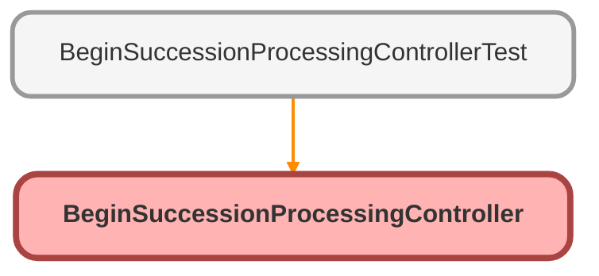

---
hide:
  - path
---

# BeginSuccessionProcessingController Class

BeginSuccessionProcessingController 
 
Apex controller for the Begin Succession Processing Quick Action. 
Automatically sets Verification_Status__c to &#x27;Complete - Verified&#x27; to trigger workflow.

**Author** Claude Code

**Date** 2025-01-27

## Class Diagram



<!-- Apex description -->

## Apex Code

```java
/**
 * BeginSuccessionProcessingController
 *
 * Apex controller for the Begin Succession Processing Quick Action.
 * Automatically sets Verification_Status__c to 'Complete - Verified' to trigger workflow.
 *
 * @author Claude Code
 * @date 2025-01-27
 */
public with sharing class BeginSuccessionProcessingController {
  /**
   * Wrapper class for Quick Action result
   */
  public class UpdateResult {
    @AuraEnabled
    public Boolean success { get; set; }
    @AuraEnabled
    public String message { get; set; }
  }

  /**
   * Update verification status to trigger workflow
   *
   * @param caseId - ID of the Case to update
   * @return UpdateResult with success status and message
   */
  @AuraEnabled
  public static UpdateResult updateVerificationStatus(Id caseId) {
    try {
      System.debug('Starting updateVerificationStatus for Case: ' + caseId);

      // Validate case exists and is not already verified
      List<Case> cases = [
        SELECT Id, Verification_Status__c, Contact_Attempt_Count__c
        FROM Case
        WHERE Id = :caseId AND RecordType.DeveloperName = 'EstateAdministration'
        LIMIT 1
      ];

      if (cases.isEmpty()) {
        UpdateResult errorResult = new UpdateResult();
        errorResult.success = false;
        errorResult.message = 'Case not found or not an Estate Administration case';
        return errorResult;
      }

      Case caseToUpdate = cases[0];

      // Check if already verified
      if (caseToUpdate.Verification_Status__c == 'Complete - Verified') {
        UpdateResult warningResult = new UpdateResult();
        warningResult.success = true;
        warningResult.message = 'Succession processing has already been started for this case';
        return warningResult;
      }

      // Check if workflow already started (duplicate prevention)
      if (caseToUpdate.Contact_Attempt_Count__c != null) {
        UpdateResult warningResult = new UpdateResult();
        warningResult.success = true;
        warningResult.message = 'Contact cadence has already begun for this case';
        return warningResult;
      }

      // Update verification status to trigger workflow
      caseToUpdate.Verification_Status__c = 'Complete - Verified';

      // Update with field-level security
      try {
        Database.update(caseToUpdate, false, AccessLevel.USER_MODE);

        UpdateResult successResult = new UpdateResult();
        successResult.success = true;
        successResult.message = 'Succession processing has begun. The first contact attempt task has been created.';
        return successResult;
      } catch (DmlException e) {
        UpdateResult errorResult = new UpdateResult();
        errorResult.success = false;
        errorResult.message =
          'Insufficient permissions to update this case: ' + e.getMessage();
        return errorResult;
      }
    } catch (Exception e) {
      System.debug('Exception occurred: ' + e.getMessage());
      System.debug('Stack trace: ' + e.getStackTraceString());
      UpdateResult errorResult = new UpdateResult();
      errorResult.success = false;
      errorResult.message =
        'Error starting succession processing: ' + e.getMessage();
      return errorResult;
    }
  }
}

```

## Methods
### `updateVerificationStatus(caseId)`

`AURAENABLED`

Update verification status to trigger workflow

#### Signature
```apex
public static UpdateResult updateVerificationStatus(Id caseId)
```

#### Parameters
| Name | Type | Description |
|------|------|-------------|
| caseId | Id | - ID of the Case to update |

#### Return Type
**UpdateResult**

UpdateResult with success status and message

## Classes
### UpdateResult Class

Wrapper class for Quick Action result

#### Properties
##### `success`

`AURAENABLED`

###### Signature
```apex
public success
```

###### Type
Boolean

---

##### `message`

`AURAENABLED`

###### Signature
```apex
public message
```

###### Type
String