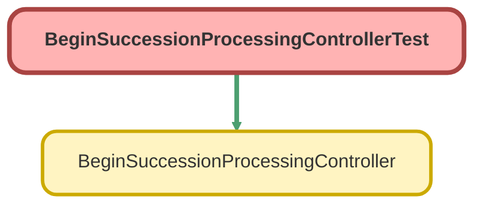

---
hide:
  - path
---

# BeginSuccessionProcessingControllerTest Class

`ISTEST`

Test class for BeginSuccessionProcessingController

## Class Diagram



<!-- Apex description -->

## Apex Code

```java
/**
 * Test class for BeginSuccessionProcessingController
 */
@IsTest
public class BeginSuccessionProcessingControllerTest {
  
  @TestSetup
  static void setupTestData() {
    // Create test account
    Account testAccount = new Account(
      FirstName = 'Test',
      LastName = 'Donor',
      PersonEmail = 'test@example.com'
    );
    insert testAccount;
    
    // Create test financial account
    FinServ__FinancialAccount__c testFA = new FinServ__FinancialAccount__c(
      Name = 'Test DAF Account',
      FinServ__PrimaryOwner__c = testAccount.Id
    );
    insert testFA;
    
    // Create test case
    Id estateAdminRT = Schema.SObjectType.Case.getRecordTypeInfosByDeveloperName().get('EstateAdministration').getRecordTypeId();
    Case testCase = new Case(
      RecordTypeId = estateAdminRT,
      Type = 'Named Successor Enactment',
      Subject = 'Test Succession Case',
      Status = 'New',
      AccountId = testAccount.Id,
      FinServ__FinancialAccount__c = testFA.Id,
      Verification_Status__c = 'Not Started'
    );
    insert testCase;
  }
  
  @IsTest
  static void testUpdateVerificationStatus_Success() {
    Case testCase = [SELECT Id FROM Case LIMIT 1];
    
    Test.startTest();
    BeginSuccessionProcessingController.UpdateResult result = 
      BeginSuccessionProcessingController.updateVerificationStatus(testCase.Id);
    Test.stopTest();
    
    // Verify success
    System.assert(result.success, 'Result should be successful');
    System.assert(result.message.contains('Succession processing has begun'), 'Message should indicate workflow started');
    
    // Verify case was updated
    Case updatedCase = [SELECT Verification_Status__c FROM Case WHERE Id = :testCase.Id];
    System.assertEquals('Complete - Verified', updatedCase.Verification_Status__c, 'Verification status should be updated');
  }
  
  @IsTest
  static void testUpdateVerificationStatus_AlreadyVerified() {
    Case testCase = [SELECT Id FROM Case LIMIT 1];
    testCase.Verification_Status__c = 'Complete - Verified';
    update testCase;
    
    Test.startTest();
    BeginSuccessionProcessingController.UpdateResult result = 
      BeginSuccessionProcessingController.updateVerificationStatus(testCase.Id);
    Test.stopTest();
    
    // Verify warning message
    System.assert(result.success, 'Result should be successful');
    System.assert(result.message.contains('already been started'), 'Message should indicate already started');
  }
  
  @IsTest
  static void testUpdateVerificationStatus_InvalidCase() {
    Test.startTest();
    BeginSuccessionProcessingController.UpdateResult result = 
      BeginSuccessionProcessingController.updateVerificationStatus('001000000000000AAA');
    Test.stopTest();
    
    // Verify error
    System.assert(!result.success, 'Result should not be successful');
    System.assert(result.message.contains('not found'), 'Message should indicate case not found');
  }
}

```

## Methods
### `setupTestData()`

`TESTSETUP`

#### Signature
```apex
private static void setupTestData()
```

#### Return Type
**void**

---

### `testUpdateVerificationStatus_Success()`

`ISTEST`

#### Signature
```apex
private static void testUpdateVerificationStatus_Success()
```

#### Return Type
**void**

---

### `testUpdateVerificationStatus_AlreadyVerified()`

`ISTEST`

#### Signature
```apex
private static void testUpdateVerificationStatus_AlreadyVerified()
```

#### Return Type
**void**

---

### `testUpdateVerificationStatus_InvalidCase()`

`ISTEST`

#### Signature
```apex
private static void testUpdateVerificationStatus_InvalidCase()
```

#### Return Type
**void**