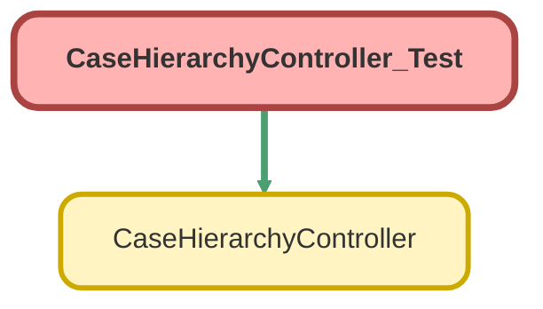

---
hide:
  - path
---

# CaseHierarchyController_Test Class

`ISTEST`

Test class for CaseHierarchyController

**Author** Estate Administration Team

**Date** 2025-10-14

## Class Diagram



<!-- Apex description -->

## Apex Code

```java
/**
 * @description Test class for CaseHierarchyController
 * @author Estate Administration Team
 * @date 2025-10-14
 */
@isTest
private class CaseHierarchyController_Test {
  @TestSetup
  static void setupTestData() {
    // Get Person Account record type
    Id personAccountRecordTypeId = Schema.SObjectType.Account.getRecordTypeInfosByDeveloperName()
      .get('PersonAccount')
      .getRecordTypeId();

    // Create deceased donor (Person Account)
    Account deceasedDonor = new Account(
      RecordTypeId = personAccountRecordTypeId,
      FirstName = 'Margaret',
      LastName = 'Thompson',
      PersonEmail = 'margaret.thompson@example.com',
      PersonMobilePhone = '555-0101'
    );
    insert deceasedDonor;

    // Create living successors (Person Accounts)
    Account successor1 = new Account(
      RecordTypeId = personAccountRecordTypeId,
      FirstName = 'Amanda',
      LastName = 'Williams',
      PersonEmail = 'amanda.williams@example.com',
      PersonMobilePhone = '555-0102'
    );
    insert successor1;

    Account successor2 = new Account(
      RecordTypeId = personAccountRecordTypeId,
      FirstName = 'Brandon',
      LastName = 'Williams',
      PersonEmail = 'brandon.williams@example.com',
      PersonMobilePhone = '555-0103'
    );
    insert successor2;

    // Query PersonContactId (auto-created with Person Accounts)
    deceasedDonor = [
      SELECT Id, PersonContactId
      FROM Account
      WHERE Id = :deceasedDonor.Id
    ];
    successor1 = [
      SELECT Id, PersonContactId
      FROM Account
      WHERE Id = :successor1.Id
    ];
    successor2 = [
      SELECT Id, PersonContactId
      FROM Account
      WHERE Id = :successor2.Id
    ];

    // Create financial account
    FinServ__FinancialAccount__c finAccount = new FinServ__FinancialAccount__c(
      Name = 'Thompson Family Fund',
      FinServ__PrimaryOwner__c = deceasedDonor.Id,
      FinServ__Balance__c = 2500000,
      FinServ__FinancialAccountNumber__c = 'DAF-12345678',
      FinServ__Status__c = 'Active'
    );
    insert finAccount;

    // Create financial account roles (FSC-compliant: use RelatedContact for Person Accounts)
    List<FinServ__FinancialAccountRole__c> roles = new List<FinServ__FinancialAccountRole__c>();

    // Primary Owner role
    roles.add(
      new FinServ__FinancialAccountRole__c(
        FinServ__FinancialAccount__c = finAccount.Id,
        FinServ__RelatedContact__c = deceasedDonor.PersonContactId,
        FinServ__Role__c = 'Primary Owner',
        FinServ__Active__c = true
      )
    );

    // Successor roles with allocations
    roles.add(
      new FinServ__FinancialAccountRole__c(
        FinServ__FinancialAccount__c = finAccount.Id,
        FinServ__RelatedContact__c = successor1.PersonContactId,
        FinServ__Role__c = 'Successor',
        FinServ__Active__c = true,
        SuccessorAllocation__c = 50
      )
    );

    roles.add(
      new FinServ__FinancialAccountRole__c(
        FinServ__FinancialAccount__c = finAccount.Id,
        FinServ__RelatedContact__c = successor2.PersonContactId,
        FinServ__Role__c = 'Successor',
        FinServ__Active__c = true,
        SuccessorAllocation__c = 50
      )
    );

    insert roles;

    // Get EstateAdministration record type
    Id estateRecordTypeId = Schema.SObjectType.Case.getRecordTypeInfosByDeveloperName()
      .get('EstateAdministration')
      .getRecordTypeId();

    // Create parent case (Multi-Account Succession Master)
    Case parentCase = new Case(
      RecordTypeId = estateRecordTypeId,
      Type = 'Multi-Account Succession Master',
      Subject = 'Multi-Successor Coordination - Margaret Thompson',
      Status = 'In Progress',
      AccountId = deceasedDonor.Id,
      FinServ__FinancialAccount__c = finAccount.Id
    );
    insert parentCase;

    // Create child cases (Named Successor Enactment)
    List<Case> childCases = new List<Case>();

    childCases.add(
      new Case(
        RecordTypeId = estateRecordTypeId,
        Type = 'Named Successor Enactment',
        Subject = 'Succession - Amanda Williams (50%)',
        Status = 'New',
        ParentId = parentCase.Id,
        AccountId = deceasedDonor.Id,
        ContactId = successor1.PersonContactId,
        FinServ__FinancialAccount__c = finAccount.Id,
        Pathway_Confirmed__c = 'Not Selected',
        Contact_Established__c = false,
        Contact_Attempt_Count__c = 0
      )
    );

    childCases.add(
      new Case(
        RecordTypeId = estateRecordTypeId,
        Type = 'Named Successor Enactment',
        Subject = 'Succession - Brandon Williams (50%)',
        Status = 'New',
        ParentId = parentCase.Id,
        AccountId = deceasedDonor.Id,
        ContactId = successor2.PersonContactId,
        FinServ__FinancialAccount__c = finAccount.Id,
        Pathway_Confirmed__c = 'Not Selected',
        Contact_Established__c = false,
        Contact_Attempt_Count__c = 0
      )
    );

    // Add a closed child case for status exclusion testing
    childCases.add(
      new Case(
        RecordTypeId = estateRecordTypeId,
        Type = 'Named Successor Enactment',
        Subject = 'Succession - Closed Case',
        Status = 'Closed',
        ParentId = parentCase.Id,
        AccountId = deceasedDonor.Id,
        ContactId = successor1.PersonContactId,
        FinServ__FinancialAccount__c = finAccount.Id,
        Pathway_Confirmed__c = 'Final Grant',
        Contact_Established__c = true
      )
    );

    insert childCases;
  }

  /**
   * Test successful hierarchy retrieval with all optional parameters true
   */
  @isTest
  static void testGetCaseHierarchy_AllOptionsEnabled() {
    // Get test parent case
    Case parentCase = [
      SELECT Id
      FROM Case
      WHERE Type = 'Multi-Account Succession Master'
      LIMIT 1
    ];

    Test.startTest();
    CaseHierarchyController.CaseHierarchyData result = CaseHierarchyController.getCaseHierarchy(
      parentCase.Id,
      'Subject,Status,Pathway_Confirmed__c',
      true, // includeFinancialAccounts
      true, // includeAccountRoles
      'Successor', // roleFilterString
      null // excludeStatusString
    );
    Test.stopTest();

    // Verify parent case
    System.assertNotEquals(null, result, 'Result should not be null');
    System.assertNotEquals(
      null,
      result.parentCase,
      'Parent case should not be null'
    );
    System.assertEquals(
      parentCase.Id,
      result.parentCase.Id,
      'Parent case ID should match'
    );

    // Verify child cases (3 total: 2 open + 1 closed)
    System.assertNotEquals(
      null,
      result.childCases,
      'Child cases list should not be null'
    );
    System.assertEquals(
      3,
      result.childCases.size(),
      'Should have 3 child cases'
    );

    // Verify financial accounts are included
    for (CaseHierarchyController.ChildCaseData childData : result.childCases) {
      System.assertNotEquals(
        null,
        childData.financialAccount,
        'Financial account should be included'
      );
      System.assertEquals(
        'Thompson Family Fund',
        childData.financialAccount.Name,
        'Financial account name should match'
      );
    }

    // Verify successors are included (only for cases with successor roles)
    Boolean foundSuccessors = false;
    for (CaseHierarchyController.ChildCaseData childData : result.childCases) {
      if (childData.successors != null && !childData.successors.isEmpty()) {
        foundSuccessors = true;
        // Verify successor data structure
        CaseHierarchyController.SuccessorData successor = childData.successors[0];
        System.assertNotEquals(
          null,
          successor.successorName,
          'Successor name should not be null'
        );
        System.assertEquals(
          50,
          successor.allocationPercent,
          'Allocation should be 50%'
        );
      }
    }
    System.assert(
      foundSuccessors,
      'Should have found successor data in at least one child case'
    );
  }

  /**
   * Test hierarchy retrieval with financial accounts disabled
   */
  @isTest
  static void testGetCaseHierarchy_NoFinancialAccounts() {
    Case parentCase = [
      SELECT Id
      FROM Case
      WHERE Type = 'Multi-Account Succession Master'
      LIMIT 1
    ];

    Test.startTest();
    CaseHierarchyController.CaseHierarchyData result = CaseHierarchyController.getCaseHierarchy(
      parentCase.Id,
      'Subject,Status',
      false, // includeFinancialAccounts
      false, // includeAccountRoles
      null,
      null
    );
    Test.stopTest();

    // Verify child cases exist but no financial account data
    System.assertEquals(
      3,
      result.childCases.size(),
      'Should have 3 child cases'
    );

    for (CaseHierarchyController.ChildCaseData childData : result.childCases) {
      // Financial accounts should be null when not included
      System.assertEquals(
        null,
        childData.financialAccount,
        'Financial account should be null when not included'
      );
    }
  }

  /**
   * Test hierarchy retrieval with account roles disabled
   */
  @isTest
  static void testGetCaseHierarchy_NoAccountRoles() {
    Case parentCase = [
      SELECT Id
      FROM Case
      WHERE Type = 'Multi-Account Succession Master'
      LIMIT 1
    ];

    Test.startTest();
    CaseHierarchyController.CaseHierarchyData result = CaseHierarchyController.getCaseHierarchy(
      parentCase.Id,
      'Subject,Status',
      true, // includeFinancialAccounts
      false, // includeAccountRoles (disabled)
      null,
      null
    );
    Test.stopTest();

    // Verify financial accounts are included but not successor data
    for (CaseHierarchyController.ChildCaseData childData : result.childCases) {
      System.assertNotEquals(
        null,
        childData.financialAccount,
        'Financial account should be included'
      );
      System.assertEquals(
        0,
        childData.successors.size(),
        'Successors list should be empty when roles not included'
      );
    }
  }

  /**
   * Test status exclusion filter
   */
  @isTest
  static void testGetCaseHierarchy_StatusExclusion() {
    Case parentCase = [
      SELECT Id
      FROM Case
      WHERE Type = 'Multi-Account Succession Master'
      LIMIT 1
    ];

    Test.startTest();
    CaseHierarchyController.CaseHierarchyData result = CaseHierarchyController.getCaseHierarchy(
      parentCase.Id,
      'Subject,Status',
      false,
      false,
      null,
      'Closed' // excludeStatusString
    );
    Test.stopTest();

    // Verify only open cases are returned (2 cases, excluding 1 closed case)
    System.assertEquals(
      2,
      result.childCases.size(),
      'Should have 2 child cases after excluding Closed status'
    );

    for (CaseHierarchyController.ChildCaseData childData : result.childCases) {
      System.assertNotEquals(
        'Closed',
        childData.caseRecord.Status,
        'No closed cases should be in results'
      );
    }
  }

  /**
   * Test role filter with comma-separated values
   */
  @isTest
  static void testGetCaseHierarchy_RoleFilter() {
    Case parentCase = [
      SELECT Id
      FROM Case
      WHERE Type = 'Multi-Account Succession Master'
      LIMIT 1
    ];

    Test.startTest();
    CaseHierarchyController.CaseHierarchyData result = CaseHierarchyController.getCaseHierarchy(
      parentCase.Id,
      'Subject,Status',
      true,
      true,
      'Successor,Primary Owner', // roleFilterString
      null
    );
    Test.stopTest();

    // Verify successors are included (filtered by role)
    Boolean foundSuccessors = false;
    for (CaseHierarchyController.ChildCaseData childData : result.childCases) {
      if (childData.successors != null && !childData.successors.isEmpty()) {
        foundSuccessors = true;
      }
    }
    System.assert(
      foundSuccessors,
      'Should have found successor data with role filter'
    );
  }

  /**
   * Test with no child cases
   */
  @isTest
  static void testGetCaseHierarchy_NoChildCases() {
    // Create a parent case without children
    Account testAccount = [
      SELECT Id
      FROM Account
      WHERE LastName = 'Thompson'
      LIMIT 1
    ];
    Id estateRecordTypeId = Schema.SObjectType.Case.getRecordTypeInfosByDeveloperName()
      .get('EstateAdministration')
      .getRecordTypeId();

    Case standaloneCase = new Case(
      RecordTypeId = estateRecordTypeId,
      Type = 'Named Successor Enactment',
      Subject = 'Standalone Case - No Children',
      Status = 'New',
      AccountId = testAccount.Id
    );
    insert standaloneCase;

    Test.startTest();
    CaseHierarchyController.CaseHierarchyData result = CaseHierarchyController.getCaseHierarchy(
      standaloneCase.Id,
      'Subject,Status',
      false,
      false,
      null,
      null
    );
    Test.stopTest();

    // Verify parent case exists but no child cases
    System.assertNotEquals(null, result.parentCase, 'Parent case should exist');
    System.assertEquals(
      0,
      result.childCases.size(),
      'Should have no child cases'
    );
  }

  /**
   * Test error handling with invalid case ID
   */
  @isTest
  static void testGetCaseHierarchy_InvalidCaseId() {
    // Use a fake case ID (invalid format)
    Id fakeCaseId = '500000000000000AAA';

    Test.startTest();
    try {
      CaseHierarchyController.CaseHierarchyData result = CaseHierarchyController.getCaseHierarchy(
        fakeCaseId,
        'Subject,Status',
        false,
        false,
        null,
        null
      );
      System.assert(
        false,
        'Should have thrown an exception for invalid case ID'
      );
    } catch (AuraHandledException e) {
      // Verify an exception was thrown - the specific message may vary
      // We just need to confirm the method throws an exception for invalid input
      System.assertNotEquals(null, e, 'Should throw AuraHandledException');
    }
    Test.stopTest();
  }

  /**
   * Test error handling with null case ID
   */
  @isTest
  static void testGetCaseHierarchy_NullCaseId() {
    Test.startTest();
    try {
      CaseHierarchyController.CaseHierarchyData result = CaseHierarchyController.getCaseHierarchy(
        null,
        'Subject,Status',
        false,
        false,
        null,
        null
      );
      System.assert(false, 'Should have thrown an exception for null case ID');
    } catch (Exception e) {
      // Expect AuraHandledException or NullPointerException
      System.assert(true, 'Exception should be thrown for null case ID');
    }
    Test.stopTest();
  }

  /**
   * Test wrapper class data structure
   */
  @isTest
  static void testWrapperClasses() {
    // Test CaseHierarchyData wrapper
    CaseHierarchyController.CaseHierarchyData hierarchyData = new CaseHierarchyController.CaseHierarchyData();
    hierarchyData.childCases = new List<CaseHierarchyController.ChildCaseData>();
    System.assertNotEquals(
      null,
      hierarchyData,
      'CaseHierarchyData should be instantiated'
    );

    // Test ChildCaseData wrapper
    CaseHierarchyController.ChildCaseData childData = new CaseHierarchyController.ChildCaseData();
    childData.successors = new List<CaseHierarchyController.SuccessorData>();
    System.assertNotEquals(
      null,
      childData,
      'ChildCaseData should be instantiated'
    );

    // Test SuccessorData wrapper
    CaseHierarchyController.SuccessorData successorData = new CaseHierarchyController.SuccessorData();
    successorData.successorName = 'Test Successor';
    successorData.allocationPercent = 100;
    System.assertEquals(
      'Test Successor',
      successorData.successorName,
      'Successor name should be set'
    );
    System.assertEquals(
      100,
      successorData.allocationPercent,
      'Allocation percent should be set'
    );
  }
}

```

## Methods
### `setupTestData()`

`TESTSETUP`

#### Signature
```apex
private static void setupTestData()
```

#### Return Type
**void**

---

### `testGetCaseHierarchy_AllOptionsEnabled()`

`ISTEST`

Test successful hierarchy retrieval with all optional parameters true

#### Signature
```apex
private static void testGetCaseHierarchy_AllOptionsEnabled()
```

#### Return Type
**void**

---

### `testGetCaseHierarchy_NoFinancialAccounts()`

`ISTEST`

Test hierarchy retrieval with financial accounts disabled

#### Signature
```apex
private static void testGetCaseHierarchy_NoFinancialAccounts()
```

#### Return Type
**void**

---

### `testGetCaseHierarchy_NoAccountRoles()`

`ISTEST`

Test hierarchy retrieval with account roles disabled

#### Signature
```apex
private static void testGetCaseHierarchy_NoAccountRoles()
```

#### Return Type
**void**

---

### `testGetCaseHierarchy_StatusExclusion()`

`ISTEST`

Test status exclusion filter

#### Signature
```apex
private static void testGetCaseHierarchy_StatusExclusion()
```

#### Return Type
**void**

---

### `testGetCaseHierarchy_RoleFilter()`

`ISTEST`

Test role filter with comma-separated values

#### Signature
```apex
private static void testGetCaseHierarchy_RoleFilter()
```

#### Return Type
**void**

---

### `testGetCaseHierarchy_NoChildCases()`

`ISTEST`

Test with no child cases

#### Signature
```apex
private static void testGetCaseHierarchy_NoChildCases()
```

#### Return Type
**void**

---

### `testGetCaseHierarchy_InvalidCaseId()`

`ISTEST`

Test error handling with invalid case ID

#### Signature
```apex
private static void testGetCaseHierarchy_InvalidCaseId()
```

#### Return Type
**void**

---

### `testGetCaseHierarchy_NullCaseId()`

`ISTEST`

Test error handling with null case ID

#### Signature
```apex
private static void testGetCaseHierarchy_NullCaseId()
```

#### Return Type
**void**

---

### `testWrapperClasses()`

`ISTEST`

Test wrapper class data structure

#### Signature
```apex
private static void testWrapperClasses()
```

#### Return Type
**void**