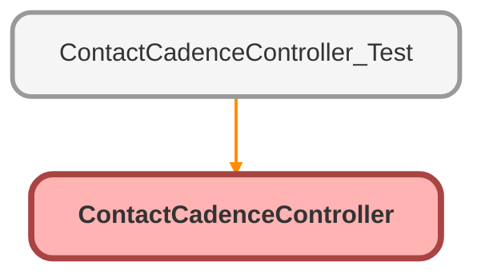

---
hide:
  - path
---

# ContactCadenceController Class

`SUPPRESSWARNINGS`

ContactCadenceController 
 
Apex controller for successionContactCadence LWC component. 
Provides methods for retrieving contact attempt tasks and saving outcomes. 
 
REFACTORED: Reduced cognitive complexity from 63 to 10 by extracting helper methods. 
DEMO ENVIRONMENT: Warnings suppressed - this is a demo/sandbox environment 
with simplified security model. Production implementations should add proper 
CRUD/FLS validation using WITH USER_MODE or explicit permission checks.

**Author** Claude Code

**Date** 2025-10-02

## Class Diagram



<!-- Apex description -->

## Apex Code

```java
/**
 * ContactCadenceController
 *
 * Apex controller for successionContactCadence LWC component.
 * Provides methods for retrieving contact attempt tasks and saving outcomes.
 *
 * REFACTORED: Reduced cognitive complexity from 63 to 10 by extracting helper methods.
 * DEMO ENVIRONMENT: Warnings suppressed - this is a demo/sandbox environment
 * with simplified security model. Production implementations should add proper
 * CRUD/FLS validation using WITH USER_MODE or explicit permission checks.
 *
 * @author Claude Code
 * @date 2025-10-02
 */
@SuppressWarnings('PMD.ApexCRUDViolation')
public with sharing class ContactCadenceController {
  /**
   * Wrapper class for task data with computed properties
   */
  public class TaskAttemptData {
    @AuraEnabled
    public Task taskRecord { get; set; }
    @AuraEnabled
    public Integer attemptNumber { get; set; }
    @AuraEnabled
    public String attemptLabel { get; set; }
    @AuraEnabled
    public String dayLabel { get; set; }
    @AuraEnabled
    public String statusLabel { get; set; }
    @AuraEnabled
    public Boolean isCompleted { get; set; }
    @AuraEnabled
    public Boolean isCurrent { get; set; }
    @AuraEnabled
    public Boolean isPending { get; set; }
    @AuraEnabled
    public Boolean isLocked { get; set; } // Task exists but date hasn't arrived
    @AuraEnabled
    public String formattedDueDate { get; set; }
    @AuraEnabled
    public Integer daysUntilAvailable { get; set; } // Days until task can be completed
    @AuraEnabled
    public String countdownText { get; set; } // Human-readable countdown
    @AuraEnabled
    public String userNotes { get; set; } // User-entered notes from ContentNote
  }

  /**
   * Wrapper class for contact cadence data
   */
  public class ContactCadenceData {
    @AuraEnabled
    public Boolean isValidRecordType { get; set; }
    @AuraEnabled
    public String invalidRecordTypeMessage { get; set; }
    @AuraEnabled
    public List<TaskAttemptData> attempts { get; set; }
    @AuraEnabled
    public Integer currentAttemptNumber { get; set; }
    @AuraEnabled
    public Integer totalAttempts { get; set; }
    @AuraEnabled
    public Boolean contactEstablished { get; set; }
    @AuraEnabled
    public String caseStatus { get; set; }
    @AuraEnabled
    public Id contactId { get; set; } // Contact ID for Business Account + Contact model
    @AuraEnabled
    public Id accountId { get; set; } // Account ID (used for Person Accounts)
    @AuraEnabled
    public Boolean isPersonAccount { get; set; } // True if Case.Account is Person Account

    // Email validation fields
    @AuraEnabled
    public String emailAddress { get; set; } // The actual email address
    @AuraEnabled
    public Boolean hasEmail { get; set; } // True if email exists and is not blank
    @AuraEnabled
    public Boolean hasValidEmailFormat { get; set; } // True if email format is valid
    @AuraEnabled
    public Boolean hasOptedOut { get; set; } // True if recipient opted out of email
    @AuraEnabled
    public String emailWarning { get; set; } // Warning message about email issues
  }

  /**
   * Retrieve contact attempt tasks for a succession case
   * REFACTORED: Reduced cognitive complexity by extracting helper methods
   *
   * @param caseId - ID of the succession case
   * @return ContactCadenceData with tasks and metadata
   */
  @AuraEnabled(cacheable=true)
  public static ContactCadenceData getContactCadence(Id caseId) {
    ContactCadenceData cadenceData = new ContactCadenceData();
    cadenceData.attempts = new List<TaskAttemptData>();

    // Query parent case
    Case parentCase = queryCaseData(caseId);

    // Validate case and return early if invalid
    if (!validateCaseData(parentCase, cadenceData)) {
      return cadenceData;
    }

    // Populate cadence metadata
    populateCadenceMetadata(parentCase, cadenceData);

    // Query and map task data
    Map<Integer, Task> tasksByAttempt = queryAndMapTasks(caseId);
    Map<Integer, String> notesByAttempt = queryAndMapNotes(caseId);

    // Build attempt data for all 5 attempts
    Integer firstIncompleteAttempt = findFirstIncompleteAttempt(
      parentCase,
      tasksByAttempt
    );
    buildAttemptData(
      cadenceData,
      tasksByAttempt,
      notesByAttempt,
      firstIncompleteAttempt
    );

    return cadenceData;
  }

  /**
   * Query case data with all required fields
   * DEMO: Using WITH USER_MODE for demo environment
   */
  @SuppressWarnings('PMD.ApexCRUDViolation')
  private static Case queryCaseData(Id caseId) {
    return [
      SELECT
        Id,
        RecordType.DeveloperName,
        Type,
        Contact_Established__c,
        Contact_Attempt_Count__c,
        Status,
        ContactId,
        AccountId,
        Successor__c,
        Account.IsPersonAccount,
        Account.PersonEmail,
        Account.PersonHasOptedOutOfEmail,
        Contact.Email,
        Contact.HasOptedOutOfEmail
      FROM Case
      WHERE Id = :caseId
      LIMIT 1
    ];
  }

  /**
   * Validate case record type, type, and account
   * Returns false if validation fails (early return pattern)
   */
  private static Boolean validateCaseData(
    Case parentCase,
    ContactCadenceData cadenceData
  ) {
    // Validate record type
    if (parentCase.RecordType.DeveloperName != 'EstateAdministration') {
      cadenceData.isValidRecordType = false;
      cadenceData.invalidRecordTypeMessage = 'This component is only available for Estate Administration cases.';
      return false;
    }

    // Validate case type
    if (
      parentCase.Type != 'Succession Management' &&
      parentCase.Type != 'Named Successor Enactment'
    ) {
      cadenceData.isValidRecordType = false;
      cadenceData.invalidRecordTypeMessage = 'This component is only available for Succession Management or Named Successor Enactment cases.';
      return false;
    }

    // Validate account exists
    if (parentCase.AccountId == null) {
      cadenceData.isValidRecordType = false;
      cadenceData.invalidRecordTypeMessage = 'This case does not have an associated Account. Please assign an Account to enable email functionality.';
      return false;
    }

    cadenceData.isValidRecordType = true;
    return true;
  }

  /**
   * Populate cadence metadata from case data
   */
  private static void populateCadenceMetadata(
    Case parentCase,
    ContactCadenceData cadenceData
  ) {
    cadenceData.contactEstablished = parentCase.Contact_Established__c;
    cadenceData.caseStatus = parentCase.Status;
    cadenceData.contactId = parentCase.Successor__c;
    cadenceData.accountId = parentCase.AccountId;
    cadenceData.isPersonAccount = parentCase.Account?.IsPersonAccount ?? false;
    cadenceData.totalAttempts = 5;

    // CRITICAL: Validate email existence and opt-out status
    validateEmailAddress(parentCase, cadenceData);
  }

  /**
   * Query and map tasks by attempt number
   * DEMO: Using WITH USER_MODE for demo environment
   */
  @SuppressWarnings('PMD.ApexCRUDViolation')
  private static Map<Integer, Task> queryAndMapTasks(Id caseId) {
    Map<Integer, Task> tasksByAttempt = new Map<Integer, Task>();

    List<Task> attemptTasks = [
      SELECT
        Id,
        Subject,
        Status,
        ActivityDate,
        Contact_Attempt_Number__c,
        Succession_Contact_Established__c,
        IsClosed,
        CompletedDateTime
      FROM Task
      WHERE WhatId = :caseId AND Contact_Attempt_Number__c != NULL
      ORDER BY Contact_Attempt_Number__c ASC
    ];

    for (Task t : attemptTasks) {
      Integer attemptNum = Integer.valueOf(t.Contact_Attempt_Number__c);
      tasksByAttempt.put(attemptNum, t);
    }

    return tasksByAttempt;
  }

  /**
   * Query and map ContentNote records by attempt number
   * DEMO: Using WITH USER_MODE for demo environment
   */
  @SuppressWarnings('PMD.ApexCRUDViolation')
  private static Map<Integer, String> queryAndMapNotes(Id caseId) {
    Map<Integer, String> notesByAttempt = new Map<Integer, String>();

    System.debug('DEBUG: Querying notes for Case: ' + caseId);

    // Query ContentDocumentLink to find documents linked to the case
    List<ContentDocumentLink> cdLinks = [
      SELECT ContentDocumentId
      FROM ContentDocumentLink
      WHERE LinkedEntityId = :caseId
      ORDER BY SystemModstamp DESC
    ];

    System.debug('DEBUG: Found ' + cdLinks.size() + ' ContentDocumentLinks');

    if (cdLinks.isEmpty()) {
      return notesByAttempt;
    }

    // Extract document IDs
    Set<Id> docIds = new Set<Id>();
    for (ContentDocumentLink cdl : cdLinks) {
      docIds.add(cdl.ContentDocumentId);
    }

    // Query ContentVersion records (ContentNote is stored as ContentVersion)
    List<ContentVersion> contentVersions = [
      SELECT Id, Title, VersionData
      FROM ContentVersion
      WHERE ContentDocumentId IN :docIds AND IsLatest = TRUE
      ORDER BY CreatedDate DESC
    ];

    System.debug('DEBUG: Found ' + contentVersions.size() + ' ContentVersions');

    for (ContentVersion cv : contentVersions) {
      // Parse the title to extract attempt number
      String title = cv.Title;
      System.debug('DEBUG: Processing ContentVersion with Title: ' + title);

      if (title.contains('Succession Contact Attempt ')) {
        Integer attemptNum = extractAttemptNumberFromTitle(title);
        System.debug('DEBUG: Extracted attempt number: ' + attemptNum);

        if (attemptNum != null) {
          String content = cv.VersionData.toString();
          System.debug('DEBUG: Content preview (first 200 chars): ' + content.substring(0, Math.min(200, content.length())));

          String userNotes = extractUserNotesFromContent(content);
          System.debug('DEBUG: Extracted user notes: ' + userNotes);

          if (String.isNotBlank(userNotes)) {
            notesByAttempt.put(attemptNum, userNotes);
            System.debug('DEBUG: Added notes for attempt ' + attemptNum);
          }
        }
      }
    }

    System.debug('DEBUG: Final notesByAttempt map size: ' + notesByAttempt.size());
    return notesByAttempt;
  }

  /**
   * Parse single ContentNote and add to map
   * REFACTORED: Extracted from nested loop to reduce complexity
   */
  private static void parseAndMapNote(
    ContentNote note,
    Map<Integer, String> notesByAttempt
  ) {
    String title = note.Title;

    // Early return if title doesn't match expected format
    if (!title.contains('Succession Contact Attempt ')) {
      return;
    }

    Integer attemptNum = extractAttemptNumberFromTitle(title);
    if (attemptNum == null) {
      return;
    }

    String fullContent = note.Content.toString();
    String userNotes = extractUserNotesFromContent(fullContent);

    if (String.isNotBlank(userNotes)) {
      notesByAttempt.put(attemptNum, userNotes);
    }
  }

  /**
   * Extract attempt number from ContentNote title
   * Returns null if parsing fails
   */
  private static Integer extractAttemptNumberFromTitle(String title) {
    try {
      String[] parts = title.split('Succession Contact Attempt ');
      if (parts.size() <= 1) {
        return null;
      }

      String[] attemptParts = parts[1].split(' - ');
      if (attemptParts.size() == 0) {
        return null;
      }

      return Integer.valueOf(attemptParts[0]);
    } catch (Exception e) {
      System.debug('Error parsing attempt number from title: ' + title);
      return null;
    }
  }

  /**
   * Find first incomplete attempt number
   */
  private static Integer findFirstIncompleteAttempt(
    Case parentCase,
    Map<Integer, Task> tasksByAttempt
  ) {
    // If contact already established, no incomplete attempts
    if (parentCase.Contact_Established__c) {
      return null;
    }

    // Find first incomplete attempt
    for (Integer i = 1; i <= 5; i++) {
      if (!tasksByAttempt.containsKey(i) || !tasksByAttempt.get(i).IsClosed) {
        return i;
      }
    }

    return null;
  }

  /**
   * Build attempt data for all 5 attempts
   * REFACTORED: Extracted from main method to reduce complexity
   */
  @SuppressWarnings('PMD.ExcessiveParameterList')
  private static void buildAttemptData(
    ContactCadenceData cadenceData,
    Map<Integer, Task> tasksByAttempt,
    Map<Integer, String> notesByAttempt,
    Integer firstIncompleteAttempt
  ) {
    Map<Integer, String> attemptDays = new Map<Integer, String>{
      1 => 'Day 0',
      2 => 'Day 5',
      3 => 'Day 35',
      4 => 'Day 65',
      5 => 'Day 95'
    };

    for (Integer i = 1; i <= 5; i++) {
      TaskAttemptData attemptData = new TaskAttemptData();
      attemptData.attemptNumber = i;
      attemptData.attemptLabel = 'Attempt ' + i;
      attemptData.dayLabel = attemptDays.get(i);

      if (tasksByAttempt.containsKey(i)) {
        populateTaskAttemptData(
          attemptData,
          tasksByAttempt.get(i),
          i,
          firstIncompleteAttempt
        );
      } else {
        populatePendingAttemptData(attemptData);
      }

      // Add user notes
      attemptData.userNotes = notesByAttempt.containsKey(i)
        ? notesByAttempt.get(i)
        : '';

      cadenceData.attempts.add(attemptData);
    }

    // Set current attempt number to first incomplete, or 5 if all complete
    cadenceData.currentAttemptNumber = firstIncompleteAttempt != null
      ? firstIncompleteAttempt
      : 5;
  }

  /**
   * Populate attempt data when task exists
   */
  @SuppressWarnings('PMD.ExcessiveParameterList')
  private static void populateTaskAttemptData(
    TaskAttemptData attemptData,
    Task task,
    Integer attemptNumber,
    Integer firstIncompleteAttempt
  ) {
    attemptData.taskRecord = task;
    attemptData.isCompleted = task.IsClosed;
    attemptData.statusLabel = task.Status;
    attemptData.formattedDueDate = task.ActivityDate != null
      ? task.ActivityDate.format()
      : '';

    // Calculate date-gating and countdown
    calculateDateGating(attemptData, task);

    // Determine attempt state
    determineAttemptState(
      attemptData,
      task,
      attemptNumber,
      firstIncompleteAttempt
    );
  }

  /**
   * Calculate date-gating and countdown for task
   */
  private static void calculateDateGating(
    TaskAttemptData attemptData,
    Task task
  ) {
    Date today = Date.today();
    Boolean dateHasArrived = (task.ActivityDate != null &&
    task.ActivityDate <= today);

    if (!dateHasArrived && task.ActivityDate != null) {
      Integer daysRemaining = today.daysBetween(task.ActivityDate);
      attemptData.daysUntilAvailable = daysRemaining;
      attemptData.countdownText =
        'Available in ' +
        daysRemaining +
        ' day' +
        (daysRemaining == 1 ? '' : 's');
    } else {
      attemptData.daysUntilAvailable = 0;
      attemptData.countdownText = '';
    }
  }

  /**
   * Determine attempt state (completed, current, locked, pending)
   */
  @SuppressWarnings('PMD.ExcessiveParameterList')
  private static void determineAttemptState(
    TaskAttemptData attemptData,
    Task task,
    Integer attemptNumber,
    Integer firstIncompleteAttempt
  ) {
    if (task.IsClosed) {
      // Completed attempts are read-only
      attemptData.isCompleted = true;
      attemptData.isCurrent = false;
      attemptData.isPending = false;
      attemptData.isLocked = false;
      return;
    }

    if (attemptNumber == firstIncompleteAttempt) {
      // First incomplete attempt - check if date has arrived
      Date today = Date.today();
      Boolean dateHasArrived = (task.ActivityDate != null &&
      task.ActivityDate <= today);

      if (dateHasArrived) {
        attemptData.isCurrent = true;
        attemptData.isLocked = false;
      } else {
        attemptData.isCurrent = false;
        attemptData.isLocked = true;
      }
      attemptData.isPending = false;
      return;
    }

    // Future attempts
    attemptData.isCurrent = false;
    attemptData.isPending = true;
    attemptData.isLocked = false;
  }

  /**
   * Populate attempt data when no task exists yet
   */
  private static void populatePendingAttemptData(TaskAttemptData attemptData) {
    attemptData.taskRecord = null;
    attemptData.isCompleted = false;
    attemptData.isCurrent = false;
    attemptData.isPending = true;
    attemptData.isLocked = false;
    attemptData.statusLabel = 'Waiting for Previous Attempt';
    attemptData.countdownText = 'Complete previous attempts first';
    attemptData.daysUntilAvailable = null;
  }

  /**
   * Save the outcome of a contact attempt
   * DEMO: Suppressing CRUD and parameter list warnings for demo environment
   *
   * @param caseId - ID of the parent case
   * @param taskId - ID of the task being updated (null if creating new)
   * @param attemptNumber - Attempt number (1-5)
   * @param contactEstablished - Whether contact was successfully established
   * @param notes - Agent notes about the attempt
   * @return Success message or error
   */
  @AuraEnabled
  @SuppressWarnings('PMD.ExcessiveParameterList')
  public static String saveAttemptOutcome(
    Id caseId,
    Id taskId,
    Integer attemptNumber,
    Boolean contactEstablished,
    String notes
  ) {
    try {
      Task attemptTask;

      // If taskId is null, create new task immediately (agent is recording outcome)
      if (taskId == null) {
        attemptTask = new Task(
          WhatId = caseId,
          Subject = 'Succession Contact Attempt ' + attemptNumber,
          Contact_Attempt_Number__c = attemptNumber,
          Status = 'Completed',
          Succession_Contact_Established__c = contactEstablished,
          ActivityDate = Date.today()
        );
      } else {
        // Query existing task
        attemptTask = [
          SELECT Id, WhatId, Status, Succession_Contact_Established__c
          FROM Task
          WHERE Id = :taskId
          LIMIT 1
        ];

        // Update task
        attemptTask.Status = 'Completed';
        attemptTask.Succession_Contact_Established__c = contactEstablished;
      }

      // Add/append notes
      // Notes are handled separately - not stored in Description field
      // The Description field is metadata only

      upsert attemptTask;

      // Create ContentNote and Chatter post if notes were provided
      // Wrapped in try-catch to handle test context where ContentNote/FeedItem may have limitations
      if (String.isNotBlank(notes)) {
        try {
          createContactAttemptNote(
            caseId,
            attemptNumber,
            contactEstablished,
            notes
          );
        } catch (Exception noteEx) {
          // Log but don't fail - ContentNote creation is supplementary
          System.debug(
            'Note creation failed (may be test context): ' + noteEx.getMessage()
          );
        }

        try {
          createChatterPost(caseId, attemptNumber, contactEstablished, notes);
        } catch (Exception chatterEx) {
          // Log but don't fail - Chatter post creation is supplementary
          System.debug(
            'Chatter post creation failed (may be test context): ' +
            chatterEx.getMessage()
          );
        }
      }

      // Update parent case based on outcome
      Case parentCase = [
        SELECT
          Id,
          Contact_Established__c,
          Contact_Established_Date__c,
          Contact_Attempt_Count__c
        FROM Case
        WHERE Id = :caseId
        LIMIT 1
      ];

      // If contact established, update case
      // Task_Succession_Contact_Update flow will handle this too, but we update here for immediate feedback
      if (contactEstablished && !parentCase.Contact_Established__c) {
        parentCase.Contact_Established__c = true;
        parentCase.Contact_Established_Date__c = Date.today();
        update parentCase;
      }

      // Flow Task_Create_Next_Contact_Attempt will auto-create next task when this task completes
      // No manual intervention needed

      return 'Success';
    } catch (Exception e) {
      throw new AuraHandledException('Error saving outcome: ' + e.getMessage());
    }
  }

  // TODO: Implement ContentNote query and extractUserNotes method later

  /**
   * Create a ContentNote record for the contact attempt
   * DEMO: Suppressing CRUD and parameter list warnings for demo environment
   *
   * @param caseId - Case record ID
   * @param attemptNumber - Attempt number (1-5)
   * @param contactEstablished - Whether contact was established
   * @param noteContent - Note content
   */
  @SuppressWarnings('PMD.ExcessiveParameterList')
  private static void createContactAttemptNote(
    Id caseId,
    Integer attemptNumber,
    Boolean contactEstablished,
    String noteContent
  ) {
    // Format timestamp for note title and content
    DateTime now = DateTime.now();
    String formattedDate = now.format('yyyy-MM-dd HH:mm:ss');
    String dateOnly = now.format('yyyy-MM-dd');

    // Determine outcome label
    String outcomeLabel = contactEstablished
      ? 'Contact Established'
      : 'Contact Not Established';

    // Create note title
    String noteTitle =
      'Succession Contact Attempt ' +
      attemptNumber +
      ' - ' +
      dateOnly;

    // Create note body with structured format
    String noteBody = '========================================\n';
    noteBody += 'SUCCESSION CONTACT ATTEMPT #' + attemptNumber + '\n';
    noteBody += '========================================\n\n';
    noteBody += 'Date/Time: ' + formattedDate + '\n';
    noteBody += 'Outcome: ' + outcomeLabel + '\n\n';
    noteBody += '----------------------------------------\n';
    noteBody += 'NOTES:\n';
    noteBody += '----------------------------------------\n\n';
    noteBody += noteContent;

    // Create ContentNote
    ContentNote note = new ContentNote();
    note.Title = noteTitle;
    note.Content = Blob.valueOf(noteBody);
    insert note;

    System.debug('DEBUG: Created ContentNote with Title: ' + noteTitle);
    System.debug('DEBUG: ContentNote Id: ' + note.Id);
    System.debug('DEBUG: Note content preview: ' + noteBody.substring(0, Math.min(100, noteBody.length())));

    // Link note to Case
    // Query ContentDocument using LatestPublishedVersionId (ContentNote is a version)
    ContentDocument doc = [
      SELECT Id
      FROM ContentDocument
      WHERE LatestPublishedVersionId = :note.Id
      LIMIT 1
    ];

    System.debug('DEBUG: Found ContentDocument Id: ' + doc.Id);

    ContentDocumentLink cdl = new ContentDocumentLink();
    cdl.ContentDocumentId = doc.Id;
    cdl.LinkedEntityId = caseId;
    cdl.ShareType = 'V'; // Viewer permission
    cdl.Visibility = 'AllUsers'; // Visible to all users with access to the record
    insert cdl;

    System.debug('DEBUG: Created ContentDocumentLink to Case: ' + caseId);
  }

  /**
   * Create a Chatter post on the Case for the contact attempt
   * DEMO: Suppressing CRUD and parameter list warnings for demo environment
   *
   * @param caseId - Case record ID
   * @param attemptNumber - Attempt number (1-5)
   * @param contactEstablished - Whether contact was established
   * @param noteContent - Note content
   */
  @SuppressWarnings('PMD.ExcessiveParameterList')
  private static void createChatterPost(
    Id caseId,
    Integer attemptNumber,
    Boolean contactEstablished,
    String noteContent
  ) {
    // Format timestamp and outcome
    DateTime now = DateTime.now();
    String formattedDateTime = now.format('MM/dd/yyyy HH:mm');
    String outcomeEmoji = contactEstablished ? '✅' : '❌';
    String outcomeText = contactEstablished
      ? 'Contact Established'
      : 'Contact Not Established';

    // Build Chatter post body
    String postBody = String.format(
      '{0} Succession Contact Attempt {1}\n\n' +
        'Time: {2}\n' +
        'Outcome: {3}\n\n' +
        'Agent Notes:\n{4}',
      new List<String>{
        outcomeEmoji,
        String.valueOf(attemptNumber),
        formattedDateTime,
        outcomeText,
        noteContent
      }
    );

    // Create FeedItem (Chatter post)
    FeedItem post = new FeedItem();
    post.ParentId = caseId;
    post.Body = postBody;
    post.Type = 'TextPost';
    insert post;
  }

  /**
   * Validate email address existence, format, and opt-out status
   * DEMO: Suppressing CRUD warnings for demo environment
   *
   * @param parentCase - Case record with Account and Contact relationships
   * @param cadenceData - ContactCadenceData to populate with email validation results
   */
  @SuppressWarnings('PMD.ApexCRUDViolation')
  private static void validateEmailAddress(
    Case parentCase,
    ContactCadenceData cadenceData
  ) {
    String email = null;
    Boolean optedOut = false;

    // SUCCESSION FIX: Always use Successor Contact for email validation
    if (parentCase.Successor__c != null) {
      // Query the Successor Contact for email validation
      List<Contact> successorContacts = [
        SELECT Email, HasOptedOutOfEmail
        FROM Contact
        WHERE Id = :parentCase.Successor__c
        LIMIT 1
      ];

      if (!successorContacts.isEmpty()) {
        email = successorContacts[0].Email;
        optedOut = successorContacts[0].HasOptedOutOfEmail == true;
      }
    }

    // Check if email exists and is not blank
    cadenceData.hasEmail = String.isNotBlank(email);
    cadenceData.emailAddress = email;
    cadenceData.hasOptedOut = optedOut;

    // Validate email format using regex (basic RFC 5322 pattern)
    // Pattern matches: local-part@domain.tld
    if (cadenceData.hasEmail) {
      String emailPattern = '^[a-zA-Z0-9._%+-]+@[a-zA-Z0-9.-]+\\.[a-zA-Z]{2,}$';
      cadenceData.hasValidEmailFormat = Pattern.matches(emailPattern, email);
    } else {
      cadenceData.hasValidEmailFormat = false;
    }

    // Build warning message for UI
    List<String> warnings = new List<String>();

    if (optedOut) {
      warnings.add(
        '⚠️ Successor has opted out of email. Contact by phone only.'
      );
    }

    if (!cadenceData.hasEmail) {
      warnings.add('No email address on file for this successor.');
    } else if (!cadenceData.hasValidEmailFormat) {
      warnings.add('Email address format appears invalid: ' + email);
    }

    // Set warning message (null if no issues)
    cadenceData.emailWarning = warnings.isEmpty()
      ? null
      : String.join(warnings, ' ');
  }

  /**
   * Extract user notes from ContentNote content
   * ContentNote content is stored with structured format:
   * ========================================
   * SUCCESSION CONTACT ATTEMPT #X
   * ========================================
   * Date/Time: ...
   * Outcome: ...
   * ----------------------------------------
   * NOTES:
   * ----------------------------------------
   * [USER NOTES HERE]
   *
   * @param fullContent - Full content from ContentNote
   * @return Extracted user notes
   */
  private static String extractUserNotesFromContent(String fullContent) {
    if (String.isBlank(fullContent)) {
      return '';
    }

    // Find the "NOTES:" section
    Integer notesIndex = fullContent.indexOf('NOTES:');
    if (notesIndex == -1) {
      return '';
    }

    // Find the next line after "NOTES:" header
    Integer startIndex = fullContent.indexOf('\n', notesIndex);
    if (startIndex == -1) {
      return '';
    }

    // Skip the dashes line after NOTES:
    startIndex = fullContent.indexOf('\n', startIndex + 1);
    if (startIndex == -1) {
      return '';
    }

    // Skip the blank line
    startIndex = fullContent.indexOf('\n', startIndex + 1);
    if (startIndex == -1) {
      return '';
    }

    // Extract everything after the blank line as user notes
    String userNotes = fullContent.substring(startIndex + 1).trim();
    return userNotes;
  }
}

```

## Methods
### `getContactCadence(caseId)`

`AURAENABLED`

Retrieve contact attempt tasks for a succession case 
REFACTORED: Reduced cognitive complexity by extracting helper methods

#### Signature
```apex
public static ContactCadenceData getContactCadence(Id caseId)
```

#### Parameters
| Name | Type | Description |
|------|------|-------------|
| caseId | Id | - ID of the succession case |

#### Return Type
**ContactCadenceData**

ContactCadenceData with tasks and metadata

---

### `queryCaseData(caseId)`

`SUPPRESSWARNINGS`

Query case data with all required fields 
DEMO: Using WITH USER_MODE for demo environment

#### Signature
```apex
private static Case queryCaseData(Id caseId)
```

#### Parameters
| Name | Type | Description |
|------|------|-------------|
| caseId | Id |  |

#### Return Type
**[Case](../objects/Case.md)**

---

### `validateCaseData(parentCase, cadenceData)`

Validate case record type, type, and account 
Returns false if validation fails (early return pattern)

#### Signature
```apex
private static Boolean validateCaseData(Case parentCase, ContactCadenceData cadenceData)
```

#### Parameters
| Name | Type | Description |
|------|------|-------------|
| parentCase | [Case](../objects/Case.md) |  |
| cadenceData | ContactCadenceData |  |

#### Return Type
**Boolean**

---

### `populateCadenceMetadata(parentCase, cadenceData)`

Populate cadence metadata from case data

#### Signature
```apex
private static void populateCadenceMetadata(Case parentCase, ContactCadenceData cadenceData)
```

#### Parameters
| Name | Type | Description |
|------|------|-------------|
| parentCase | [Case](../objects/Case.md) |  |
| cadenceData | ContactCadenceData |  |

#### Return Type
**void**

---

### `queryAndMapTasks(caseId)`

`SUPPRESSWARNINGS`

Query and map tasks by attempt number 
DEMO: Using WITH USER_MODE for demo environment

#### Signature
```apex
private static Map<Integer,Task> queryAndMapTasks(Id caseId)
```

#### Parameters
| Name | Type | Description |
|------|------|-------------|
| caseId | Id |  |

#### Return Type
**Map&lt;Integer,Task&gt;**

---

### `queryAndMapNotes(caseId)`

`SUPPRESSWARNINGS`

Query and map ContentNote records by attempt number 
DEMO: Using WITH USER_MODE for demo environment

#### Signature
```apex
private static Map<Integer,String> queryAndMapNotes(Id caseId)
```

#### Parameters
| Name | Type | Description |
|------|------|-------------|
| caseId | Id |  |

#### Return Type
**Map&lt;Integer,String&gt;**

---

### `parseAndMapNote(note, notesByAttempt)`

Parse single ContentNote and add to map 
REFACTORED: Extracted from nested loop to reduce complexity

#### Signature
```apex
private static void parseAndMapNote(ContentNote note, Map<Integer,String> notesByAttempt)
```

#### Parameters
| Name | Type | Description |
|------|------|-------------|
| note | ContentNote |  |
| notesByAttempt | Map&lt;Integer,String&gt; |  |

#### Return Type
**void**

---

### `extractAttemptNumberFromTitle(title)`

Extract attempt number from ContentNote title 
Returns null if parsing fails

#### Signature
```apex
private static Integer extractAttemptNumberFromTitle(String title)
```

#### Parameters
| Name | Type | Description |
|------|------|-------------|
| title | String |  |

#### Return Type
**Integer**

---

### `findFirstIncompleteAttempt(parentCase, tasksByAttempt)`

Find first incomplete attempt number

#### Signature
```apex
private static Integer findFirstIncompleteAttempt(Case parentCase, Map<Integer,Task> tasksByAttempt)
```

#### Parameters
| Name | Type | Description |
|------|------|-------------|
| parentCase | [Case](../objects/Case.md) |  |
| tasksByAttempt | Map&lt;Integer,Task&gt; |  |

#### Return Type
**Integer**

---

### `buildAttemptData(cadenceData, tasksByAttempt, notesByAttempt, firstIncompleteAttempt)`

`SUPPRESSWARNINGS`

Build attempt data for all 5 attempts 
REFACTORED: Extracted from main method to reduce complexity

#### Signature
```apex
private static void buildAttemptData(ContactCadenceData cadenceData, Map<Integer,Task> tasksByAttempt, Map<Integer,String> notesByAttempt, Integer firstIncompleteAttempt)
```

#### Parameters
| Name | Type | Description |
|------|------|-------------|
| cadenceData | ContactCadenceData |  |
| tasksByAttempt | Map&lt;Integer,Task&gt; |  |
| notesByAttempt | Map&lt;Integer,String&gt; |  |
| firstIncompleteAttempt | Integer |  |

#### Return Type
**void**

---

### `populateTaskAttemptData(attemptData, task, attemptNumber, firstIncompleteAttempt)`

`SUPPRESSWARNINGS`

Populate attempt data when task exists

#### Signature
```apex
private static void populateTaskAttemptData(TaskAttemptData attemptData, Task task, Integer attemptNumber, Integer firstIncompleteAttempt)
```

#### Parameters
| Name | Type | Description |
|------|------|-------------|
| attemptData | TaskAttemptData |  |
| task | [Task](../objects/Task.md) |  |
| attemptNumber | Integer |  |
| firstIncompleteAttempt | Integer |  |

#### Return Type
**void**

---

### `calculateDateGating(attemptData, task)`

Calculate date-gating and countdown for task

#### Signature
```apex
private static void calculateDateGating(TaskAttemptData attemptData, Task task)
```

#### Parameters
| Name | Type | Description |
|------|------|-------------|
| attemptData | TaskAttemptData |  |
| task | [Task](../objects/Task.md) |  |

#### Return Type
**void**

---

### `determineAttemptState(attemptData, task, attemptNumber, firstIncompleteAttempt)`

`SUPPRESSWARNINGS`

Determine attempt state (completed, current, locked, pending)

#### Signature
```apex
private static void determineAttemptState(TaskAttemptData attemptData, Task task, Integer attemptNumber, Integer firstIncompleteAttempt)
```

#### Parameters
| Name | Type | Description |
|------|------|-------------|
| attemptData | TaskAttemptData |  |
| task | [Task](../objects/Task.md) |  |
| attemptNumber | Integer |  |
| firstIncompleteAttempt | Integer |  |

#### Return Type
**void**

---

### `populatePendingAttemptData(attemptData)`

Populate attempt data when no task exists yet

#### Signature
```apex
private static void populatePendingAttemptData(TaskAttemptData attemptData)
```

#### Parameters
| Name | Type | Description |
|------|------|-------------|
| attemptData | TaskAttemptData |  |

#### Return Type
**void**

---

### `saveAttemptOutcome(caseId, taskId, attemptNumber, contactEstablished, notes)`

`AURAENABLED`
`SUPPRESSWARNINGS`

Save the outcome of a contact attempt 
DEMO: Suppressing CRUD and parameter list warnings for demo environment

#### Signature
```apex
public static String saveAttemptOutcome(Id caseId, Id taskId, Integer attemptNumber, Boolean contactEstablished, String notes)
```

#### Parameters
| Name | Type | Description |
|------|------|-------------|
| caseId | Id | - ID of the parent case |
| taskId | Id | - ID of the task being updated (null if creating new) |
| attemptNumber | Integer | - Attempt number (1-5) |
| contactEstablished | Boolean | - Whether contact was successfully established |
| notes | String | - Agent notes about the attempt |

#### Return Type
**String**

Success message or error

---

### `createContactAttemptNote(caseId, attemptNumber, contactEstablished, noteContent)`

`SUPPRESSWARNINGS`

Create a ContentNote record for the contact attempt 
DEMO: Suppressing CRUD and parameter list warnings for demo environment

#### Signature
```apex
private static void createContactAttemptNote(Id caseId, Integer attemptNumber, Boolean contactEstablished, String noteContent)
```

#### Parameters
| Name | Type | Description |
|------|------|-------------|
| caseId | Id | - Case record ID |
| attemptNumber | Integer | - Attempt number (1-5) |
| contactEstablished | Boolean | - Whether contact was established |
| noteContent | String | - Note content |

#### Return Type
**void**

---

### `createChatterPost(caseId, attemptNumber, contactEstablished, noteContent)`

`SUPPRESSWARNINGS`

Create a Chatter post on the Case for the contact attempt 
DEMO: Suppressing CRUD and parameter list warnings for demo environment

#### Signature
```apex
private static void createChatterPost(Id caseId, Integer attemptNumber, Boolean contactEstablished, String noteContent)
```

#### Parameters
| Name | Type | Description |
|------|------|-------------|
| caseId | Id | - Case record ID |
| attemptNumber | Integer | - Attempt number (1-5) |
| contactEstablished | Boolean | - Whether contact was established |
| noteContent | String | - Note content |

#### Return Type
**void**

---

### `validateEmailAddress(parentCase, cadenceData)`

`SUPPRESSWARNINGS`

Validate email address existence, format, and opt-out status 
DEMO: Suppressing CRUD warnings for demo environment

#### Signature
```apex
private static void validateEmailAddress(Case parentCase, ContactCadenceData cadenceData)
```

#### Parameters
| Name | Type | Description |
|------|------|-------------|
| parentCase | [Case](../objects/Case.md) | - Case record with Account and Contact relationships |
| cadenceData | ContactCadenceData | - ContactCadenceData to populate with email validation results |

#### Return Type
**void**

---

### `extractUserNotesFromContent(fullContent)`

Extract user notes from ContentNote content 
ContentNote content is stored with structured format: 
&#x3D;&#x3D;&#x3D;&#x3D;&#x3D;&#x3D;&#x3D;&#x3D;&#x3D;&#x3D;&#x3D;&#x3D;&#x3D;&#x3D;&#x3D;&#x3D;&#x3D;&#x3D;&#x3D;&#x3D;&#x3D;&#x3D;&#x3D;&#x3D;&#x3D;&#x3D;&#x3D;&#x3D;&#x3D;&#x3D;&#x3D;&#x3D;&#x3D;&#x3D;&#x3D;&#x3D;&#x3D;&#x3D;&#x3D;&#x3D; 
SUCCESSION CONTACT ATTEMPT #X 
&#x3D;&#x3D;&#x3D;&#x3D;&#x3D;&#x3D;&#x3D;&#x3D;&#x3D;&#x3D;&#x3D;&#x3D;&#x3D;&#x3D;&#x3D;&#x3D;&#x3D;&#x3D;&#x3D;&#x3D;&#x3D;&#x3D;&#x3D;&#x3D;&#x3D;&#x3D;&#x3D;&#x3D;&#x3D;&#x3D;&#x3D;&#x3D;&#x3D;&#x3D;&#x3D;&#x3D;&#x3D;&#x3D;&#x3D;&#x3D; 
Date/Time: ... 
Outcome: ... 
---------------------------------------- 
NOTES: 
---------------------------------------- 
[USER NOTES HERE]

#### Signature
```apex
private static String extractUserNotesFromContent(String fullContent)
```

#### Parameters
| Name | Type | Description |
|------|------|-------------|
| fullContent | String | - Full content from ContentNote |

#### Return Type
**String**

Extracted user notes

## Classes
### TaskAttemptData Class

Wrapper class for task data with computed properties

#### Properties
##### `taskRecord`

`AURAENABLED`

###### Signature
```apex
public taskRecord
```

###### Type
[Task](../objects/Task.md)

---

##### `attemptNumber`

`AURAENABLED`

###### Signature
```apex
public attemptNumber
```

###### Type
Integer

---

##### `attemptLabel`

`AURAENABLED`

###### Signature
```apex
public attemptLabel
```

###### Type
String

---

##### `dayLabel`

`AURAENABLED`

###### Signature
```apex
public dayLabel
```

###### Type
String

---

##### `statusLabel`

`AURAENABLED`

###### Signature
```apex
public statusLabel
```

###### Type
String

---

##### `isCompleted`

`AURAENABLED`

###### Signature
```apex
public isCompleted
```

###### Type
Boolean

---

##### `isCurrent`

`AURAENABLED`

###### Signature
```apex
public isCurrent
```

###### Type
Boolean

---

##### `isPending`

`AURAENABLED`

###### Signature
```apex
public isPending
```

###### Type
Boolean

---

##### `isLocked`

`AURAENABLED`

###### Signature
```apex
public isLocked
```

###### Type
Boolean

---

##### `formattedDueDate`

`AURAENABLED`

###### Signature
```apex
public formattedDueDate
```

###### Type
String

---

##### `daysUntilAvailable`

`AURAENABLED`

###### Signature
```apex
public daysUntilAvailable
```

###### Type
Integer

---

##### `countdownText`

`AURAENABLED`

###### Signature
```apex
public countdownText
```

###### Type
String

---

##### `userNotes`

`AURAENABLED`

###### Signature
```apex
public userNotes
```

###### Type
String

### ContactCadenceData Class

Wrapper class for contact cadence data

#### Properties
##### `isValidRecordType`

`AURAENABLED`

###### Signature
```apex
public isValidRecordType
```

###### Type
Boolean

---

##### `invalidRecordTypeMessage`

`AURAENABLED`

###### Signature
```apex
public invalidRecordTypeMessage
```

###### Type
String

---

##### `attempts`

`AURAENABLED`

###### Signature
```apex
public attempts
```

###### Type
List&lt;TaskAttemptData&gt;

---

##### `currentAttemptNumber`

`AURAENABLED`

###### Signature
```apex
public currentAttemptNumber
```

###### Type
Integer

---

##### `totalAttempts`

`AURAENABLED`

###### Signature
```apex
public totalAttempts
```

###### Type
Integer

---

##### `contactEstablished`

`AURAENABLED`

###### Signature
```apex
public contactEstablished
```

###### Type
Boolean

---

##### `caseStatus`

`AURAENABLED`

###### Signature
```apex
public caseStatus
```

###### Type
String

---

##### `contactId`

`AURAENABLED`

###### Signature
```apex
public contactId
```

###### Type
Id

---

##### `accountId`

`AURAENABLED`

###### Signature
```apex
public accountId
```

###### Type
Id

---

##### `isPersonAccount`

`AURAENABLED`

###### Signature
```apex
public isPersonAccount
```

###### Type
Boolean

---

##### `emailAddress`

`AURAENABLED`

###### Signature
```apex
public emailAddress
```

###### Type
String

---

##### `hasEmail`

`AURAENABLED`

###### Signature
```apex
public hasEmail
```

###### Type
Boolean

---

##### `hasValidEmailFormat`

`AURAENABLED`

###### Signature
```apex
public hasValidEmailFormat
```

###### Type
Boolean

---

##### `hasOptedOut`

`AURAENABLED`

###### Signature
```apex
public hasOptedOut
```

###### Type
Boolean

---

##### `emailWarning`

`AURAENABLED`

###### Signature
```apex
public emailWarning
```

###### Type
String