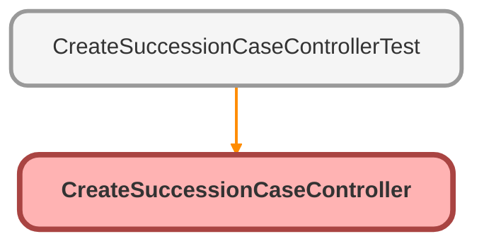

---
hide:
  - path
---

# CreateSuccessionCaseController Class

CreateSuccessionCaseController 
 
Apex controller for FinancialAccount Quick Action to create succession cases. 
Handles both single and multi-successor scenarios in pure Apex (no flows). 
 
Single Successor: Creates one Case (Type &#x3D; &quot;Named Successor Enactment&quot;) 
Multi-Successor: Creates parent Case (Type &#x3D; &quot;Multi-Account Succession Master&quot;) 
+ child Cases for each successor

**Version** 

2.0 - Refactored to handle multi-successor in Apex

**Author** Claude Code

**Date** 2025-01-27

## Class Diagram



<!-- Apex description -->

## Apex Code

```java
/**
 * CreateSuccessionCaseController
 *
 * Apex controller for FinancialAccount Quick Action to create succession cases.
 * Handles both single and multi-successor scenarios in pure Apex (no flows).
 *
 * Single Successor: Creates one Case (Type = "Named Successor Enactment")
 * Multi-Successor: Creates parent Case (Type = "Multi-Account Succession Master")
 *                  + child Cases for each successor
 *
 * @author Claude Code
 * @date 2025-01-27
 * @version 2.0 - Refactored to handle multi-successor in Apex
 */
public with sharing class CreateSuccessionCaseController {
  /**
   * Wrapper class for Quick Action result
   */
  public class CreateCaseResult {
    @AuraEnabled
    public Boolean success { get; set; }
    @AuraEnabled
    public String message { get; set; }
    @AuraEnabled
    public Id seedCaseId { get; set; }
    @AuraEnabled
    public Id parentCaseId { get; set; }
    @AuraEnabled
    public Integer successorCount { get; set; }
  }

  /**
   * Main entry point for Quick Action
   * Handles both single and multi-successor scenarios
   *
   * @param financialAccountId - ID of the FinancialAccount
   * @return CreateCaseResult with success status and case information
   */
  @AuraEnabled
  public static CreateCaseResult createSuccessionCase(Id financialAccountId) {
    try {
      System.debug(
        'Starting createSuccessionCase for FA: ' + financialAccountId
      );

      // Validate requirements
      String validationError = validateRequirements(financialAccountId);
      if (String.isNotBlank(validationError)) {
        System.debug('Validation failed: ' + validationError);
        return createErrorResult(validationError);
      }

      // Get deceased donor account
      Id deceasedOwnerAccountId = getDeceasedDonorAccount(financialAccountId);
      if (deceasedOwnerAccountId == null) {
        return createErrorResult(
          'No deceased primary owner found on this financial account'
        );
      }

      // Get successors and validate allocation
      List<FinServ__FinancialAccountRole__c> successors = getSuccessors(
        financialAccountId
      );
      if (successors.isEmpty()) {
        return createErrorResult(
          'No active successors designated on this financial account'
        );
      }

      // Validate allocation totals
      String allocationError = validateSuccessorAllocations(successors);
      if (String.isNotBlank(allocationError)) {
        return createErrorResult(allocationError);
      }

      // Get Estate Administration record type
      Id estateAdminRecordTypeId = getEstateAdministrationRecordTypeId();
      if (estateAdminRecordTypeId == null) {
        return createErrorResult('Estate Administration record type not found');
      }

      // Get FinancialAccount name for subject
      String financialAccountName = getFinancialAccountName(financialAccountId);

      // Branch based on successor count
      if (successors.size() == 1) {
        // Single successor - create one case
        return createSingleSuccessorCase(
          successors[0],
          deceasedOwnerAccountId,
          financialAccountId,
          financialAccountName,
          estateAdminRecordTypeId
        );
      } else {
        // Multiple successors - create parent + children
        return createMultiSuccessorCases(
          successors,
          deceasedOwnerAccountId,
          financialAccountId,
          financialAccountName,
          estateAdminRecordTypeId
        );
      }
    } catch (Exception e) {
      System.debug('Exception occurred: ' + e.getMessage());
      System.debug('Stack trace: ' + e.getStackTraceString());
      return createErrorResult(
        'Error creating succession case: ' +
          e.getMessage() +
          ' (Line: ' +
          e.getLineNumber() +
          ')'
      );
    }
  }

  /**
   * Create error result wrapper
   */
  private static CreateCaseResult createErrorResult(String message) {
    CreateCaseResult errorResult = new CreateCaseResult();
    errorResult.success = false;
    errorResult.message = message;
    return errorResult;
  }

  /**
   * Create single successor case
   */
  private static CreateCaseResult createSingleSuccessorCase(
    FinServ__FinancialAccountRole__c successor,
    Id deceasedOwnerAccountId,
    Id financialAccountId,
    String financialAccountName,
    Id estateAdminRecordTypeId
  ) {
    // Get ContactId for successor
    Id contactId = getContactIdForSuccessor(successor);

    // Validate ContactId exists - critical for contact cadence workflow
    if (contactId == null) {
      return createErrorResult(
        'Successor contact not found. Please ensure the successor has a Related Contact or is linked to a Person Account.'
      );
    }

    // Create case
    Case successionCase = new Case(
      RecordTypeId = estateAdminRecordTypeId,
      Type = 'Named Successor Enactment',
      Subject = financialAccountName + ' - Named Successor Enactment',
      Status = 'New',
      Origin = 'Financial Account',
      Priority = 'Medium',
      AccountId = deceasedOwnerAccountId,
      Deceased_Donor__c = deceasedOwnerAccountId,
      ContactId = contactId,
      Successor__c = contactId,
      FinServ__FinancialAccount__c = financialAccountId,
      Verification_Status__c = 'Not Started',
      Description = 'Succession case created from Financial Account.'
    );

    Database.insert(successionCase, AccessLevel.USER_MODE);

    // Return success
    CreateCaseResult successResult = new CreateCaseResult();
    successResult.success = true;
    successResult.message = 'Case created successfully. Click "Begin Succession Processing" to start the contact cadence workflow.';
    successResult.seedCaseId = successionCase.Id;
    successResult.successorCount = 1;
    return successResult;
  }

  /**
   * Create multi-successor cases (parent + children)
   */
  private static CreateCaseResult createMultiSuccessorCases(
    List<FinServ__FinancialAccountRole__c> successors,
    Id deceasedOwnerAccountId,
    Id financialAccountId,
    String financialAccountName,
    Id estateAdminRecordTypeId
  ) {
    // Create parent case
    Case parentCase = new Case(
      RecordTypeId = estateAdminRecordTypeId,
      Type = 'Multi-Account Succession Master',
      Subject = financialAccountName + ' - Multi-Account Succession Master',
      Status = 'In Progress',
      Origin = 'Financial Account',
      Priority = 'Medium',
      AccountId = deceasedOwnerAccountId,
      FinServ__FinancialAccount__c = financialAccountId,
      Description = 'Multi-successor coordination case. ' +
        successors.size() +
        ' successors identified for this DAF account. Individual succession cases created for each successor with independent contact cadence and pathway selection.'
    );

    Database.insert(parentCase, AccessLevel.USER_MODE);

    // Create child cases for each successor
    List<Case> childCases = new List<Case>();
    Integer skippedCount = 0;

    for (FinServ__FinancialAccountRole__c successor : successors) {
      Id contactId = getContactIdForSuccessor(successor);

      // Skip successors without valid ContactId (cannot run contact cadence)
      if (contactId == null) {
        System.debug(
          'Warning: Skipping successor without valid ContactId: ' + successor.Id
        );
        skippedCount++;
        continue;
      }

      Case childCase = new Case(
        RecordTypeId = estateAdminRecordTypeId,
        Type = 'Named Successor Enactment',
        Subject = financialAccountName + ' - Named Successor Enactment',
        Status = 'New',
        Origin = 'Financial Account',
        Priority = 'Medium',
        AccountId = deceasedOwnerAccountId,
        Deceased_Donor__c = deceasedOwnerAccountId,
        ContactId = contactId,
        Successor__c = contactId,
        FinServ__FinancialAccount__c = financialAccountId,
        ParentId = parentCase.Id,
        Verification_Status__c = 'Not Started',
        Description = 'Succession case for successor. Part of multi-successor coordination under parent case. ' +
          (successor.SuccessorAllocation__c != null
            ? 'Allocation: ' + successor.SuccessorAllocation__c + '%'
            : 'Equal allocation assumed unless otherwise specified in financial account roles.')
      );

      childCases.add(childCase);
    }

    // Validate at least one child case was created
    if (childCases.isEmpty()) {
      return createErrorResult(
        'No valid successor contacts found. Please ensure at least one successor has a Related Contact or is linked to a Person Account.'
      );
    }

    Database.insert(childCases, AccessLevel.USER_MODE);

    // Return success
    CreateCaseResult successResult = new CreateCaseResult();
    successResult.success = true;

    String warningMessage = skippedCount > 0
      ? ' (' +
        skippedCount +
        ' successor(s) skipped due to missing contact information)'
      : '';

    successResult.message =
      'Parent case and ' +
      childCases.size() +
      ' child cases created successfully.' +
      warningMessage +
      ' Click "Begin Succession Processing" on each child case to start the contact cadence workflow.';
    successResult.parentCaseId = parentCase.Id;
    successResult.seedCaseId = childCases[0].Id;
    successResult.successorCount = childCases.size();
    return successResult;
  }

  /**
   * Get ContactId for a successor (handles Person Accounts)
   */
  private static Id getContactIdForSuccessor(
    FinServ__FinancialAccountRole__c successor
  ) {
    Id contactId = successor.FinServ__RelatedContact__c;

    // If no RelatedContact, try to get PersonContactId from Account
    if (contactId == null && successor.FinServ__RelatedAccount__c != null) {
      List<Account> successorAccounts = [
        SELECT PersonContactId, IsPersonAccount
        FROM Account
        WHERE Id = :successor.FinServ__RelatedAccount__c
        WITH USER_MODE
        LIMIT 1
      ];

      if (!successorAccounts.isEmpty()) {
        SObjectAccessDecision decision = Security.stripInaccessible(
          AccessType.READABLE,
          successorAccounts
        );
        List<Account> filteredAccounts = (List<Account>) decision.getRecords();
        if (!filteredAccounts.isEmpty()) {
          contactId = filteredAccounts[0].PersonContactId;
        }
      }
    }

    return contactId;
  }

  /**
   * Validate all requirements before creating case
   *
   * @param financialAccountId - ID of the FinancialAccount
   * @return Error message if validation fails, null if valid
   */
  private static String validateRequirements(Id financialAccountId) {
    // Check for existing cases (idempotency)
    List<Case> existingCases = [
      SELECT Id
      FROM Case
      WHERE
        FinServ__FinancialAccount__c = :financialAccountId
        AND (Type = 'Named Successor Enactment'
        OR Type = 'Multi-Account Succession Master')
        AND IsClosed = FALSE
      WITH USER_MODE
      LIMIT 1
    ];

    if (!existingCases.isEmpty()) {
      return 'A succession case already exists for this financial account';
    }

    return null; // All validations passed
  }

  /**
   * Get deceased donor account ID
   *
   * @param financialAccountId - ID of the FinancialAccount
   * @return Account ID of deceased primary owner, or null if not found
   */
  private static Id getDeceasedDonorAccount(Id financialAccountId) {
    List<FinServ__FinancialAccountRole__c> deceasedOwners = [
      SELECT FinServ__RelatedAccount__c, FinServ__RelatedAccount__r.Deceased__c
      FROM FinServ__FinancialAccountRole__c
      WHERE
        FinServ__FinancialAccount__c = :financialAccountId
        AND FinServ__Role__c LIKE '%Primary%'
        AND FinServ__RelatedAccount__r.Deceased__c = TRUE
      WITH USER_MODE
      ORDER BY CreatedDate DESC
      LIMIT 2
    ];

    if (deceasedOwners.size() > 1) {
      System.debug(
        'Warning: Multiple deceased primary owners found for FA ' +
        financialAccountId
      );
    }

    if (deceasedOwners.isEmpty()) {
      return null;
    }

    // Apply field-level security
    SObjectAccessDecision decision = Security.stripInaccessible(
      AccessType.READABLE,
      deceasedOwners
    );
    List<FinServ__FinancialAccountRole__c> filteredOwners = decision.getRecords();

    return filteredOwners.isEmpty()
      ? null
      : filteredOwners[0].FinServ__RelatedAccount__c;
  }

  /**
   * Get active successors for the financial account
   *
   * @param financialAccountId - ID of the FinancialAccount
   * @return List of successor FinancialAccountRole records
   */
  private static List<FinServ__FinancialAccountRole__c> getSuccessors(
    Id financialAccountId
  ) {
    List<FinServ__FinancialAccountRole__c> successors = [
      SELECT
        Id,
        FinServ__RelatedContact__c,
        FinServ__RelatedAccount__c,
        SuccessorAllocation__c
      FROM FinServ__FinancialAccountRole__c
      WHERE
        FinServ__FinancialAccount__c = :financialAccountId
        AND FinServ__Role__c LIKE '%Successor%'
        AND FinServ__Active__c = TRUE
      WITH USER_MODE
      ORDER BY CreatedDate ASC
    ];

    // Enforce field-level security
    SObjectAccessDecision decision = Security.stripInaccessible(
      AccessType.READABLE,
      successors
    );
    return decision.getRecords();
  }

  /**
   * Validate that successor allocations sum to 100%
   * If all allocations are null, equal split is assumed (valid)
   * Partial allocations (some set, some null) are NOT allowed
   *
   * @param successors - List of successor FinancialAccountRole records
   * @return Error message if validation fails, null if valid
   */
  private static String validateSuccessorAllocations(
    List<FinServ__FinancialAccountRole__c> successors
  ) {
    // Count how many successors have allocations set
    Integer allocatedCount = 0;
    Decimal totalAllocation = 0;

    for (FinServ__FinancialAccountRole__c s : successors) {
      if (s.SuccessorAllocation__c != null) {
        allocatedCount++;
        totalAllocation += s.SuccessorAllocation__c;
      }
    }

    // If no allocations are set, assume equal split (valid scenario)
    if (allocatedCount == 0) {
      return null;
    }

    // Partial allocations not allowed - must be ALL or NONE
    if (allocatedCount > 0 && allocatedCount < successors.size()) {
      return 'Successor allocations must be set for ALL successors or NONE. ' +
        'Currently ' +
        allocatedCount +
        ' of ' +
        successors.size() +
        ' successors have allocations set. ' +
        'Please either set allocations for all successors (totaling 100%) or remove all allocations to use equal split.';
    }

    // If all allocations are set, they must sum to 100%
    if (Math.abs(totalAllocation - 100) > 0.01) {
      return 'Successor allocations must sum to 100%. Current total: ' +
        totalAllocation +
        '%';
    }

    return null; // Validation passed
  }

  /**
   * Get Estate Administration record type ID
   *
   * @return Record type ID for Estate Administration
   */
  private static Id getEstateAdministrationRecordTypeId() {
    List<RecordType> recordTypes = [
      SELECT Id
      FROM RecordType
      WHERE SObjectType = 'Case' AND DeveloperName = 'EstateAdministration'
      WITH USER_MODE
      LIMIT 1
    ];

    return recordTypes.isEmpty() ? null : recordTypes[0].Id;
  }

  /**
   * Get FinancialAccount name for case subject
   *
   * @param financialAccountId - ID of the FinancialAccount
   * @return FinancialAccount name
   */
  private static String getFinancialAccountName(Id financialAccountId) {
    List<FinServ__FinancialAccount__c> accounts = [
      SELECT Name
      FROM FinServ__FinancialAccount__c
      WHERE Id = :financialAccountId
      WITH USER_MODE
      LIMIT 1
    ];

    return accounts.isEmpty() ? 'Unknown Financial Account' : accounts[0].Name;
  }
}

```

## Methods
### `createSuccessionCase(financialAccountId)`

`AURAENABLED`

Main entry point for Quick Action 
Handles both single and multi-successor scenarios

#### Signature
```apex
public static CreateCaseResult createSuccessionCase(Id financialAccountId)
```

#### Parameters
| Name | Type | Description |
|------|------|-------------|
| financialAccountId | Id | - ID of the FinancialAccount |

#### Return Type
**CreateCaseResult**

CreateCaseResult with success status and case information

---

### `createErrorResult(message)`

Create error result wrapper

#### Signature
```apex
private static CreateCaseResult createErrorResult(String message)
```

#### Parameters
| Name | Type | Description |
|------|------|-------------|
| message | String |  |

#### Return Type
**CreateCaseResult**

---

### `createSingleSuccessorCase(successor, deceasedOwnerAccountId, financialAccountId, financialAccountName, estateAdminRecordTypeId)`

Create single successor case

#### Signature
```apex
private static CreateCaseResult createSingleSuccessorCase(FinServ__FinancialAccountRole__c successor, Id deceasedOwnerAccountId, Id financialAccountId, String financialAccountName, Id estateAdminRecordTypeId)
```

#### Parameters
| Name | Type | Description |
|------|------|-------------|
| successor | FinServ__FinancialAccountRole__c |  |
| deceasedOwnerAccountId | Id |  |
| financialAccountId | Id |  |
| financialAccountName | String |  |
| estateAdminRecordTypeId | Id |  |

#### Return Type
**CreateCaseResult**

---

### `createMultiSuccessorCases(successors, deceasedOwnerAccountId, financialAccountId, financialAccountName, estateAdminRecordTypeId)`

Create multi-successor cases (parent + children)

#### Signature
```apex
private static CreateCaseResult createMultiSuccessorCases(List<FinServ__FinancialAccountRole__c> successors, Id deceasedOwnerAccountId, Id financialAccountId, String financialAccountName, Id estateAdminRecordTypeId)
```

#### Parameters
| Name | Type | Description |
|------|------|-------------|
| successors | List&lt;FinServ__FinancialAccountRole__c&gt; |  |
| deceasedOwnerAccountId | Id |  |
| financialAccountId | Id |  |
| financialAccountName | String |  |
| estateAdminRecordTypeId | Id |  |

#### Return Type
**CreateCaseResult**

---

### `getContactIdForSuccessor(successor)`

Get ContactId for a successor (handles Person Accounts)

#### Signature
```apex
private static Id getContactIdForSuccessor(FinServ__FinancialAccountRole__c successor)
```

#### Parameters
| Name | Type | Description |
|------|------|-------------|
| successor | FinServ__FinancialAccountRole__c |  |

#### Return Type
**Id**

---

### `validateRequirements(financialAccountId)`

Validate all requirements before creating case

#### Signature
```apex
private static String validateRequirements(Id financialAccountId)
```

#### Parameters
| Name | Type | Description |
|------|------|-------------|
| financialAccountId | Id | - ID of the FinancialAccount |

#### Return Type
**String**

Error message if validation fails, null if valid

---

### `getDeceasedDonorAccount(financialAccountId)`

Get deceased donor account ID

#### Signature
```apex
private static Id getDeceasedDonorAccount(Id financialAccountId)
```

#### Parameters
| Name | Type | Description |
|------|------|-------------|
| financialAccountId | Id | - ID of the FinancialAccount |

#### Return Type
**Id**

Account ID of deceased primary owner, or null if not found

---

### `getSuccessors(financialAccountId)`

Get active successors for the financial account

#### Signature
```apex
private static List<FinServ__FinancialAccountRole__c> getSuccessors(Id financialAccountId)
```

#### Parameters
| Name | Type | Description |
|------|------|-------------|
| financialAccountId | Id | - ID of the FinancialAccount |

#### Return Type
**List&lt;FinServ__FinancialAccountRole__c&gt;**

List of successor FinancialAccountRole records

---

### `validateSuccessorAllocations(successors)`

Validate that successor allocations sum to 100% 
If all allocations are null, equal split is assumed (valid) 
Partial allocations (some set, some null) are NOT allowed

#### Signature
```apex
private static String validateSuccessorAllocations(List<FinServ__FinancialAccountRole__c> successors)
```

#### Parameters
| Name | Type | Description |
|------|------|-------------|
| successors | List&lt;FinServ__FinancialAccountRole__c&gt; | - List of successor FinancialAccountRole records |

#### Return Type
**String**

Error message if validation fails, null if valid

---

### `getEstateAdministrationRecordTypeId()`

Get Estate Administration record type ID

#### Signature
```apex
private static Id getEstateAdministrationRecordTypeId()
```

#### Return Type
**Id**

Record type ID for Estate Administration

---

### `getFinancialAccountName(financialAccountId)`

Get FinancialAccount name for case subject

#### Signature
```apex
private static String getFinancialAccountName(Id financialAccountId)
```

#### Parameters
| Name | Type | Description |
|------|------|-------------|
| financialAccountId | Id | - ID of the FinancialAccount |

#### Return Type
**String**

FinancialAccount name

## Classes
### CreateCaseResult Class

Wrapper class for Quick Action result

#### Properties
##### `success`

`AURAENABLED`

###### Signature
```apex
public success
```

###### Type
Boolean

---

##### `message`

`AURAENABLED`

###### Signature
```apex
public message
```

###### Type
String

---

##### `seedCaseId`

`AURAENABLED`

###### Signature
```apex
public seedCaseId
```

###### Type
Id

---

##### `parentCaseId`

`AURAENABLED`

###### Signature
```apex
public parentCaseId
```

###### Type
Id

---

##### `successorCount`

`AURAENABLED`

###### Signature
```apex
public successorCount
```

###### Type
Integer