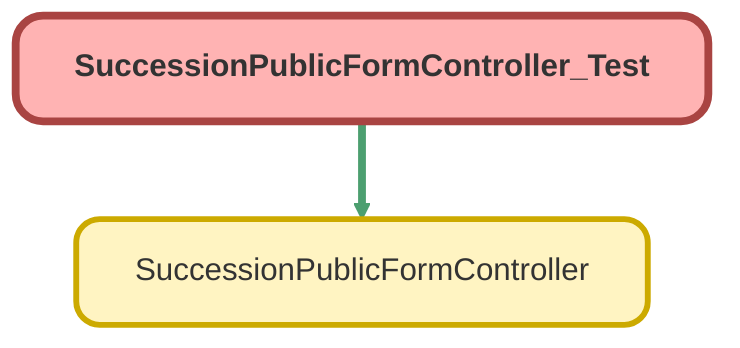

---
hide:
  - path
---

# SuccessionPublicFormController_Test Class

`ISTEST`

Test class for SuccessionPublicFormController

**Author** Estate Administration Team

**Date** 2025

## Class Diagram



<!-- Apex description -->

## Apex Code

```java
/**
 * @description Test class for SuccessionPublicFormController
 * @author Estate Administration Team
 * @date 2025
 */
@isTest
private class SuccessionPublicFormController_Test {
  @TestSetup
  static void setupTestData() {
    // Get Person Account record type
    Id personAccountRecordTypeId = Schema.SObjectType.Account.getRecordTypeInfosByDeveloperName()
      .get('PersonAccount')
      .getRecordTypeId();

    // Create test account (deceased donor) - Person Account
    Account testAccount = new Account(
      RecordTypeId = personAccountRecordTypeId,
      FirstName = 'Test',
      LastName = 'Donor',
      PersonEmail = 'testdonor@example.com'
    );
    insert testAccount;

    // Create successor (Person Account) - FSC best practice
    Account successorAccount = new Account(
      RecordTypeId = personAccountRecordTypeId,
      FirstName = 'Jane',
      LastName = 'Successor',
      PersonEmail = 'jane.successor@example.com',
      PersonMobilePhone = '555-0100'
    );
    insert successorAccount;

    // Query PersonContactId (auto-created for Person Accounts)
    successorAccount = [
      SELECT Id, PersonContactId
      FROM Account
      WHERE Id = :successorAccount.Id
    ];

    // Create financial account
    FinServ__FinancialAccount__c finAccount = new FinServ__FinancialAccount__c(
      Name = 'Test DAF Account',
      FinServ__PrimaryOwner__c = testAccount.Id,
      FinServ__Balance__c = 1000000,
      FinServ__FinancialAccountNumber__c = 'DAF-123456'
    );
    insert finAccount;

    // Create financial account role (successor) - FSC standard object
    // Use PersonContactId for Person Account successors
    FinServ__FinancialAccountRole__c successorRole = new FinServ__FinancialAccountRole__c(
      FinServ__FinancialAccount__c = finAccount.Id,
      FinServ__RelatedContact__c = successorAccount.PersonContactId,
      FinServ__Role__c = 'Successor',
      SuccessorAllocation__c = 100,
      FinServ__Active__c = true
    );
    insert successorRole;

    // Get EstateAdministration record type
    Id estateRecordTypeId = Schema.SObjectType.Case.getRecordTypeInfosByDeveloperName()
      .get('EstateAdministration')
      .getRecordTypeId();

    // Create succession case
    // Use PersonContactId from successor Person Account
    Case successionCase = new Case(
      RecordTypeId = estateRecordTypeId,
      Type = 'Named Successor Enactment',
      Subject = 'Succession Case for ' + testAccount.LastName,
      Status = 'New',
      AccountId = testAccount.Id,
      ContactId = successorAccount.PersonContactId,
      FinServ__FinancialAccount__c = finAccount.Id,
      Contact_Established__c = true
    );
    insert successionCase;
  }

  @isTest
  static void testGetFormData_Success() {
    // Get test case
    Case testCase = [
      SELECT Id
      FROM Case
      WHERE Type = 'Named Successor Enactment'
      LIMIT 1
    ];

    Test.startTest();
    SuccessionPublicFormController.FormData result = SuccessionPublicFormController.getFormData(
      testCase.Id
    );
    Test.stopTest();

    // Verify results
    System.assertNotEquals(null, result, 'FormData should not be null');
    System.assertEquals(testCase.Id, result.caseId, 'Case ID should match');
    System.assertEquals(
      'Test Donor',
      result.accountName,
      'Account name should match'
    );
    System.assertEquals(
      'Jane Successor',
      result.successorName,
      'Successor name should match'
    );
    System.assertEquals(
      'jane.successor@example.com',
      result.successorEmail,
      'Successor email should match'
    );
    System.assertEquals(
      'Test DAF Account',
      result.financialAccountName,
      'Financial account name should match'
    );
    System.assertEquals(
      1000000,
      result.accountBalance,
      'Account balance should match'
    );
    System.assertEquals(
      100,
      result.allocationPercentage,
      'Allocation percentage should match'
    );
  }

  @isTest
  static void testGetFormData_BlankCaseId() {
    Test.startTest();
    try {
      SuccessionPublicFormController.getFormData('');
      System.assert(false, 'Should have thrown exception');
    } catch (AuraHandledException e) {
      System.assertNotEquals(null, e, 'Should throw AuraHandledException');
    }
    Test.stopTest();
  }

  @isTest
  static void testGetFormData_InvalidCaseId() {
    Test.startTest();
    try {
      SuccessionPublicFormController.getFormData('500000000000000AAA');
      System.assert(false, 'Should have thrown exception');
    } catch (AuraHandledException e) {
      System.assertNotEquals(null, e, 'Should throw AuraHandledException');
    }
    Test.stopTest();
  }

  @isTest
  static void testSavePathwaySelection_FinalGrant() {
    // Get test case
    Case testCase = [
      SELECT Id
      FROM Case
      WHERE Type = 'Named Successor Enactment'
      LIMIT 1
    ];

    // Prepare form data
    Map<String, Object> formFields = new Map<String, Object>{
      'additionalNotes' => 'Please process as Final Grant to Red Cross'
    };
    String formDataJson = JSON.serialize(formFields);

    Test.startTest();
    String result = SuccessionPublicFormController.savePathwaySelection(
      testCase.Id,
      'Final Grant',
      formDataJson
    );
    Test.stopTest();

    // Verify results
    System.assertEquals(
      'Pathway selection saved successfully',
      result,
      'Should return success message'
    );

    // Verify case was updated
    Case updatedCase = [
      SELECT
        Id,
        Pathway_Confirmed__c,
        Form_Completed_Date__c,
        Status,
        Description
      FROM Case
      WHERE Id = :testCase.Id
    ];

    System.assertEquals(
      'Final Grant',
      updatedCase.Pathway_Confirmed__c,
      'Pathway should be set'
    );
    System.assertNotEquals(
      null,
      updatedCase.Form_Completed_Date__c,
      'Form completed date should be set'
    );
    System.assertEquals(
      'Awaiting Response',
      updatedCase.Status,
      'Status should be updated to Awaiting Response'
    );
    System.assertEquals(
      'Please process as Final Grant to Red Cross',
      updatedCase.Description,
      'Notes should be saved'
    );
  }

  @isTest
  static void testSavePathwaySelection_NewDAF() {
    Case testCase = [
      SELECT Id
      FROM Case
      WHERE Type = 'Named Successor Enactment'
      LIMIT 1
    ];

    Test.startTest();
    String result = SuccessionPublicFormController.savePathwaySelection(
      testCase.Id,
      'New DAF',
      null
    );
    Test.stopTest();

    System.assertEquals('Pathway selection saved successfully', result);

    Case updatedCase = [
      SELECT Pathway_Confirmed__c
      FROM Case
      WHERE Id = :testCase.Id
    ];
    System.assertEquals('New DAF Account', updatedCase.Pathway_Confirmed__c);
  }

  @isTest
  static void testSavePathwaySelection_Disclaim() {
    Case testCase = [
      SELECT Id
      FROM Case
      WHERE Type = 'Named Successor Enactment'
      LIMIT 1
    ];

    Test.startTest();
    String result = SuccessionPublicFormController.savePathwaySelection(
      testCase.Id,
      'Disclaim',
      null
    );
    Test.stopTest();

    System.assertEquals('Pathway selection saved successfully', result);

    Case updatedCase = [
      SELECT Pathway_Confirmed__c
      FROM Case
      WHERE Id = :testCase.Id
    ];
    System.assertEquals('Disclaim Assets', updatedCase.Pathway_Confirmed__c);
  }

  @isTest
  static void testSavePathwaySelection_BlankCaseId() {
    Test.startTest();
    try {
      SuccessionPublicFormController.savePathwaySelection(
        '',
        'Final Grant',
        null
      );
      System.assert(false, 'Should have thrown exception');
    } catch (AuraHandledException e) {
      System.assertNotEquals(null, e, 'Should throw AuraHandledException');
    }
    Test.stopTest();
  }

  @isTest
  static void testSavePathwaySelection_BlankPathway() {
    Case testCase = [
      SELECT Id
      FROM Case
      WHERE Type = 'Named Successor Enactment'
      LIMIT 1
    ];

    Test.startTest();
    try {
      SuccessionPublicFormController.savePathwaySelection(
        testCase.Id,
        '',
        null
      );
      System.assert(false, 'Should have thrown exception');
    } catch (AuraHandledException e) {
      System.assertNotEquals(null, e, 'Should throw AuraHandledException');
    }
    Test.stopTest();
  }
}

```

## Methods
### `setupTestData()`

`TESTSETUP`

#### Signature
```apex
private static void setupTestData()
```

#### Return Type
**void**

---

### `testGetFormData_Success()`

`ISTEST`

#### Signature
```apex
private static void testGetFormData_Success()
```

#### Return Type
**void**

---

### `testGetFormData_BlankCaseId()`

`ISTEST`

#### Signature
```apex
private static void testGetFormData_BlankCaseId()
```

#### Return Type
**void**

---

### `testGetFormData_InvalidCaseId()`

`ISTEST`

#### Signature
```apex
private static void testGetFormData_InvalidCaseId()
```

#### Return Type
**void**

---

### `testSavePathwaySelection_FinalGrant()`

`ISTEST`

#### Signature
```apex
private static void testSavePathwaySelection_FinalGrant()
```

#### Return Type
**void**

---

### `testSavePathwaySelection_NewDAF()`

`ISTEST`

#### Signature
```apex
private static void testSavePathwaySelection_NewDAF()
```

#### Return Type
**void**

---

### `testSavePathwaySelection_Disclaim()`

`ISTEST`

#### Signature
```apex
private static void testSavePathwaySelection_Disclaim()
```

#### Return Type
**void**

---

### `testSavePathwaySelection_BlankCaseId()`

`ISTEST`

#### Signature
```apex
private static void testSavePathwaySelection_BlankCaseId()
```

#### Return Type
**void**

---

### `testSavePathwaySelection_BlankPathway()`

`ISTEST`

#### Signature
```apex
private static void testSavePathwaySelection_BlankPathway()
```

#### Return Type
**void**