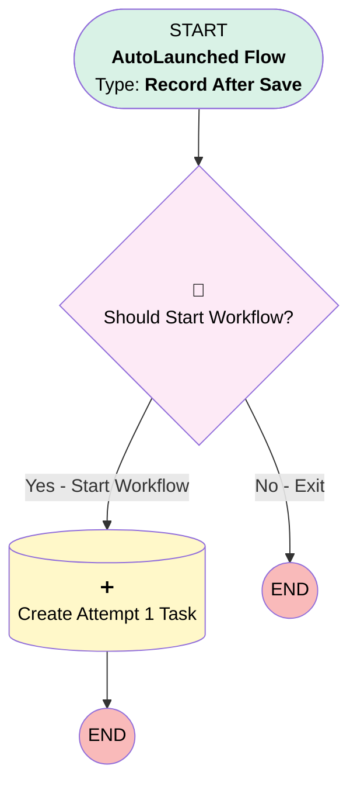

# Case - Create Initial Contact Attempt

## Flow Diagram

<!-- Flow description -->

## General Information

|<!-- -->|<!-- -->|
|:---|:---|
|Object|Case|
|Process Type| Auto Launched Flow|
|Trigger Type| Record After Save|
|Record Trigger Type| Create And Update|
|Label|Case - Create Initial Contact Attempt|
|Status|Active|
|Filter Formula|AND(     RecordType.DeveloperName = "EstateAdministration",     TEXT({!$Record.Type}) = "Named Successor Enactment",     NOT(ISBLANK({!$Record.ContactId})),     NOT(ISBLANK({!$Record.Successor__c})),     NOT({!$Record.IsClosed}),     OR(         ISNEW(),         ISCHANGED({!$Record.Verification_Status__c})     ) )|
|Description|Seeds Attempt 1 (Day 0) when Verification_Status__c becomes "Complete - Verified" on an Estate Administration case. Guards against duplicates via Contact_Attempt_Count__c IS NULL. Triggers on create or when the verification field changes. Adds Builder UI metadata for clarity.|
| Builder Type (PM)|LightningFlowBuilder|
| Canvas Mode (PM)|AUTO_LAYOUT_CANVAS|
| Origin Builder Type (PM)|LightningFlowBuilder|
|Connector|[Check_Should_Start_Workflow](#check_should_start_workflow)|
|Next Node|[Check_Should_Start_Workflow](#check_should_start_workflow)|

## Flow Nodes Details

### Check_Should_Start_Workflow

|<!-- -->|<!-- -->|
|:---|:---|
|Type|Decision|
|Label|Should Start Workflow?|
|Default Connector Label|No - Exit|

#### Rule Start_Workflow (Yes - Start Workflow)

|<!-- -->|<!-- -->|
|:---|:---|
|Connector|[Create_Attempt_1_Task](#create_attempt_1_task)|
|Condition Logic|and|

|Condition Id|Left Value Reference|Operator|Right Value|
|:-- |:-- |:--:|:--: |
|1|$Record.Verification_Status__c| Equal To|Complete - Verified|
|2|$Record.Contact_Attempt_Count__c| Is Null|✅|

### Create_Attempt_1_Task

|<!-- -->|<!-- -->|
|:---|:---|
|Type|Record Create|
|Object|Task|
|Label|Create Attempt 1 Task|
|Store Output Automatically|✅|

#### Input Assignments

|Field|Value|
|:-- |:--: |
|WhatId|$Record.Id|
|Subject|Succession Contact - Attempt 1 (Day 0)|
|Status|Not Started|
|Priority|High|
|ActivityDate|$Flow.CurrentDate|
|Contact_Attempt_Number__c|1|
|Description|Contact attempt for succession case.|

___

_Documentation generated from branch main by [sfdx-hardis](https://sfdx-hardis.cloudity.com), featuring [salesforce-flow-visualiser](https://github.com/toddhalfpenny/salesforce-flow-visualiser)_