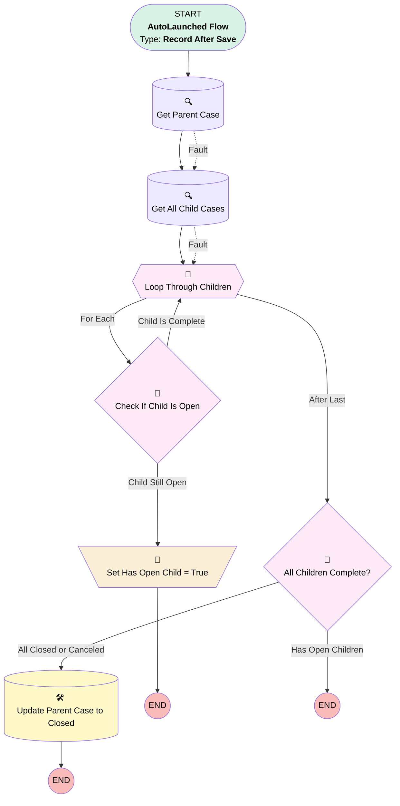

# Case: Parent Closure Handler

## Flow Diagram

<!-- Flow description -->

## General Information

|<!-- -->|<!-- -->|
|:---|:---|
|Object|Case|
|Process Type| Auto Launched Flow|
|Trigger Type| Record After Save|
|Record Trigger Type| Update|
|Label|Case: Parent Closure Handler|
|Status|Active|
|Filter Formula|AND(     RecordType.DeveloperName = "EstateAdministration",     TEXT({!$Record.Type}) = "Named Successor Enactment",     NOT(ISBLANK({!$Record.ParentId})),     ISCHANGED({!$Record.Status}),     OR(         TEXT({!$Record.Status}) = "Closed",         TEXT({!$Record.Status}) = "Canceled"     ) )|
|Description|Monitors child case status changes and automatically closes the parent Multi-Account Succession Master case when all child Named Successor Enactment cases reach terminal status (Closed or Canceled).|
|Environments|Default|
|Interview Label|Case: Parent Closure Handler {!$Flow.CurrentDateTime}|
| Builder Type (PM)|LightningFlowBuilder|
| Canvas Mode (PM)|AUTO_LAYOUT_CANVAS|
| Origin Builder Type (PM)|LightningFlowBuilder|
|Connector|[Get_Parent_Case](#get_parent_case)|
|Next Node|[Get_Parent_Case](#get_parent_case)|

## Variables

|Name|Data Type|Is Collection|Is Input|Is Output|Object Type|Description|
|:-- |:--:|:--:|:--:|:--:|:--:|:--  |
|varHasOpenChild|Boolean|⬜|⬜|⬜|<!-- -->|<!-- -->|

## Flow Nodes Details

### Set_Has_Open_Child_True

|<!-- -->|<!-- -->|
|:---|:---|
|Type|Assignment|
|Label|Set Has Open Child = True|

#### Assignments

|Assign To Reference|Operator|Value|
|:-- |:--:|:--: |
|varHasOpenChild| Assign|✅|

### All_Children_Complete

|<!-- -->|<!-- -->|
|:---|:---|
|Type|Decision|
|Label|All Children Complete?|
|Default Connector Label|Has Open Children|

#### Rule All_Closed_or_Canceled (All Closed or Canceled)

|<!-- -->|<!-- -->|
|:---|:---|
|Connector|[Update_Parent_Case_Closed](#update_parent_case_closed)|
|Condition Logic|and|

|Condition Id|Left Value Reference|Operator|Right Value|
|:-- |:-- |:--:|:--: |
|1|varHasOpenChild| Equal To|⬜|

### Check_If_Child_Is_Open

|<!-- -->|<!-- -->|
|:---|:---|
|Type|Decision|
|Label|Check If Child Is Open|
|Default Connector|[Loop_Through_Children](#loop_through_children)|
|Default Connector Label|Child Is Complete|

#### Rule Child_Still_Open (Child Still Open)

|<!-- -->|<!-- -->|
|:---|:---|
|Connector|[Set_Has_Open_Child_True](#set_has_open_child_true)|
|Condition Logic|and|

|Condition Id|Left Value Reference|Operator|Right Value|
|:-- |:-- |:--:|:--: |
|1|Loop_Through_Children.Status| Not Equal To|Closed|
|2|Loop_Through_Children.Status| Not Equal To|Canceled|

### Loop_Through_Children

|<!-- -->|<!-- -->|
|:---|:---|
|Type|Loop|
|Label|Loop Through Children|
|Collection Reference|[Get_All_Child_Cases](#get_all_child_cases)|
|Iteration Order|Asc|
|Next Value Connector|[Check_If_Child_Is_Open](#check_if_child_is_open)|
|No More Values Connector|[All_Children_Complete](#all_children_complete)|

### Get_All_Child_Cases

|<!-- -->|<!-- -->|
|:---|:---|
|Type|Record Lookup|
|Object|Case|
|Label|Get All Child Cases|
|Assign Null Values If No Records Found|⬜|
|Fault Connector|[Loop_Through_Children](#loop_through_children)|
|Get First Record Only|⬜|
|Queried Fields|- Id - Status - Type |
|Store Output Automatically|✅|
|Connector|[Loop_Through_Children](#loop_through_children)|

#### Filters (logic: **and**)

|Filter Id|Field|Operator|Value|
|:-- |:-- |:--:|:--: |
|1|ParentId| Equal To|$Record.ParentId|
|2|RecordType.DeveloperName| Equal To|EstateAdministration|

### Get_Parent_Case

|<!-- -->|<!-- -->|
|:---|:---|
|Type|Record Lookup|
|Object|Case|
|Label|Get Parent Case|
|Assign Null Values If No Records Found|⬜|
|Fault Connector|[Get_All_Child_Cases](#get_all_child_cases)|
|Get First Record Only|✅|
|Queried Fields|- Id - Status - Type |
|Store Output Automatically|✅|
|Connector|[Get_All_Child_Cases](#get_all_child_cases)|

#### Filters (logic: **and**)

|Filter Id|Field|Operator|Value|
|:-- |:-- |:--:|:--: |
|1|Id| Equal To|$Record.ParentId|
|2|Type| Equal To|Multi-Account Succession Master|
|3|Status| Not Equal To|Closed|

### Update_Parent_Case_Closed

|<!-- -->|<!-- -->|
|:---|:---|
|Type|Record Update|
|Object|Case|
|Label|Update Parent Case to Closed|

#### Filters

|Filter Id|Field|Operator|Value|
|:-- |:-- |:--:|:--: |
|1|Id| Equal To|Get_Parent_Case.Id|

#### Input Assignments

|Field|Value|
|:-- |:--: |
|Execution_Status__c|Completed|
|Status|Closed|

___

_Documentation generated from branch main by [sfdx-hardis](https://sfdx-hardis.cloudity.com), featuring [salesforce-flow-visualiser](https://github.com/toddhalfpenny/salesforce-flow-visualiser)_