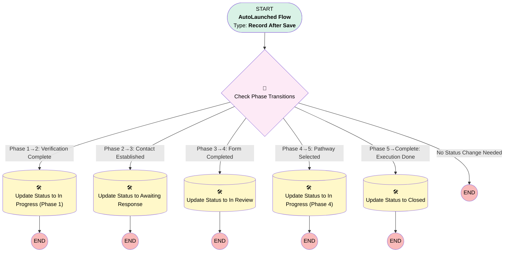

# Case: Status Coordination

## Flow Diagram

<!-- Flow description -->

## General Information

|<!-- -->|<!-- -->|
|:---|:---|
|Object|Case|
|Process Type| Auto Launched Flow|
|Trigger Type| Record After Save|
|Record Trigger Type| Update|
|Label|Case: Status Coordination|
|Status|Active|
|Filter Formula|AND(     RecordType.DeveloperName = "EstateAdministration",     IsClosed = FALSE )|
|Description|Automatically coordinates Case Status field updates across the 5-phase succession workflow. Updates Status based on phase-tracking field changes (Verification_Status__c, Contact_Established__c, Form_Completed_Date__c, Pathway_Confirmed__c, Execution_Status__c).|
|Environments|Default|
|Interview Label|Case: Status Coordination {!$Flow.CurrentDateTime}|
| Builder Type (PM)|LightningFlowBuilder|
| Canvas Mode (PM)|AUTO_LAYOUT_CANVAS|
| Origin Builder Type (PM)|LightningFlowBuilder|
|Connector|[Check_Phase_Transitions](#check_phase_transitions)|
|Next Node|[Check_Phase_Transitions](#check_phase_transitions)|

## Flow Nodes Details

### Update_Status_to_In_Progress_Phase1

|<!-- -->|<!-- -->|
|:---|:---|
|Type|Record Update|
|Label|Update Status to In Progress (Phase 1)|
|Input Reference|$Record|

#### Input Assignments

|Field|Value|
|:-- |:--: |
|Status|In Progress|

### Update_Status_to_Awaiting_Response

|<!-- -->|<!-- -->|
|:---|:---|
|Type|Record Update|
|Label|Update Status to Awaiting Response|
|Input Reference|$Record|

#### Input Assignments

|Field|Value|
|:-- |:--: |
|Status|Awaiting Response|

### Update_Status_to_In_Review

|<!-- -->|<!-- -->|
|:---|:---|
|Type|Record Update|
|Label|Update Status to In Review|
|Input Reference|$Record|

#### Input Assignments

|Field|Value|
|:-- |:--: |
|Status|In Review|

### Update_Status_to_In_Progress_Phase4

|<!-- -->|<!-- -->|
|:---|:---|
|Type|Record Update|
|Label|Update Status to In Progress (Phase 4)|
|Input Reference|$Record|

#### Input Assignments

|Field|Value|
|:-- |:--: |
|Status|In Progress|

### Update_Status_to_Closed

|<!-- -->|<!-- -->|
|:---|:---|
|Type|Record Update|
|Label|Update Status to Closed|
|Input Reference|$Record|

#### Input Assignments

|Field|Value|
|:-- |:--: |
|Status|Closed|

### Check_Phase_Transitions

|<!-- -->|<!-- -->|
|:---|:---|
|Type|Decision|
|Label|Check Phase Transitions|
|Default Connector Label|No Status Change Needed|

#### Rule Phase_1_to_2_Verification_Complete (Phase 1→2: Verification Complete)

|<!-- -->|<!-- -->|
|:---|:---|
|Connector|[Update_Status_to_In_Progress_Phase1](#update_status_to_in_progress_phase1)|
|Condition Logic|and|

|Condition Id|Left Value Reference|Operator|Right Value|
|:-- |:-- |:--:|:--: |
|1|$Record.Verification_Status__c| Is Changed|✅|
|2|$Record.Verification_Status__c| Equal To|Complete - Verified|

#### Rule Phase_2_to_3_Contact_Established (Phase 2→3: Contact Established)

|<!-- -->|<!-- -->|
|:---|:---|
|Connector|[Update_Status_to_Awaiting_Response](#update_status_to_awaiting_response)|
|Condition Logic|and|

|Condition Id|Left Value Reference|Operator|Right Value|
|:-- |:-- |:--:|:--: |
|1|$Record.Contact_Established__c| Is Changed|✅|
|2|$Record.Contact_Established__c| Equal To|✅|
|3|$Record.Form_Sent_Date__c| Is Null|⬜|

#### Rule Phase_3_to_4_Form_Completed (Phase 3→4: Form Completed)

|<!-- -->|<!-- -->|
|:---|:---|
|Connector|[Update_Status_to_In_Review](#update_status_to_in_review)|
|Condition Logic|and|

|Condition Id|Left Value Reference|Operator|Right Value|
|:-- |:-- |:--:|:--: |
|1|$Record.Form_Completed_Date__c| Is Changed|✅|
|2|$Record.Form_Completed_Date__c| Is Null|⬜|

#### Rule Phase_4_to_5_Pathway_Selected (Phase 4→5: Pathway Selected)

|<!-- -->|<!-- -->|
|:---|:---|
|Connector|[Update_Status_to_In_Progress_Phase4](#update_status_to_in_progress_phase4)|
|Condition Logic|and|

|Condition Id|Left Value Reference|Operator|Right Value|
|:-- |:-- |:--:|:--: |
|1|$Record.Pathway_Confirmed__c| Is Changed|✅|
|2|$Record.Pathway_Confirmed__c| Not Equal To|Not Selected|

#### Rule Phase_5_to_Complete_Execution_Done (Phase 5→Complete: Execution Done)

|<!-- -->|<!-- -->|
|:---|:---|
|Connector|[Update_Status_to_Closed](#update_status_to_closed)|
|Condition Logic|and|

|Condition Id|Left Value Reference|Operator|Right Value|
|:-- |:-- |:--:|:--: |
|1|$Record.Execution_Status__c| Is Changed|✅|
|2|$Record.Execution_Status__c| Equal To|Completed|

___

_Documentation generated from branch main by [sfdx-hardis](https://sfdx-hardis.cloudity.com), featuring [salesforce-flow-visualiser](https://github.com/toddhalfpenny/salesforce-flow-visualiser)_