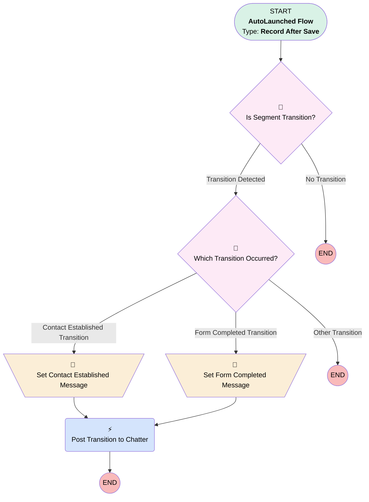

# Case: Succession Segment Transition

## Flow Diagram

<!-- Flow description -->

## General Information

|<!-- -->|<!-- -->|
|:---|:---|
|Object|Case|
|Process Type| Auto Launched Flow|
|Trigger Type| Record After Save|
|Record Trigger Type| Update|
|Label|Case: Succession Segment Transition|
|Status|Active|
|Filter Formula|AND(     RecordType.DeveloperName = "EstateAdministration",     IsClosed = FALSE )|
|Description|Logs key succession segment transitions and notifies the case feed. Triggers on Estate Administration cases when Contact_Established__c, Form_Completed_Date__c, or Pathway_Confirmed__c change. Posts a concise Chatter message indicating the new segment and next action to aid demo narration and agent handoffs.|
|Environments|Default|
|Interview Label|Case: Succession Segment Transition {!$Flow.CurrentDateTime}|
| Builder Type (PM)|LightningFlowBuilder|
| Canvas Mode (PM)|AUTO_LAYOUT_CANVAS|
| Origin Builder Type (PM)|LightningFlowBuilder|
|Connector|[Is_Segment_Transition](#is_segment_transition)|
|Next Node|[Is_Segment_Transition](#is_segment_transition)|

## Variables

|Name|Data Type|Is Collection|Is Input|Is Output|Object Type|Description|
|:-- |:--:|:--:|:--:|:--:|:--:|:--  |
|ChatterMessage|String|⬜|⬜|⬜|<!-- -->|<!-- -->|

## Flow Nodes Details

### Post_Transition_to_Chatter

|<!-- -->|<!-- -->|
|:---|:---|
|Type|Action Call|
|Label|Post Transition to Chatter|
|Action Type|Chatter Post|
|Action Name|chatterPost|
|Flow Transaction Model|CurrentTransaction|
|Name Segment|chatterPost|
|Version Segment|1|
|Text (input)|ChatterMessage|
|Subject Name Or Id (input)|$Record.Id|

### Set_Contact_Established_Message

|<!-- -->|<!-- -->|
|:---|:---|
|Type|Assignment|
|Label|Set Contact Established Message|
|Connector|[Post_Transition_to_Chatter](#post_transition_to_chatter)|

#### Assignments

|Assign To Reference|Operator|Value|
|:-- |:--:|:--: |
|ChatterMessage| Assign|📞 ✅ Workflow Transition: Contact established with successor. Case moved to "Awaiting Form" segment. Next: Send pathway selection form.|

### Set_Form_Completed_Message

|<!-- -->|<!-- -->|
|:---|:---|
|Type|Assignment|
|Label|Set Form Completed Message|
|Connector|[Post_Transition_to_Chatter](#post_transition_to_chatter)|

#### Assignments

|Assign To Reference|Operator|Value|
|:-- |:--:|:--: |
|ChatterMessage| Assign|✅ 📋 Workflow Transition: Pathway form completed. Pathway: {!$Record.Pathway_Confirmed__c}. Case moved to "Form Completed" segment. Next: Gather required documentation.|

### Which_Transition_Occurred

|<!-- -->|<!-- -->|
|:---|:---|
|Type|Decision|
|Label|Which Transition Occurred?|
|Default Connector Label|Other Transition|

#### Rule Contact_Established_Transition (Contact Established Transition)

|<!-- -->|<!-- -->|
|:---|:---|
|Connector|[Set_Contact_Established_Message](#set_contact_established_message)|
|Condition Logic|and|

|Condition Id|Left Value Reference|Operator|Right Value|
|:-- |:-- |:--:|:--: |
|1|$Record.Contact_Established__c| Equal To|✅|
|2|$Record__Prior.Contact_Established__c| Equal To|⬜|

#### Rule Form_Completed_Transition (Form Completed Transition)

|<!-- -->|<!-- -->|
|:---|:---|
|Connector|[Set_Form_Completed_Message](#set_form_completed_message)|
|Condition Logic|and|

|Condition Id|Left Value Reference|Operator|Right Value|
|:-- |:-- |:--:|:--: |
|1|$Record.Form_Completed_Date__c| Is Null|⬜|
|2|$Record__Prior.Form_Completed_Date__c| Is Null|✅|

### Is_Segment_Transition

|<!-- -->|<!-- -->|
|:---|:---|
|Type|Decision|
|Label|Is Segment Transition?|
|Default Connector Label|No Transition|

#### Rule Transition_Detected (Transition Detected)

|<!-- -->|<!-- -->|
|:---|:---|
|Connector|[Which_Transition_Occurred](#which_transition_occurred)|
|Condition Logic|or|

|Condition Id|Left Value Reference|Operator|Right Value|
|:-- |:-- |:--:|:--: |
|1|$Record.Contact_Established__c| Not Equal To|$Record__Prior.Contact_Established__c|
|2|$Record.Form_Completed_Date__c| Is Changed|✅|
|3|$Record.Pathway_Confirmed__c| Is Changed|✅|

___

_Documentation generated from branch main by [sfdx-hardis](https://sfdx-hardis.cloudity.com), featuring [salesforce-flow-visualiser](https://github.com/toddhalfpenny/salesforce-flow-visualiser)_