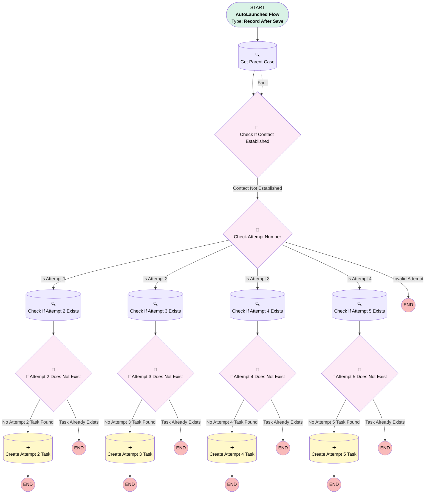

# Task - Create Next Contact Attempt

## Flow Diagram

<!-- Flow description -->

## General Information

|<!-- -->|<!-- -->|
|:---|:---|
|Object|Task|
|Process Type| Auto Launched Flow|
|Trigger Type| Record After Save|
|Record Trigger Type| Update|
|Label|Task - Create Next Contact Attempt|
|Status|Active|
|Description|Creates the next contact attempt when the current attempt Task is completed. Schedules ActivityDate off Case.CreatedDate (Day 5/35/65/95). Exits when contact established or after Attempt 5. Includes fault connector for parent case lookup.|
| Builder Type (PM)|LightningFlowBuilder|
|Connector|[Get_Parent_Case](#get_parent_case)|
|Next Node|[Get_Parent_Case](#get_parent_case)|

#### Filters (logic: **and**)

|Filter Id|Field|Operator|Value|
|:-- |:-- |:--:|:--: |
|1|Status| Equal To|Completed|
|2|Contact_Attempt_Number__c| Is Null|<!-- -->|

## Formulas

|Name|Data Type|Expression|Description|
|:-- |:--:|:-- |:--  |
|fxCalculateDay5|Date|DATEVALUE({!Get_Parent_Case.CreatedDate}) + 5|<!-- -->|
|fxCalculateDay35|Date|DATEVALUE({!Get_Parent_Case.CreatedDate}) + 35|<!-- -->|
|fxCalculateDay65|Date|DATEVALUE({!Get_Parent_Case.CreatedDate}) + 65|<!-- -->|
|fxCalculateDay95|Date|DATEVALUE({!Get_Parent_Case.CreatedDate}) + 95|<!-- -->|

## Flow Nodes Details

### Get_Parent_Case

|<!-- -->|<!-- -->|
|:---|:---|
|Type|Record Lookup|
|Object|Case|
|Label|Get Parent Case|
|Assign Null Values If No Records Found|⬜|
|Fault Connector|[Check_If_Contact_Established](#check_if_contact_established)|
|Get First Record Only|✅|
|Store Output Automatically|✅|
|Connector|[Check_If_Contact_Established](#check_if_contact_established)|

#### Filters (logic: **and**)

|Filter Id|Field|Operator|Value|
|:-- |:-- |:--:|:--: |
|1|Id| Equal To|$Record.WhatId|

### Check_If_Attempt_2_Exists

|<!-- -->|<!-- -->|
|:---|:---|
|Type|Record Lookup|
|Object|Task|
|Label|Check If Attempt 2 Exists|
|Assign Null Values If No Records Found|⬜|
|Get First Record Only|⬜|
|Store Output Automatically|✅|
|Connector|[If_Attempt_2_Does_Not_Exist](#if_attempt_2_does_not_exist)|

#### Filters (logic: **and**)

|Filter Id|Field|Operator|Value|
|:-- |:-- |:--:|:--: |
|1|WhatId| Equal To|Get_Parent_Case.Id|
|2|Contact_Attempt_Number__c| Equal To|2|

### Check_If_Attempt_3_Exists

|<!-- -->|<!-- -->|
|:---|:---|
|Type|Record Lookup|
|Object|Task|
|Label|Check If Attempt 3 Exists|
|Assign Null Values If No Records Found|⬜|
|Get First Record Only|⬜|
|Store Output Automatically|✅|
|Connector|[If_Attempt_3_Does_Not_Exist](#if_attempt_3_does_not_exist)|

#### Filters (logic: **and**)

|Filter Id|Field|Operator|Value|
|:-- |:-- |:--:|:--: |
|1|WhatId| Equal To|Get_Parent_Case.Id|
|2|Contact_Attempt_Number__c| Equal To|3|

### Check_If_Attempt_4_Exists

|<!-- -->|<!-- -->|
|:---|:---|
|Type|Record Lookup|
|Object|Task|
|Label|Check If Attempt 4 Exists|
|Assign Null Values If No Records Found|⬜|
|Get First Record Only|⬜|
|Store Output Automatically|✅|
|Connector|[If_Attempt_4_Does_Not_Exist](#if_attempt_4_does_not_exist)|

#### Filters (logic: **and**)

|Filter Id|Field|Operator|Value|
|:-- |:-- |:--:|:--: |
|1|WhatId| Equal To|Get_Parent_Case.Id|
|2|Contact_Attempt_Number__c| Equal To|4|

### Check_If_Attempt_5_Exists

|<!-- -->|<!-- -->|
|:---|:---|
|Type|Record Lookup|
|Object|Task|
|Label|Check If Attempt 5 Exists|
|Assign Null Values If No Records Found|⬜|
|Get First Record Only|⬜|
|Store Output Automatically|✅|
|Connector|[If_Attempt_5_Does_Not_Exist](#if_attempt_5_does_not_exist)|

#### Filters (logic: **and**)

|Filter Id|Field|Operator|Value|
|:-- |:-- |:--:|:--: |
|1|WhatId| Equal To|Get_Parent_Case.Id|
|2|Contact_Attempt_Number__c| Equal To|5|

### Check_If_Contact_Established

|<!-- -->|<!-- -->|
|:---|:---|
|Type|Decision|
|Label|Check If Contact Established|
|Default Connector Label|Contact Not Established|
|Default Connector|[Check_Attempt_Number](#check_attempt_number)|

#### Rule Contact_Already_Established (Contact Already Established)

|<!-- -->|<!-- -->|
|:---|:---|
|Condition Logic|and|

|Condition Id|Left Value Reference|Operator|Right Value|
|:-- |:-- |:--:|:--: |
|1|Get_Parent_Case.Contact_Established__c| Equal To|✅|

### Check_Attempt_Number

|<!-- -->|<!-- -->|
|:---|:---|
|Type|Decision|
|Label|Check Attempt Number|
|Default Connector Label|Invalid Attempt|

#### Rule Is_Attempt_1 (Is Attempt 1)

|<!-- -->|<!-- -->|
|:---|:---|
|Connector|[Check_If_Attempt_2_Exists](#check_if_attempt_2_exists)|
|Condition Logic|and|

|Condition Id|Left Value Reference|Operator|Right Value|
|:-- |:-- |:--:|:--: |
|1|$Record.Contact_Attempt_Number__c| Equal To|1|

#### Rule Is_Attempt_2 (Is Attempt 2)

|<!-- -->|<!-- -->|
|:---|:---|
|Connector|[Check_If_Attempt_3_Exists](#check_if_attempt_3_exists)|
|Condition Logic|and|

|Condition Id|Left Value Reference|Operator|Right Value|
|:-- |:-- |:--:|:--: |
|1|$Record.Contact_Attempt_Number__c| Equal To|2|

#### Rule Is_Attempt_3 (Is Attempt 3)

|<!-- -->|<!-- -->|
|:---|:---|
|Connector|[Check_If_Attempt_4_Exists](#check_if_attempt_4_exists)|
|Condition Logic|and|

|Condition Id|Left Value Reference|Operator|Right Value|
|:-- |:-- |:--:|:--: |
|1|$Record.Contact_Attempt_Number__c| Equal To|3|

#### Rule Is_Attempt_4 (Is Attempt 4)

|<!-- -->|<!-- -->|
|:---|:---|
|Connector|[Check_If_Attempt_5_Exists](#check_if_attempt_5_exists)|
|Condition Logic|and|

|Condition Id|Left Value Reference|Operator|Right Value|
|:-- |:-- |:--:|:--: |
|1|$Record.Contact_Attempt_Number__c| Equal To|4|

#### Rule Is_Attempt_5 (Is Attempt 5 (Exit))

|<!-- -->|<!-- -->|
|:---|:---|
|Condition Logic|and|

|Condition Id|Left Value Reference|Operator|Right Value|
|:-- |:-- |:--:|:--: |
|1|$Record.Contact_Attempt_Number__c| Equal To|5|

### If_Attempt_2_Does_Not_Exist

|<!-- -->|<!-- -->|
|:---|:---|
|Type|Decision|
|Label|If Attempt 2 Does Not Exist|
|Default Connector Label|Task Already Exists|

#### Rule No_Attempt_2_Task_Found (No Attempt 2 Task Found)

|<!-- -->|<!-- -->|
|:---|:---|
|Connector|[Create_Attempt_2_Task](#create_attempt_2_task)|
|Condition Logic|and|

|Condition Id|Left Value Reference|Operator|Right Value|
|:-- |:-- |:--:|:--: |
|1|[Check_If_Attempt_2_Exists](#check_if_attempt_2_exists)| Is Null|✅|

### If_Attempt_3_Does_Not_Exist

|<!-- -->|<!-- -->|
|:---|:---|
|Type|Decision|
|Label|If Attempt 3 Does Not Exist|
|Default Connector Label|Task Already Exists|

#### Rule No_Attempt_3_Task_Found (No Attempt 3 Task Found)

|<!-- -->|<!-- -->|
|:---|:---|
|Connector|[Create_Attempt_3_Task](#create_attempt_3_task)|
|Condition Logic|and|

|Condition Id|Left Value Reference|Operator|Right Value|
|:-- |:-- |:--:|:--: |
|1|[Check_If_Attempt_3_Exists](#check_if_attempt_3_exists)| Is Null|✅|

### If_Attempt_4_Does_Not_Exist

|<!-- -->|<!-- -->|
|:---|:---|
|Type|Decision|
|Label|If Attempt 4 Does Not Exist|
|Default Connector Label|Task Already Exists|

#### Rule No_Attempt_4_Task_Found (No Attempt 4 Task Found)

|<!-- -->|<!-- -->|
|:---|:---|
|Connector|[Create_Attempt_4_Task](#create_attempt_4_task)|
|Condition Logic|and|

|Condition Id|Left Value Reference|Operator|Right Value|
|:-- |:-- |:--:|:--: |
|1|[Check_If_Attempt_4_Exists](#check_if_attempt_4_exists)| Is Null|✅|

### If_Attempt_5_Does_Not_Exist

|<!-- -->|<!-- -->|
|:---|:---|
|Type|Decision|
|Label|If Attempt 5 Does Not Exist|
|Default Connector Label|Task Already Exists|

#### Rule No_Attempt_5_Task_Found (No Attempt 5 Task Found)

|<!-- -->|<!-- -->|
|:---|:---|
|Connector|[Create_Attempt_5_Task](#create_attempt_5_task)|
|Condition Logic|and|

|Condition Id|Left Value Reference|Operator|Right Value|
|:-- |:-- |:--:|:--: |
|1|[Check_If_Attempt_5_Exists](#check_if_attempt_5_exists)| Is Null|✅|

### Create_Attempt_2_Task

|<!-- -->|<!-- -->|
|:---|:---|
|Type|Record Create|
|Object|Task|
|Label|Create Attempt 2 Task|

#### Input Assignments

|Field|Value|
|:-- |:--: |
|WhatId|Get_Parent_Case.Id|
|Subject|Succession Contact - Attempt 2 (Day 5)|
|Status|Not Started|
|Priority|High|
|ActivityDate|fxCalculateDay5|
|Contact_Attempt_Number__c|2|
|Description|Contact attempt for succession case.|

### Create_Attempt_3_Task

|<!-- -->|<!-- -->|
|:---|:---|
|Type|Record Create|
|Object|Task|
|Label|Create Attempt 3 Task|

#### Input Assignments

|Field|Value|
|:-- |:--: |
|WhatId|Get_Parent_Case.Id|
|Subject|Succession Contact - Attempt 3 (Day 35)|
|Status|Not Started|
|Priority|High|
|ActivityDate|fxCalculateDay35|
|Contact_Attempt_Number__c|3|
|Description|Contact attempt for succession case.|

### Create_Attempt_4_Task

|<!-- -->|<!-- -->|
|:---|:---|
|Type|Record Create|
|Object|Task|
|Label|Create Attempt 4 Task|

#### Input Assignments

|Field|Value|
|:-- |:--: |
|WhatId|Get_Parent_Case.Id|
|Subject|Succession Contact - Attempt 4 (Day 65)|
|Status|Not Started|
|Priority|Urgent|
|ActivityDate|fxCalculateDay65|
|Contact_Attempt_Number__c|4|
|Description|Contact attempt for succession case.|

### Create_Attempt_5_Task

|<!-- -->|<!-- -->|
|:---|:---|
|Type|Record Create|
|Object|Task|
|Label|Create Attempt 5 Task|

#### Input Assignments

|Field|Value|
|:-- |:--: |
|WhatId|Get_Parent_Case.Id|
|Subject|Succession Contact - Attempt 5 (Day 95)|
|Status|Not Started|
|Priority|Urgent|
|ActivityDate|fxCalculateDay95|
|Contact_Attempt_Number__c|5|
|Description|Contact attempt for succession case.|

___

_Documentation generated from branch main by [sfdx-hardis](https://sfdx-hardis.cloudity.com), featuring [salesforce-flow-visualiser](https://github.com/toddhalfpenny/salesforce-flow-visualiser)_