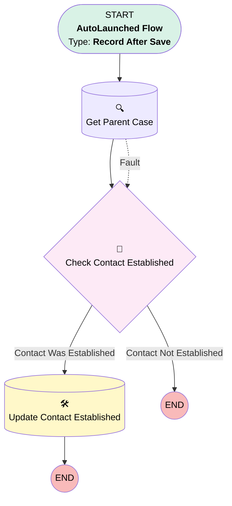

# Task: Succession Contact Update

## Flow Diagram

<!-- Flow description -->

## General Information

|<!-- -->|<!-- -->|
|:---|:---|
|Object|Task|
|Process Type| Auto Launched Flow|
|Trigger Type| Record After Save|
|Record Trigger Type| Update|
|Label|Task: Succession Contact Update|
|Status|Active|
|Filter Formula|AND(     ISCHANGED({!$Record.Status}),     TEXT({!$Record.Status}) = "Completed",     NOT(ISBLANK({!$Record.Contact_Attempt_Number__c})) )|
|Description|Sets Case.Contact_Established__c when a Task is completed with Succession_Contact_Established__c = TRUE. Acts as circuit breaker to stop the cadence. Includes fault connector for parent case lookup.|
|Environments|Default|
|Interview Label|Task: Succession Contact Update {!$Flow.CurrentDateTime}|
| Builder Type (PM)|LightningFlowBuilder|
| Canvas Mode (PM)|AUTO_LAYOUT_CANVAS|
| Origin Builder Type (PM)|LightningFlowBuilder|
|Connector|[Get_Parent_Case](#get_parent_case)|
|Next Node|[Get_Parent_Case](#get_parent_case)|

## Flow Nodes Details

### Check_Contact_Established

|<!-- -->|<!-- -->|
|:---|:---|
|Type|Decision|
|Label|Check Contact Established|
|Default Connector Label|Contact Not Established|

#### Rule Contact_Was_Established (Contact Was Established)

|<!-- -->|<!-- -->|
|:---|:---|
|Connector|[Update_Contact_Established](#update_contact_established)|
|Condition Logic|and|

|Condition Id|Left Value Reference|Operator|Right Value|
|:-- |:-- |:--:|:--: |
|1|$Record.Succession_Contact_Established__c| Equal To|✅|

### Get_Parent_Case

|<!-- -->|<!-- -->|
|:---|:---|
|Type|Record Lookup|
|Object|Case|
|Label|Get Parent Case|
|Assign Null Values If No Records Found|⬜|
|Fault Connector|[Check_Contact_Established](#check_contact_established)|
|Get First Record Only|✅|
|Store Output Automatically|✅|
|Connector|[Check_Contact_Established](#check_contact_established)|

#### Filters (logic: **and**)

|Filter Id|Field|Operator|Value|
|:-- |:-- |:--:|:--: |
|1|Id| Equal To|$Record.WhatId|

### Update_Contact_Established

|<!-- -->|<!-- -->|
|:---|:---|
|Type|Record Update|
|Object|Case|
|Label|Update Contact Established|

#### Filters (logic: **and**)

|Filter Id|Field|Operator|Value|
|:-- |:-- |:--:|:--: |
|1|Id| Equal To|$Record.WhatId|

#### Input Assignments

|Field|Value|
|:-- |:--: |
|Contact_Established__c|✅|

___

_Documentation generated from branch main by [sfdx-hardis](https://sfdx-hardis.cloudity.com), featuring [salesforce-flow-visualiser](https://github.com/toddhalfpenny/salesforce-flow-visualiser)_