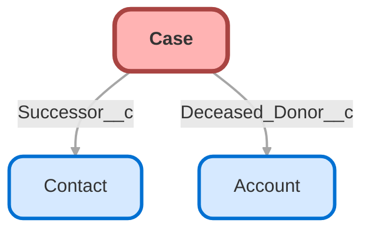

---
hide:
  - path
---

<!-- This file is auto-generated. if you do not want it to be overwritten, set TRUE in the line below -->
<!-- DO_NOT_OVERWRITE_DOC=FALSE -->

## Schema

<!-- Object description -->

## Fields

| Name      | Label | Type | Description |
| :-------- | :---- | :--: | :---------- | 
| Contact_Attempt_Count__c | Contact Attempt Count | Number | BRD Contact Cadence: Running count of contact attempts (1-5). Maps to BRD Day 0, 5, 35, 65, 95 cadence. Auto-increments with each task completion. After 5 attempts without contact, case escalates to trading/liquidation. |
| Contact_Established__c | Contact Established | Checkbox | BRD Phase 1-2: Indicates whether verbal contact has been successfully established with the successor. Used as gate to stop contact cadence automation. Only check after direct conversation where successor understands their options. |
| Deceased_Donor__c | Deceased Donor | Lookup | undefined |
| Execution_Status__c | Execution Status | Picklist | BRD Phase 4: Tracks the execution and settlement status of the chosen succession pathway. Different execution steps apply based on Pathway Confirmed (Final Grant, New DAF, Disclaim). |
| Form_Completed_Date__c | Form Completed Date | DateTime | BRD Phase 2-3: Date when successor completed and submitted the Succession Recommendation Form. Indicates readiness to proceed to Document Collection phase. |
| Form_Sent_Date__c | Form Sent Date | DateTime | BRD Phase 2: Date when Succession Recommendation Form (OmniScript) was sent to successor. Replaces deprecated SuccessorFormStatus__c with objective date stamp. Per BRD critical rule: form can only be sent AFTER verbal contact established. |
| New_DAF_Account_Number__c | New DAF Account Number | Text | BRD Phase 4 - New DAF Pathway: The newly established DAF account number where assets will be transferred. Populated during Step 1 (Verify new account established) of New DAF execution. |
| Pathway_Confirmed__c | Succession Pathway | Picklist | BRD Phase 2: Successor's chosen succession pathway. Three mutually exclusive options per BRD section 3.1. Pathway locks once documentation begins - cannot be changed after that point. |
| SLA_Status__c | SLA Status | Text | BRD Visual Indicator: Formula field showing case SLA status based on days open and contact status. Green (On Track), Yellow (Attention), Orange (At Risk), Red (Critical/Escalate). Per user request: escalates after 4 attempts, not 5. |
| Successor__c | Successor | Lookup | Lookup to successor Contact. Displays in highlights panel with clickable navigation to Contact record. Also used by Successor_Email__c and Successor_Phone__c formula fields. |
| Successor_Email__c | Successor Email | Text | Clickable email link that displays in the highlights panel. When clicked, opens email client to compose an email to the successor. |
| Successor_Phone__c | Successor Phone | Text | Clickable phone link that displays in the highlights panel. When clicked, initiates a phone call to the successor. |
| Verification_Status__c | Verification Status | Picklist | Workflow trigger field controlled by agent via Quick Action. Agent clicks "Begin Succession Processing" button to start workflow when ready. Despite 90%+ of cases arriving with documents, agent maintains control over workflow initiation. |

## Related Flows

| Object | Name      | Type | Description |
| :----  | :-------- | :--: | :---------- | 
| Case | [Case_Create_Initial_Contact_Attempt](../flows/Case_Create_Initial_Contact_Attempt.md) |  Record After Save | Seeds Attempt 1 (Day 0) when Verification_Status__c becomes "Complete - Verified" on an Estate Administration case. Guards against duplicates via Contact_Attempt_Count__c IS NULL. Triggers on create or when the verification field changes. Adds Builder UI metadata for clarity. |
| Case | [Case_Parent_Closure_Handler](../flows/Case_Parent_Closure_Handler.md) |  Record After Save | Monitors child case status changes and automatically closes the parent Multi-Account Succession Master case when all child Named Successor Enactment cases reach terminal status (Closed or Canceled). |
| Case | [Case_Status_Coordination](../flows/Case_Status_Coordination.md) |  Record After Save | Automatically coordinates Case Status field updates across the 5-phase succession workflow. Updates Status based on phase-tracking field changes (Verification_Status__c, Contact_Established__c, Form_Completed_Date__c, Pathway_Confirmed__c, Execution_Status__c). |
| Case | [Case_Succession_Segment_Transition](../flows/Case_Succession_Segment_Transition.md) |  Record After Save | Logs key succession segment transitions and notifies the case feed. Triggers on Estate Administration cases when Contact_Established__c, Form_Completed_Date__c, or Pathway_Confirmed__c change. Posts a concise Chatter message indicating the new segment and next action to aid demo narration and agent handoffs. |
| Task | [Task_Create_Next_Contact_Attempt](../flows/Task_Create_Next_Contact_Attempt.md) |  Record After Save | Creates the next contact attempt when the current attempt Task is completed. Schedules ActivityDate off Case.CreatedDate (Day 5/35/65/95). Exits when contact established or after Attempt 5. Includes fault connector for parent case lookup. |
| Task | [Task_Succession_Contact_Update](../flows/Task_Succession_Contact_Update.md) |  Record After Save | Sets Case.Contact_Established__c when a Task is completed with Succession_Contact_Established__c = TRUE. Acts as circuit breaker to stop the cadence. Includes fault connector for parent case lookup. |

## Related Apex Classes

| Apex Class | Type |
| :----      | :--: | 
| [BeginSuccessionProcessingController](../apex/BeginSuccessionProcessingController.md) | Lightning Controller |
| [BeginSuccessionProcessingControllerTest](../apex/BeginSuccessionProcessingControllerTest.md) | Test |
| [CaseHierarchyController](../apex/CaseHierarchyController.md) | Lightning Controller |
| [CaseHierarchyController_Test](../apex/CaseHierarchyController_Test.md) | Test |
| [ContactCadenceController](../apex/ContactCadenceController.md) | Lightning Controller |
| [ContactCadenceController_Test](../apex/ContactCadenceController_Test.md) | Test |
| [CreateSuccessionCaseController](../apex/CreateSuccessionCaseController.md) | Lightning Controller |
| [CreateSuccessionCaseControllerTest](../apex/CreateSuccessionCaseControllerTest.md) | Test |
| [SuccessionPublicFormController](../apex/SuccessionPublicFormController.md) | Lightning Controller |
| [SuccessionPublicFormController_Test](../apex/SuccessionPublicFormController_Test.md) | Test |
| [SuccessionTaskGenerator](../apex/SuccessionTaskGenerator.md) | Class |
| [SuccessionTaskGenerator_Test](../apex/SuccessionTaskGenerator_Test.md) | Test |
| [SuccessionCaseTrigger](../apex/SuccessionCaseTrigger.md) | Class |

## Related Lightning Pages

| Lightning Page | Type |
| :----      | :--: | 
| [Succession_Management_Record_Page](../pages/Succession_Management_Record_Page.md) |  Record Page |

## Related Profiles

| Profile | User License |
| :----      | :--: | 
| [Service Agent](../profiles/Service%20Agent.md) |  Salesforce |
| [Service Supervisor](../profiles/Service%20Supervisor.md) |  Salesforce |
| [Service User](../profiles/Service%20User.md) |  Salesforce |

## Related Permission Sets

| Permission Set | User License |
| :----      | :--: | 
| [Succession_Field_Access](../permissionsets/Succession_Field_Access.md) | None |
| [Succession_Guest_Access](../permissionsets/Succession_Guest_Access.md) | None |
| [Succession_Management_Access](../permissionsets/Succession_Management_Access.md) | None |

_Documentation generated with [sfdx-hardis](https://sfdx-hardis.cloudity.com), by [Cloudity](https://www.cloudity.com/) & [friends](https://github.com/hardisgroupcom/sfdx-hardis/graphs/contributors)_
