---
hide:
  - path
---

<!-- This file is auto-generated. if you do not want it to be overwritten, set TRUE in the line below -->
<!-- DO_NOT_OVERWRITE_DOC=FALSE -->

## Schema

```mermaid
graph TD
Task["Task"]:::mainObject
click Task "/objects/Task/"


classDef object fill:#D6E9FF,stroke:#0070D2,stroke-width:3px,rx:12px,ry:12px,shadow:drop,color:#333;
classDef customObject fill:#FFF4C2,stroke:#CCAA00,stroke-width:3px,rx:12px,ry:12px,shadow:drop,color:#333;
classDef customObjectManaged fill:#FFD8B2,stroke:#CC5500,stroke-width:3px,rx:12px,ry:12px,shadow:drop,color:#333;
classDef mainObject fill:#FFB3B3,stroke:#A94442,stroke-width:4px,rx:14px,ry:14px,shadow:drop,color:#333,font-weight:bold;

```

<!-- Object description -->

## Fields

| Name      | Label | Type | Description |
| :-------- | :---- | :--: | :---------- | 
| Contact_Attempt_Number__c | Contact Attempt Number | Number | BRD Contact Cadence: Which contact attempt this task represents (1-5). Maps to BRD Day 0, 5, 35, 65, 95 cadence. Used by Flow to determine next steps and populate Case.Contact_Attempt_Count__c upon completion. |
| Succession_Contact_Established__c | Succession Contact Established | Checkbox | BRD Phase 1-2: Agent marks this checkbox when verbal contact is successfully made during this specific task attempt. Used by Flow to determine whether to create next attempt task or stop cadence. If checked, Flow updates Case.Contact_Established__c and stops scheduling future attempts. |

## Related Flows

| Object | Name      | Type | Description |
| :----  | :-------- | :--: | :---------- | 
| Case | [Case_Create_Initial_Contact_Attempt](../flows/Case_Create_Initial_Contact_Attempt.md) |  Record After Save | Seeds Attempt 1 (Day 0) when Verification_Status__c becomes "Complete - Verified" on an Estate Administration case. Guards against duplicates via Contact_Attempt_Count__c IS NULL. Triggers on create or when the verification field changes. Adds Builder UI metadata for clarity. |
| Task | [Task_Create_Next_Contact_Attempt](../flows/Task_Create_Next_Contact_Attempt.md) |  Record After Save | Creates the next contact attempt when the current attempt Task is completed. Schedules ActivityDate off Case.CreatedDate (Day 5/35/65/95). Exits when contact established or after Attempt 5. Includes fault connector for parent case lookup. |
| Task | [Task_Succession_Contact_Update](../flows/Task_Succession_Contact_Update.md) |  Record After Save | Sets Case.Contact_Established__c when a Task is completed with Succession_Contact_Established__c = TRUE. Acts as circuit breaker to stop the cadence. Includes fault connector for parent case lookup. |

## Related Apex Classes

| Apex Class | Type |
| :----      | :--: | 
| [ContactCadenceController](../apex/ContactCadenceController.md) | Lightning Controller |
| [ContactCadenceController_Test](../apex/ContactCadenceController_Test.md) | Test |
| [SuccessionTaskGenerator](../apex/SuccessionTaskGenerator.md) | Class |
| [SuccessionTaskGenerator_Test](../apex/SuccessionTaskGenerator_Test.md) | Test |
| [SuccessionCaseTrigger](../apex/SuccessionCaseTrigger.md) | Class |

## Related Profiles

| Profile | User License |
| :----      | :--: | 
| [Service Agent](../profiles/Service%20Agent.md) |  Salesforce |
| [Service Supervisor](../profiles/Service%20Supervisor.md) |  Salesforce |
| [Service User](../profiles/Service%20User.md) |  Salesforce |

## Related Permission Sets

| Permission Set | User License |
| :----      | :--: | 
| [Succession_Field_Access](../permissionsets/Succession_Field_Access.md) | None |
| [Succession_Management_Access](../permissionsets/Succession_Management_Access.md) | None |

_Documentation generated with [sfdx-hardis](https://sfdx-hardis.cloudity.com), by [Cloudity](https://www.cloudity.com/) & [friends](https://github.com/hardisgroupcom/sfdx-hardis/graphs/contributors)_
